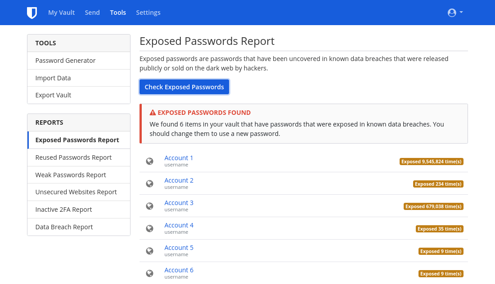

مع مرور الوقت، من السهل أن يتراكم لديك عدد من الحسابات على الإنترنت، وقد لا تعود تستخدم الكثير منها. يُعد حذف هذه الحسابات غير المستخدمة خطوة مهمة لاستعادة خصوصيتك، لأن الحسابات الخاملة (dormant accounts) تكون أكثر عرضة لتسريبات البيانات. يحدث خرق للبيانات عندما يتم اختراق أمان خدمة ما، فتتم مشاهدة المعلومات المحمية أو نقلها أو سرقتها من قِبل جهات غير مصرح لها. للأسف، أصبحت خروقات البيانات [شائعة جدا](https://haveibeenpwned.com/PwnedWebsites) هذه الأيام، لذلك فإن اتباع عادات رقمية جيدة هو أفضل طريقة لتقليل تأثيرها على حياتك. يهدف هذا الدليل إلى مساعدتك على حذف حساباتك بسهولة أكبر، لأن بعض المواقع تجعل حذف الحساب صعبا عن طريق [تصميمات مضللة](https://deceptive.design). والهدف هو مساعدتك على تقليل حساباتك القديمة وتحسين خصوصيتك على الإنترنت.

## العثور على الحسابات القديمة

### Password Manager

إذا كنت تستخدم Password Manager طوال فترة استخدامك للإنترنت، فسيكون هذا الجزء سهلا جدا. غالبًا ما تتضمن هذه الأدوات ميزة مدمجة للتحقق مما إذا كانت بيانات تسجيل الدخول الخاصة بك قد ظهرت في خرق للبيانات، مثل [Data Breach Report](https://bitwarden.com/blog/have-you-been-pwned) في Bitwarden.

<figure markdown>
  
</figure>

حتى إذا لم تستخدم Password Manager بشكل مباشر من قبل، فمن المحتمل أنك استخدمت مدير كلمات المرور الموجود في متصفحك ([Firefox](https://support.mozilla.org/kb/password-manager-remember-delete-edit-logins)، [Chrome](https://passwords.google.com/intro)، [Edge](https://support.microsoft.com/microsoft-edge/save-or-forget-passwords-in-microsoft-edge-b4beecb0-f2a8-1ca0-f26f-9ec247a3f336)) أو هاتفك ([Google](https://passwords.google.com/intro) على Android الأساسي، و[Passwords](https://support.apple.com/HT211146) على iOS) دون أن تدرك ذلك.

غالبا ما تتضمن أنظمة سطح المكتب أيضا على Password Manager، وقد يساعدك في العثور على كلمات مرور نسيتها:

- ويندوز: [Credential Manager](https://support.microsoft.com/windows/accessing-credential-manager-1b5c916a-6a16-889f-8581-fc16e8165ac0)
- macOS: [Passwords](https://support.apple.com/HT211145)
- Linux: Gnome Keyring (accessed through [Seahorse](https://gitlab.gnome.org/GNOME/seahorse#seahorse)) or [KDE Wallet Manager](https://userbase.kde.org/KDE_Wallet_Manager)

### البريد الإلكتروني

If you didn't use a password manager in the past, or you think you have accounts that were never added to your password manager, another option is to search the email account(s) that you believe you signed up on. On your email client, search for keywords such as "verify" or "welcome." Almost every time you make an online account, the service will send a verification link or an introductory message to your email. This can be a good way to find old, forgotten accounts.

## Deleting Old Accounts

### Log In

In order to delete your old accounts, you'll need to first make sure you can log in to them. Again, if the account was in your password manager, this step is easy. If not, you can try to guess your password. Failing that, there are typically options to regain access to your account, commonly available through a "forgot password" link on the login page. It may also be possible that accounts you've abandoned have already been deleted—sometimes services prune all old accounts.

When attempting to regain access, if the site returns an error message saying that email is not associated with an account, or you never receive a reset link after multiple attempts, then you do not have an account under that email address and should try a different one. If you can't figure out which email address you used, or you no longer have access to that email, you can try contacting the service's customer support. Unfortunately, there is no guarantee that you will be able to reclaim access your account.

### GDPR (EEA residents only)

Residents of the EEA have additional rights regarding data erasure specified in [Article 17](https://gdpr-info.eu/art-17-gdpr) of the GDPR. If it's applicable to you, read the privacy policy for any given service to find information on how to exercise your right to erasure. Reading the privacy policy can prove important, as some services have a "Delete Account" option that only disables your account and for real deletion you have to take additional action. Sometimes actual deletion may involve filling out surveys, emailing the data protection officer of the service or even proving your residence in the EEA. If you plan to go this way, do **not** overwrite account information—your identity as an EEA resident may be required. Note that the location of the service does not matter; GDPR applies to anyone serving European users. If the service does not respect your right to erasure, you can contact your national [Data Protection Authority](https://ec.europa.eu/info/law/law-topic/data-protection/reform/rights-citizens/redress/what-should-i-do-if-i-think-my-personal-data-protection-rights-havent-been-respected_en) and may be entitled to monetary compensation.

### Overwriting Account information

In some situations where you plan to abandon an account, it may make sense to overwrite the account information with fake data. Once you've made sure you can log in, change all the information in your account to falsified information. The reason for this is that many sites will retain information you previously had even after account deletion. The hope is that they will overwrite the previous information with the newest data you entered. However, there is no guarantee that there won't be backups with the prior information.

For the account email, either create a new alternate email account via your provider of choice or create an alias using an [email aliasing service](../email-aliasing.md). You can then delete your alternate email address once you are done. We recommend against using temporary email providers, as oftentimes it is possible to reactivate temporary emails.

### Delete

You can check [JustDeleteMe](https://justdeleteme.xyz) for instructions on deleting the account for a specific service. Some sites will graciously have a "Delete Account" option, while others will go as far as to force you to speak with a support agent. The deletion process can vary from site to site, with account deletion being impossible on some.

For services that don't allow account deletion, the best thing to do is falsify all your information as previously mentioned and strengthen account security. To do so, enable [MFA](multi-factor-authentication.md) and any extra security features offered. As well, change the password to a randomly-generated one that is the maximum allowed size (a [password manager](../passwords.md) can be useful for this).

If you're satisfied that all information you care about is removed, you can safely forget about this account. If not, it might be a good idea to keep the credentials stored with your other passwords and occasionally re-login to reset the password.

Even when you are able to delete an account, there is no guarantee that all your information will be removed. In fact, some companies are required by law to keep certain information, particularly when related to financial transactions. It's mostly out of your control what happens to your data when it comes to websites and cloud services.

## Avoid New Accounts

As the old saying goes, "an ounce of prevention is worth a pound of cure." Whenever you feel tempted to sign up for a new account, ask yourself, "Do I really need this? Can I accomplish what I need to without an account?" It can often be much harder to delete an account than to create one. And even after deleting or changing the info on your account, there might be a cached version from a third-party—like the [Internet Archive](https://archive.org). Avoid the temptation when you're able to—your future self will thank you!
