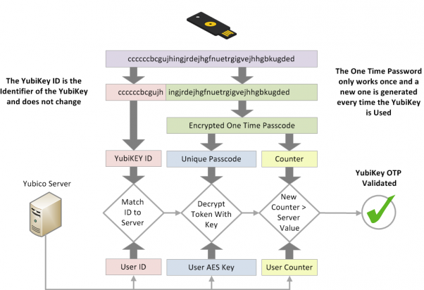
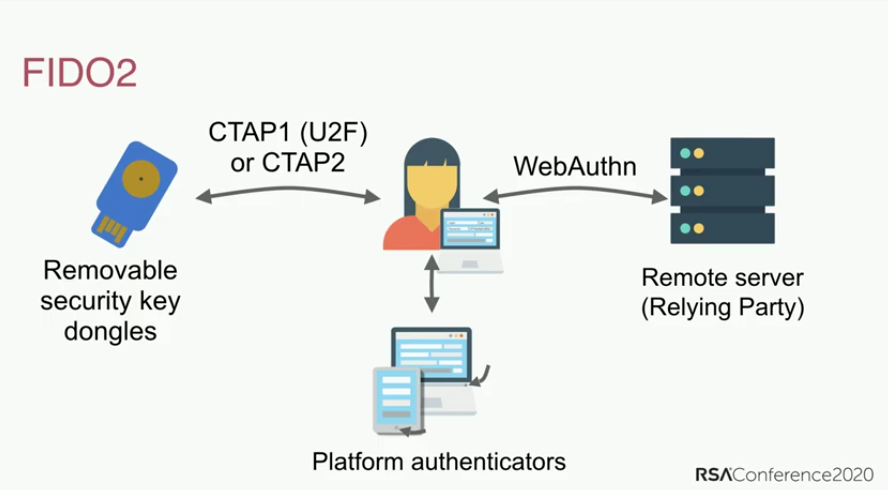

**الـ Multifactor Authentication** (**MFA**) هي آلية أمان تتطلب خطوات إضافية إلى جانب إدخال اسم المستخدم (أو البريد الإلكتروني) وكلمة المرور. الطريقة الأكثر شيوعا هي استخدام رموز مؤقتة قد تصلك عبر الـ SMS أو من خلال تطبيق.

عادةً، إذا تمكن مخترق (أو مهاجم) من معرفة كلمة مرورك، فسيتمكن من الوصول إلى الحساب المرتبط بها. الحساب الذي يستخدم الـ MFA يُجبر المخترق على امتلاك كلمة المرور (شيء *تعرفه*) وجهاز تملكه (شيء *لديك*)، مثل هاتفك.

تختلف طرق الـ MFA في مستوى الأمان، لكنها تعتمد على مبدأ بسيط: كلما كان من الصعب على المهاجم الوصول إلى وسيلة الـMFA التي تستخدمها، كان ذلك أفضل. تشمل أمثلة طرق الـ MFA، من الأضعف إلى الأقوى: SMS، ورموز البريد الإلكتروني، وإشعارات التطبيقات، وTOTP، وYubico OTP، وFIDO.

## مقارنة طرق الـ MFA

### الـ MFA عبر SMS أو البريد الإلكتروني

يُعد تلقي رموز OTP عبر الـ SMS أو البريد الإلكتروني من أضعف الطرق لتأمين حساباتك باستخدام الـ MFA. الحصول على رمز عبر البريد الإلكتروني أو الـ SMS يُضعف فكرة «شيء *تملكه*»، لأن هناك عدة طرق يمكن للمخترق من خلالها [الاستيلاء على رقم هاتفك](https://en.wikipedia.org/wiki/SIM_swap_scam) أو الوصول إلى بريدك الإلكتروني دون الحاجة إلى الوصول الفعلي إلى أي من أجهزتك. إذا تمكن شخص غير مصرح له من الوصول إلى بريدك الإلكتروني، فسيكون بإمكانه استخدام هذا الوصول لإعادة تعيين كلمة مرورك واستلام رمز المصادقة أيضا، مما يمنحه وصولا كاملا إلى حسابك.

### الإشعارات الفورية

تعمل الـ MFA عبر الإشعارات الفورية من خلال إرسال رسالة إلى تطبيق على هاتفك تطلب منك تأكيد عمليات تسجيل الدخول الجديدة إلى حسابك. هذه الطريقة أفضل بكثير من الـ SMS أو البريد الإلكتروني، لأن المهاجم عادةً لن يتمكن من تلقي هذه الإشعارات دون امتلاك جهاز مسجّل الدخول بالفعل، ما يعني أنه سيحتاج أولا إلى اختراق أحد أجهزتك الأخرى.

جميعنا قد نخطئ، وهناك احتمال أن توافق على محاولة تسجيل الدخول عن طريق الخطأ. عادةً ما تُرسل طلبات الموافقة على تسجيل الدخول عبر الإشعارات الفورية إلى *جميع* أجهزتك في الوقت نفسه، مما يزيد عدد الأجهزة التي يمكن من خلالها الموافقة على تسجيل الدخول إذا كان لديك عدة أجهزة.

يعتمد أمان الـ MFA عبر الإشعارات الفورية على جودة التطبيق ومكوّن الخادم، وكذلك على مدى موثوقية المطوّر الذي أنشأه. قد يتطلب تثبيت التطبيق أيضا منح صلاحيات واسعة تمكنه من الوصول إلى بيانات أخرى على جهازك. كما أن هذه الطريقة تتطلب عادة تطبيقا مخصصا لكل خدمة، وقد لا يتطلب هذا التطبيق كلمة مرور لفتحه، بخلاف تطبيق جيد لتوليد رموز TOTP.

### كلمة المرور الصالحة لمرة واحدة المستندة إلى الوقت (TOTTP)

تُعد الـ TOTP واحدة من أكثر أشكال الـ MFA شيوعا. عند إعداد TOTP، يُطلب منك عادةً مسح [رمز الـQR](https://en.wikipedia.org/wiki/QR_code) لإنشاء "[سر مشترك](https://en.wikipedia.org/wiki/Shared_secret)" مع الخدمة التي تريد استخدامها. يُحفظ السر المشترك بشكل آمن داخل بيانات تطبيق المصادقة، ويكون محميًا أحيانا بكلمة مرور.

بعد ذلك، يتم توليد الرمز المؤقت اعتمادا على السر المشترك والوقت الحالي. وبما أن الرمز صالح لفترة قصيرة فقط، فلن يتمكن المهاجم من توليد رموز جديدة دون الوصول إلى السر المشترك.

إذا كان لديك مفتاح أمان مادي يدعم TOTP (مثل YubiKey مع [Yubico Authenticator](https://yubico.com/products/yubico-authenticator))، فننصحك بتخزين "الأسرار المشتركة (shared secrets)" على المفتاح نفسه. تم تطوير أجهزة مثل YubiKey بهدف جعل استخراج "السر المشترك (shared secret)" ونسخه أمرًا صعبًا. كما أن الـ YubiKey غير متصل بالإنترنت، بخلاف الهاتف الذي يحتوي على تطبيق TOTP.

على عكس الـ[WebAuthn](#fido-fast-identity-online)، لا توفر TOTP أي حماية من [التصيد الاحتيالي (Phishing)](https://en.wikipedia.org/wiki/Phishing) أو هجمات إعادة الاستخدام. إذا حصل المهاجم منك على رمز صالح، فيمكنه استخدامه عدة مرات كما يشاء حتى تنتهي صلاحيته (عادة خلال 60 ثانية).

يمكن للمهاجم إنشاء موقع ينتحل شكل خدمة رسمية، في محاولة لخداعك ودفعك إلى إدخال اسم المستخدم وكلمة المرور ورمز الـ TOTP الحالي. إذا استخدم المهاجم بيانات الدخول التي حصل عليها، فقد يتمكن من تسجيل الدخول إلى الخدمة الحقيقية والاستيلاء على الحساب.

رغم أن الـTOTP ليست مثالية، فإنها آمنة بما يكفي لمعظم الأشخاص، وعندما لا تكون [الـ Hardware Security Keys](../security-keys.md) مدعومة، تظل [تطبيقات المصادقة](../multi-factor-authentication.md) خيارا جيدا.

### مفاتيح الأمان المادية (Hardware Security Keys)

يخزّن الـ YubiKey البيانات على شريحة صلبة مقاومة للعبث، ويُعد [الوصول إليها مستحيلًا](https://security.stackexchange.com/a/245772) دون إتلافها إلا باستخدام عملية مكلفة ومختبر متخصص في التحليل الجنائي الرقمي.

تكون هذه المفاتيح عادةً متعددة الوظائف، وتوفر عدة طرق للمصادقة. فيما يلي أكثرها شيوعا.

#### Yubico OTP

الـ Yubico OTP هو بروتوكول مصادقة يُستخدم عادةً في مفاتيح الأمان المادية (hardware security keys). عندما تقرر استخدام Yubico OTP، سيُنشئ المفتاح معرفا عاما، ومعرفا خاصا، ومفتاحا سريا، ثم تُرفع هذه البيانات إلى خادم Yubico OTP.

عند تسجيل الدخول إلى موقع ويب، كل ما عليك فعله هو لمس مفتاح الأمان فعليًا. سيحاكي مفتاح الأمان لوحة مفاتيح، ويدخل كلمة مرور لمرة واحدة في حقل كلمة المرور.

بعد ذلك، سترسل الخدمة كلمة المرور لمرة واحدة إلى خادم Yubico OTP للتحقق منها. يتم زيادة عدّاد (counter) على كل من المفتاح وخادم التحقق التابع لـ Yubico. لا يمكن استخدام الـOTP إلا مرة واحدة، وعند نجاح المصادقة يزداد العداد، مما يمنع إعادة استخدام الرمز نفسه. توفّر Yubico [وثيقة مفصلة](https://developers.yubico.com/OTP/OTPs_Explained.html) تشرح هذه العملية.

<figure markdown>
  
</figure>

هناك بعض المزايا والعيوب لاستخدام Yubico OTP مقارنة بـ TOTP.

The Yubico validation server is a cloud based service, and you're placing trust in Yubico that they are storing data securely and not profiling you. The public ID associated with Yubico OTP is reused on every website and could be another avenue for third-parties to profile you. Like TOTP, Yubico OTP does not provide phishing resistance.

If your threat model requires you to have different identities on different websites, **do not** use Yubico OTP with the same hardware security key across those websites as public ID is unique to each security key.

#### FIDO (Fast IDentity Online)

[FIDO](https://en.wikipedia.org/wiki/FIDO_Alliance) includes a number of standards, first there was [U2F](https://en.wikipedia.org/wiki/Universal_2nd_Factor) and then later [FIDO2](https://en.wikipedia.org/wiki/FIDO2_Project) which includes the web standard [WebAuthn](https://en.wikipedia.org/wiki/WebAuthn).

U2F and FIDO2 refer to the [Client to Authenticator Protocol](https://en.wikipedia.org/wiki/Client_to_Authenticator_Protocol), which is the protocol between the security key and the computer, such as a laptop or phone. It complements WebAuthn which is the component used to authenticate with the website (the "Relying Party") you're trying to log in on.

WebAuthn is the most secure and private form of second factor authentication. While the authentication experience is similar to Yubico OTP, the key does not print out a one-time password and validate with a third-party server. Instead, it uses [public key cryptography](https://en.wikipedia.org/wiki/Public-key_cryptography) for authentication.

<figure markdown>
  
</figure>

When you create an account, the public key is sent to the service, then when you log in, the service will require you to "sign" some data with your private key. The benefit of this is that no password data is ever stored by the service, so there is nothing for an adversary to steal.

This presentation discusses the history of password authentication, the pitfalls (such as password reuse), and the standards for FIDO2 and [WebAuthn](https://webauthn.guide):

- [How FIDO2 and WebAuthn Stop Account Takeovers](https://youtu.be/aMo4ZlWznao) <small>(YouTube)</small>

FIDO2 and WebAuthn have superior security and privacy properties when compared to any MFA methods.

Typically, for web services it is used with WebAuthn which is a part of the [W3C recommendations](https://en.wikipedia.org/wiki/World_Wide_Web_Consortium#W3C_recommendation_(REC)). It uses public key authentication and is more secure than shared secrets used in Yubico OTP and TOTP methods, as it includes the origin name (usually, the domain name) during authentication. Attestation is provided to protect you from phishing attacks, as it helps you to determine that you are using the authentic service and not a fake copy.

Unlike Yubico OTP, WebAuthn does not use any public ID, so the key is **not** identifiable across different websites. It also does not use any third-party cloud server for authentication. All communication is completed between the key and the website you are logging into. FIDO also uses a counter which is incremented upon use in order to prevent session reuse and cloned keys.

If a website or service supports WebAuthn for the authentication, it is highly recommended that you use it over any other form of MFA.

## General Recommendations

We have these general recommendations:

### Which Method Should I Use?

When configuring your MFA method, keep in mind that it is only as secure as your weakest authentication method you use. This means it is important that you only use the best MFA method available. For instance, if you are already using TOTP, you should disable email and SMS MFA. If you are already using FIDO2/WebAuthn, you should not be using Yubico OTP or TOTP on your account.

### Backups

You should always have backups for your MFA method. Hardware security keys can get lost, stolen or simply stop working over time. It is recommended that you have a pair of hardware security keys with the same access to your accounts instead of just one.

When using TOTP with an authenticator app, be sure to back up your recovery keys or the app itself, or copy the "shared secrets" to another instance of the app on a different phone or to an encrypted container (e.g. [VeraCrypt](../encryption.md#veracrypt-disk)).

### Initial Set Up

When buying a security key, it is important that you change the default credentials, set up password protection for the key, and enable touch confirmation if your key supports it. Products such as the YubiKey have multiple interfaces with separate credentials for each one of them, so you should go over each interface and set up protection as well.

### Email and SMS

If you have to use email for MFA, make sure that the email account itself is secured with a proper MFA method.

If you use SMS MFA, use a carrier who will not switch your phone number to a new SIM card without account access, or use a dedicated VoIP number from a provider with similar security to avoid a [SIM swap attack](https://en.wikipedia.org/wiki/SIM_swap_scam).

[MFA tools we recommend](../multi-factor-authentication.md ""){.md-button}

## More Places to Set Up MFA

Beyond just securing your website logins, multifactor authentication can be used to secure your local logins, SSH keys or even password databases as well.

### macOS

macOS has [native support](https://support.apple.com/guide/deployment/intro-to-smart-card-integration-depd0b888248/web) for authentication with smart cards (PIV). If you have a smart card or a hardware security key that supports the PIV interface such as the YubiKey, we recommend that you follow your smart card or hardware security vendor's documentation and set up second factor authentication for your macOS computer.

Yubico have a guide [Using Your YubiKey as a Smart Card in macOS](https://support.yubico.com/hc/articles/360016649059) which can help you set up your YubiKey on macOS.

بعد إعداد البطاقة الذكية/مفتاح الأمان، نوصي بتشغيل هذا الأمر في الـ Terminal:

```text
sudo defaults write /Library/Preferences/com.apple.loginwindow DisableFDEAutoLogin -bool YES
```

سيمنع هذا الأمر المهاجم من تجاوز الـ MFA عند إقلاع الكمبيوتر.

### لينكس

<div class="admonition warning" markdown>
<p class="admonition-title">تنوية</p>

إذا تغير اسم المضيف (hostname) لنظامك، مثلا بسبب DHCP، فلن تتمكن من تسجيل الدخول. من الضروري تعيين اسم مضيف (hostname) مناسب لجهازك قبل اتباع هذا الدليل.

</div>

يمكن لوحدة `pam_u2f` على Linux توفير المصادقة الثنائية عند تسجيل الدخول في معظم توزيعات Linux الشائعة. إذا كان لديك مفتاح أمان مادي يدعم الـU2F، فيمكنك إعداد MFA لتسجيل الدخول. لدى Yubico دليل [تسجيل الدخول إلى Ubuntu Linux باستخدام U2F](https://support.yubico.com/s/article/Ubuntu-Linux-login-guide-U2F)، ومن المفترض أن يعمل مع أي توزيعة Linux. لكن قد تختلف أوامر مدير الحزم، مثل `apt-get`، وكذلك أسماء الحزم. هذا الدليل **لا** ينطبق على Qubes OS.

### Qubes OS

يدعم Qubes OS المصادقة بنظام الـChallenge-Response باستخدام YubiKeys. إذا كان لديك YubiKey يدعم مصادقة الـChallenge-Response، فراجع [وثائق الـ YubiKey](https://qubes-os.org/doc/yubikey) الخاصة بـ Qubes OS إذا كنت تريد إعداد MFA على Qubes OS.

### SSH

#### مفاتيح الأمان المادية (Hardware Security Keys)

يمكن إعداد الـMFA لاتصالات الـSSH باستخدام عدة طرق مصادقة مختلفة تدعمها مفاتيح الأمان المادية بشكل شائع. نوصي بالاطلاع على [وثائق](https://developers.yubico.com/SSH) Yubico لمعرفة كيفية إعداد ذلك.

#### TOTP

يمكن أيضا إعداد MFA لاتصالات SSH باستخدام TOTP. قدّمت DigitalOcean دليلا بعنوان [كيفية إعداد المصادقة متعددة العوامل لـ SSH على Ubuntu 20.04](https://digitalocean.com/community/tutorials/how-to-set-up-multi-factor-authentication-for-ssh-on-ubuntu-20-04). يُفترض أن تكون معظم الخطوات متشابهة بغض النظر عن التوزيعة، لكن قد تختلف أوامر مدير الحزم، مثل `apt-get`، وكذلك أسماء الحزم.

### KeePass (and KeePassXC)

يمكن تأمين قواعد بيانات KeePass وKeePassXC باستخدام HOTP أو Challenge-Response كعامل مصادقة ثانٍ. قدمت Yubico دليلا خاصا بـ KeePass بعنوان [استخدام YubiKey مع KeePass](https://support.yubico.com/hc/articles/360013779759-Using-Your-YubiKey-with-KeePass)، كما يوجد دليل آخر على موقع [KeePassXC](https://keepassxc.org/docs/#faq-yubikey-2fa).
