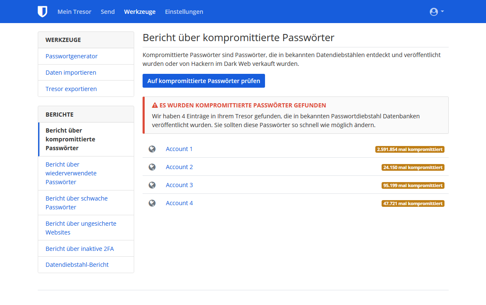

Im Laufe der Zeit kann sich leicht eine Reihe von Online-Konten ansammeln, von denen du viele möglicherweise nicht mehr nutzt. Das Löschen dieser ungenutzten Konten ist ein wichtiger Schritt, um deine Privatsphäre zurückzugewinnen, da inaktive Konten anfällig für Datenschutzverletzungen sind. Eine solche Datenschutzverletzung liegt vor, wenn die Sicherheit eines Dienstes kompromittiert wird und geschützte Informationen von Unbefugten eingesehen, übertragen oder gestohlen werden. Datenschutzverletzungen sind heutzutage leider [allzu häufig](https://haveibeenpwned.com/PwnedWebsites) und eine gute digitale Hygiene ist der beste Weg, um die Auswirkungen auf dein Leben zu minimieren. Das Ziel dieses Leitfadens ist es daher, dich durch den lästigen Prozess der Kontolöschung zu führen, der oft durch [irreführendes Design](https://deceptive.design) erschwert wird, zum Wohle deiner Online-Präsenz.

## Alte Konten finden

### Passwort-Manager

Wenn du einen Passwort-Manager hast, den du dein ganzes digitales Leben lang verwendet hast, wird dieser Teil sehr einfach sein. Oftmals enthalten sie eine integrierte Funktionalität zur Erkennung, ob deine Anmeldedaten bei einer Datenschutzverletzung offengelegt wurden – wie z. B. der [Datendiebstahl Bericht](https://bitwarden.com/blog/have-you-been-pwned) von Bitwarden.

<figure markdown>
  
</figure>

Auch wenn du noch nie explizit einen Passwort-Manager verwendet hast, ist die Wahrscheinlichkeit groß, dass du einen solchen schon in deinem Browser oder auf deinem Handy verwendet hast, ohne es zu merken. Zum Beispiel: [Firefox Passwortverwaltung](https://support.mozilla.org/kb/password-manager-remember-delete-edit-logins), [Google Passwortmanager](https://passwords.google.com/intro) und [Edge Kennwörter](https://support.microsoft.com/microsoft-edge/save-or-forget-passwords-in-microsoft-edge-b4beecb0-f2a8-1ca0-f26f-9ec247a3f336).

Desktop-Plattformen haben oft auch einen Passwort-Manager, der dir helfen kann, Passwörter wiederzufinden, an die du dich nicht mehr erinnerst:

- Windows [Anmeldeinformationsverwaltung](https://support.microsoft.com/windows/accessing-credential-manager-1b5c916a-6a16-889f-8581-fc16e8165ac0)
- macOS [Passwörter](https://support.apple.com/HT211145)
- iOS [Passwörter](https://support.apple.com/HT211146)
- Linux, Gnome-Schlüsselbund, auf den über [Seahorse](https://wiki.gnome.org/Apps/Seahorse) oder [KWallet](https://userbase.kde.org/KDE_Wallet_Manager) zugegriffen werden kann

### E-Mail

If you didn't use a password manager in the past, or you think you have accounts that were never added to your password manager, another option is to search the email account(s) that you believe you signed up on. Suche in deinem E-Mail-Programm nach „Bestätige“ oder „Willkommen“. Fast jedes Mal, wenn du ein Online-Konto erstellst, sendet der Dienst einen Bestätigungslink oder eine Willkommensnachricht an deine E-Mail-Adresse. Dies kann eine gute Möglichkeit sein, alte, vergessene Konten zu finden.

## Alte Konten löschen

### Anmelden

Um deine alten Konten zu löschen, musst du zunächst sicherstellen, dass du dich bei ihnen anmelden kannst. Wenn das Konto in deinem Passwort-Manager gespeichert war, ist dieser Schritt einfach. Falls nicht, kannst du versuchen, dein Passwort zu erraten. Wenn das nicht gelingt, gibt es in der Regel Optionen, um wieder Zugriff auf dein Konto zu erhalten, die häufig über einen "Passwort vergessen"-Link auf der Anmeldeseite verfügbar sind. Es ist auch möglich, dass Konten, die du vergessen hast, bereits gelöscht wurden – manchmal löschen Dienste alle alten Konten.

Wenn die Webseite beim Versuch, den Zugang wiederherzustellen, eine Fehlermeldung zurückgibt, die besagt, dass die E-Mail-Adresse nicht mit einem Konto verknüpft ist, oder du nach mehreren Versuchen keinen Zurücksetzungslink erhältst, hast du kein Konto unter dieser E-Mail-Adresse und solltest es mit einer anderen versuchen. Wenn du nicht herausfinden kannst, welche E-Mail-Adresse du verwendet hast, oder wenn du keinen Zugang mehr zu dieser E-Mail-Adresse hast, kannst du versuchen, den Kundensupport des Dienstes zu kontaktieren. Leider gibt es keine Garantie, dass du den Zugriff auf dein Konto zurückgewinnen kannst.

### DSGVO (nur für EWR-Bewohner)

Bewohner des EWR haben zusätzliche Rechte in Bezug auf die Datenlöschung, die in [Artikel 17](https://gdpr-info.eu/art-17-gdpr) der DSGVO festgelegt sind. Wenn dies auf dich zutrifft, lies die Datenschutzerklärung für den jeweiligen Dienst, um zu erfahren, wie du dein Recht auf Löschung ausüben kannst. Das Lesen der Datenschutzerklärung kann sich als wichtig erweisen, da einige Dienste eine Option "Konto löschen" haben, die nur dein Konto deaktiviert, und für die tatsächliche Löschung musst du zusätzliche Maßnahmen ergreifen. Manchmal kann die tatsächliche Löschung das Ausfüllen von Fragebögen, eine E-Mail an die Datenschutzbeauftragten des Dienstes oder sogar den Nachweis deines Wohnsitzes im EWR erfordern. Wenn du diesen Weg gehen möchtest, überschreibe **keine** Kontoinformationen – deine Identität als EWR-Bewohner kann erforderlich sein. Beachte, dass der Standort des Dienstes keine Rolle spielt; die DSGVO gilt für alle, die europäische Benutzer bedienen. If the service does not respect your right to erasure, you can contact your national [Data Protection Authority](https://ec.europa.eu/info/law/law-topic/data-protection/reform/rights-citizens/redress/what-should-i-do-if-i-think-my-personal-data-protection-rights-havent-been-respected_en) and may be entitled to monetary compensation.

### Kontoinformationen überschreiben

In manchen Situationen, in denen du planst, ein Konto aufzugeben, kann es sinnvoll sein, die Kontoinformationen mit falschen Daten zu überschreiben. Sobald du sicher bist, dass du dich anmelden kannst, ändere alle Informationen in deinem Konto in falsche Informationen. Der Grund dafür ist, dass viele Webseiten Informationen, die du zuvor hattest, auch nach der Kontolöschung behalten. Die Hoffnung besteht darin, dass sie die vorherigen Informationen mit den neuesten Daten überschreiben, die du eingegeben hast. Es gibt jedoch keine Garantie dafür, dass es keine Backups mit den vorherigen Daten gibt.

Für die E-Mail des Kontos erstelle entweder ein neues, alternatives Konto bei einem Anbieter deiner Wahl oder einen Alias mit einem [E-Mail-Aliasing Dienst](../email-aliasing.md). Anschließend kannst die deine alternative E-Mail-Adresse wieder löschen. Wir empfehlen, keine temporären E-Mail-Anbieter zu verwenden, weil es oft möglich ist, temporäre E-Mails zu reaktivieren.

### Löschen

Du kannst bei [JustDeleteMe](https://justdeleteme.xyz) nachschlagen, wie du dein Konto für einen bestimmten Dienst löschen kannst. Einige Webseiten werden eine Option zum "Konto löschen" anbieten, während andere sogar so weit gehen, dich dazu zu zwingen, mit einem Support-Mitarbeitenden zu sprechen. Der Löschvorgang kann von Webseite zu Webseite variieren, auf einigen ist die Kontolöschung sogar unmöglich.

Bei Diensten, die keine Kontolöschung zulassen, ist es am besten, alle Ihre Daten wie oben beschrieben zu fälschen und die Kontosicherheit zu erhöhen. Aktiviere zu diesem Zweck [MFA](multi-factor-authentication.md) und alle zusätzlich angebotenen Sicherheitsfunktionen. Ändere außerdem dein Passwort zu einem zufällig generierten, das die maximale zulässige Größe hat (ein [Passwort-Manager](../passwords.md) kann hierfür nützlich sein).

Wenn du sicher bist, dass alle dir wichtigen Information entfernt wurden, kannst du das Konto getrost vergessen. Ist das nicht der Fall, solltest du die Anmeldedaten zusammen mit deinen anderen Passwörtern speichern und gelegentlich erneut anmelden, um das Passwort zurückzusetzen.

Selbst wenn du in der Lage bist, ein Konto zu löschen, gibt es keine Garantie, dass alle deine Informationen entfernt werden. Einige Unternehmen sind sogar gesetzlich dazu verpflichtet, bestimmte Informationen aufzubewahren, insbesondere im Zusammenhang mit finanziellen Transaktionen. Bei Webseiten und Cloud-Diensten hast du meist keinen Einfluss darauf, was mit deinen Daten geschieht.

## Vermeide neue Konten

Ein altes Sprichwort besagt: „Vorbeugen ist besser als heilen“. Wann immer du in Versuchung gerätst, ein neues Konto zu eröffnen, frage dich: „Brauche ich das wirklich? Kann ich das, was ich tun muss, auch ohne ein Konto erledigen?“ Es ist oft viel schwieriger, ein Konto zu löschen als eines zu erstellen. Und selbst nach dem Löschen oder Ändern der Daten deines Kontos gibt es möglicherweise eine zwischengespeicherte Version von Dritten, z. B. dem [Internet-Archiv](https://archive.org). Vermeide die Versuchung, wenn es dir möglich ist – dein zukünftiges Ich wird es dir danken!
