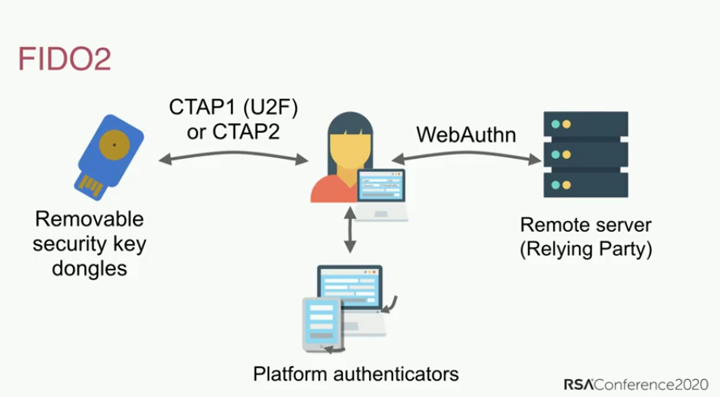

**Multi-Faktor-Authentisierung** (**MFA**) ist ein Sicherheitsmechanismus, der über die Eingabe von Benutzername (oder E-Mail) und Passwort hinaus zusätzliche Schritte erfordert. Die gängigste Methode sind zeitlich begrenzte Codes, die du per SMS oder über eine App erhalten kannst.

Wenn ein Hacker (oder Angreifer) in der Lage ist, dein Passwort herauszufinden, erhält dieser normalerweise Zugang zu dem Konto, zu dem dieses Passwort gehört. Ein Konto mit MFA zwingt den Hacker dazu, sowohl das Passwort (etwas, das du *weißt*) als auch ein Gerät zu haben, das dir gehört (etwas, das du *hast*), wie dein Handy.

MFA-Methoden sind unterschiedlich sicher, basieren aber auf der Prämisse, dass es umso besser ist, je schwieriger es für den Angreifer ist, Zugang zu deiner MFA-Methode zu erhalten. Beispiele für MFA-Methoden (von der schwächsten zur stärksten) sind SMS, E-Mail-Codes, App-Push-Benachrichtigungen, TOTP, Yubico OTP und FIDO.

## Vergleich von MFA-Methoden

### SMS oder E-Mail MFA

Der Empfang von OTP-Codes per SMS oder E-Mail ist eine der schwächeren Möglichkeiten, deine Konten mit MFA zu sichern. Die Beschaffung eines Codes per E-Mail oder SMS geht an der Idee des "etwas, das man *hat*" vorbei, denn es gibt eine Vielzahl von Möglichkeiten, wie ein Hacker [deine Telefonnummer übernehmen](https://de.wikipedia.org/wiki/SIM-Swapping) oder sich Zugang zu deiner E-Mails verschaffen kann, ohne physischen Zugang zu einem deiner Geräte zu haben. Wenn eine unbefugte Person Zugang zu deiner E-Mail hätte, könnte sie diesen Zugang nutzen, um sowohl dein Passwort zurückzusetzen als auch den Authentifizierungscode zu erhalten, wodurch sie vollen Zugriff auf dein Konto hätte.

### Push-Benachrichtigungen

MFA per Push-Benachrichtigung erfolgt in Form einer Nachricht, die an eine App auf deinem Smartphone gesendet wird und dich auffordert, neue Kontoanmeldungen zu bestätigen. Diese Methode ist viel besser als SMS oder E-Mail, da ein Angreifer diese Push-Benachrichtigungen in der Regel nur dann erhalten kann, wenn er ein bereits angemeldetes Gerät hat, was bedeutet, dass er zuerst eines deiner anderen Geräte kompromittieren müsste.

Wir alle machen Fehler, und es besteht die Gefahr, dass du den Anmeldeversuch versehentlich akzeptierst. Anmeldeautorisierungen per Push-Benachrichtigung werden in der Regel an *alle* deine Geräte gleichzeitig gesendet, was die Verfügbarkeit des MFA-Codes bei vielen Geräten erhöht.

Die Sicherheit der MFA für Push-Benachrichtigungen hängt sowohl von der Qualität der App und der Serverkomponente als auch vom Vertrauen des Entwicklers ab, der sie erstellt. Bei der Installation einer App musst du möglicherweise auch invasive Berechtigungen akzeptieren, die den Zugriff auf andere Daten auf deinem Gerät ermöglichen. Eine individuelle App erfordert auch, dass du für jeden Dienst eine eigene App hast, die im Gegensatz zu einer guten TOTP-Generator-App kein Passwort zum Öffnen erfordert.

### Zeitbasiertes Einmalpasswort (TOTP)

TOTP ist eine der am weitesten verbreiteten Formen zur MFA. Bei der Einrichtung von TOTP musst du in der Regel einen [QR-Code](https://de.wikipedia.org/wiki/QR-Code) scannen, der ein [gemeinsames Geheimnis](https://de.wikipedia.org/wiki/Gemeinsames_Geheimnis) mit dem Dienst, den du nutzen möchten, festlegt. Das gemeinsame Geheimnis ist in den Daten der Authentifikator-App gesichert und manchmal durch ein Passwort geschützt.

Der zeitlich begrenzte Code wird dann aus dem gemeinsamen Geheimnis und der aktuellen Zeit abgeleitet. Da der Code nur für eine kurze Zeit gültig ist, kann ein Angreifer ohne Zugang zum gemeinsamen Geheimnis keine neuen Codes erzeugen.

Wenn du einen Hardware-Sicherheitsschlüssel mit TOTP-Unterstützung hast (z. B. einen YubiKey mit [Yubico Authenticator](https://yubico.com/products/yubico-authenticator)), empfehlen wir, dass du dein "gemeinsamen Geheimnisse" auf der Hardware speicherst. Hardware wie der YubiKey wurde mit der Absicht entwickelt, das "gemeinsame Geheimnis" schwer zu extrahieren und zu kopieren. Ein YubiKey ist auch nicht mit dem Internet verbunden, im Gegensatz zu einem Handy mit einer TOTP-App.

Im Gegensatz zu [WebAuthn](#fido-fast-identity-online) bietet TOTP keinen Schutz vor [Phishing-](https://en.wikipedia.org/wiki/Phishing) oder Reuse-Angriffen. Wenn ein Angreifer einen gültigen Code von dir erhält, kann er ihn so oft verwenden, bis er abläuft (in der Regel 60 Sekunden).

Ein Angreifer könnte eine Website einrichten, die einen offiziellen Dienst imitiert, um dich dazu zu bringen, deinen Benutzernamen, dein Passwort und deinen aktuellen TOTP-Code preiszugeben. Wenn der Angreifer dann diese aufgezeichneten Anmeldedaten verwendet, kann er sich bei dem echten Dienst anmelden und das Konto übernehmen.

Obwohl nicht perfekt, ist TOTP für die meisten Menschen sicher genug, und wenn [Hardware-Sicherheitsschlüssel](../security-keys.md) nicht unterstützt werden, sind [Authentifizierungs-Apps](../multi-factor-authentication.md) immer noch eine gute Option.

### Hardware-Sicherheitsschlüssel

Der YubiKey speichert die Daten auf einem manipulationssicheren Solid-State-Chip, der ohne ein teures Verfahren und ein forensisches Labor [nicht zerstörungsfrei zugänglich](https://security.stackexchange.com/a/245772) ist.

Diese Schlüssel sind in der Regel multifunktional und bieten eine Reihe von Authentifizierungsmethoden. Im Folgenden sind die häufigsten aufgeführt.

#### Yubico OTP

Yubico OTP ist ein Authentifizierungsprotokoll, das normalerweise in Hardware-Sicherheitsschlüsseln implementiert ist. Wenn du dich für die Verwendung von Yubico OTP entscheidest, generiert der Schlüssel eine öffentliche ID, eine private ID und einen geheimen Schlüssel, der dann auf den Yubico OTP-Server hochgeladen wird.

Wenn du dich bei einer Website anmeldest, musst du nur den Sicherheitsschlüssel berühren. Der Sicherheitsschlüssel emuliert eine Tastatur und druckt ein einmaliges Passwort in das Passwortfeld.

Der Dienst leitet dann das Einmalpasswort zur Validierung an den Yubico OTP-Server weiter. Sowohl auf dem Schlüssel als auch auf dem Validierungsserver von Yubico wird ein Zähler hochgezählt. Das OTP kann nur einmal verwendet werden, und bei einer erfolgreichen Authentifizierung wird der Zähler erhöht, was eine erneute Verwendung des OTP verhindert. Yubico stellt eine [detaillierte Dokumentation](https://developers.yubico.com/OTP/OTPs_Explained.html) über den Prozess zur Verfügung.

<figure markdown>
  
</figure>

Die Verwendung von Yubico OTP hat im Vergleich zu TOTP einige Vor- und Nachteile.

Der Validierungsserver von Yubico ist ein cloudbasierter Dienst, und du vertraust darauf, dass Yubico deine Daten sicher speichert und kein Profil von dir erstellt. Die öffentliche ID, die mit dem Yubico OTP verbunden ist, wird auf jeder Website wiederverwendet und könnte eine weitere Möglichkeit für Dritte sein, ein Profil von dir zu erstellen. Wie TOTP bietet auch Yubico OTP keinen Schutz vor Phishing.

Wenn dein Bedrohungsmodell unterschiedliche Identitäten auf verschiedenen Websites erfordert, solltest du Yubico OTP **nicht** mit demselben Hardware-Sicherheitsschlüssel auf diesen Websites verwenden, da die öffentliche ID für jeden Sicherheitsschlüssel eindeutig ist.

#### FIDO (Fast IDentity Online)

[FIDO](https://en.wikipedia.org/wiki/FIDO_Alliance) umfasst eine Reihe von Standards, zuerst U2F und später [FIDO2](https://en.wikipedia.org/wiki/FIDO2_Project), welches den Webstandard [WebAuthn](https://en.wikipedia.org/wiki/WebAuthn) beinhaltet.

U2F und FIDO2 beziehen sich auf das [Client to Authenticator Protocol](https://de.wikipedia.org/wiki/Client_to_Authenticator_Protocol), d. h. das Protokoll zwischen dem Sicherheitsschlüssel und dem Computer, z. B. einem Laptop oder Telefon. Es ergänzt WebAuthn, die Komponente zur Authentifizierung bei der Website (der "Relying Party"), bei der du dich anzumelden versuchst.

WebAuthn ist die sicherste und privatste Form der Zweitfaktor-Authentifizierung. Die Authentifizierung ist ähnlich wie bei Yubico OTP, aber der Schlüssel druckt kein Einmalpasswort aus und validiert nicht mit einem Server eines Drittanbieters. Stattdessen wird für die Authentifizierung ein [asymetrische Kryptosystem](https://de.wikipedia.org/wiki/Asymmetrisches_Kryptosystem) verwendet (Public-Key-Cryptography).

<figure markdown>
  
</figure>

Wenn du ein Konto anlegst, wird der öffentliche Schlüssel an den Dienst gesendet. Wenn du dich dann anmeldest, verlangt der Dienst, dass du einige Daten mit deinem privaten Schlüssel "signierst". Dies hat den Vorteil, dass der Dienst keine Passwortdaten speichert, sodass ein Angreifer nichts stehlen kann.

Diese Präsentation diskutiert den Verlauf der Passwort-Authentifizierung, die Fallstricke (wie die Wiederverwendung von Passworten) und die Standards für FIDO2 und [WebAuthn](https://webauthn.guide):

- [How FIDO2 and WebAuthn Stop Account Takeovers](https://youtu.be/aMo4ZlWznao) <small>(YouTube)</small>

FIDO2 und WebAuthn haben im Vergleich zu anderen MFA-Methoden überlegene Sicherheits- und Datenschutzeigenschaften.

Typically, for web services it is used with WebAuthn which is a part of the [W3C recommendations](https://en.wikipedia.org/wiki/World_Wide_Web_Consortium#W3C_recommendation_(REC)). It uses public key authentication and is more secure than shared secrets used in Yubico OTP and TOTP methods, as it includes the origin name (usually, the domain name) during authentication. Attestation is provided to protect you from phishing attacks, as it helps you to determine that you are using the authentic service and not a fake copy.

Unlike Yubico OTP, WebAuthn does not use any public ID, so the key is **not** identifiable across different websites. It also does not use any third-party cloud server for authentication. All communication is completed between the key and the website you are logging into. FIDO also uses a counter which is incremented upon use in order to prevent session reuse and cloned keys.

If a website or service supports WebAuthn for the authentication, it is highly recommended that you use it over any other form of MFA.

## Allgemeine Empfehlungen

Wir haben folgende allgemeine Empfehlungen:

### Which Method Should I Use?

When configuring your MFA method, keep in mind that it is only as secure as your weakest authentication method you use. This means it is important that you only use the best MFA method available. For instance, if you are already using TOTP, you should disable email and SMS MFA. If you are already using FIDO2/WebAuthn, you should not be using Yubico OTP or TOTP on your account.

### Backups

You should always have backups for your MFA method. Hardware security keys can get lost, stolen or simply stop working over time. It is recommended that you have a pair of hardware security keys with the same access to your accounts instead of just one.

When using TOTP with an authenticator app, be sure to back up your recovery keys or the app itself, or copy the "shared secrets" to another instance of the app on a different phone or to an encrypted container (e.g. [VeraCrypt](../encryption.md#veracrypt-disk)).

### Initial Set Up

When buying a security key, it is important that you change the default credentials, set up password protection for the key, and enable touch confirmation if your key supports it. Products such as the YubiKey have multiple interfaces with separate credentials for each one of them, so you should go over each interface and set up protection as well.

### E-Mail und SMS

If you have to use email for MFA, make sure that the email account itself is secured with a proper MFA method.

If you use SMS MFA, use a carrier who will not switch your phone number to a new SIM card without account access, or use a dedicated VoIP number from a provider with similar security to avoid a [SIM swap attack](https://en.wikipedia.org/wiki/SIM_swap_scam).

[MFA tools we recommend](../multi-factor-authentication.md ""){.md-button}

## Weitere Orte zum Einrichten von MFA

Die Multi-Faktor-Authentisierung sichert nicht nur deine Website-Anmeldungen, sondern auch deine lokalen Anmeldungen, SSH-Schlüssel und sogar Passwortdatenbanken.

### macOS

macOS has [native support](https://support.apple.com/guide/deployment/intro-to-smart-card-integration-depd0b888248/web) for authentication with smart cards (PIV). If you have a smart card or a hardware security key that supports the PIV interface such as the YubiKey, we recommend that you follow your smart card or hardware security vendor's documentation and set up second factor authentication for your macOS computer.

Yubico have a guide [Using Your YubiKey as a Smart Card in macOS](https://support.yubico.com/hc/articles/360016649059) which can help you set up your YubiKey on macOS.

After your smart card/security key is set up, we recommend running this command in the Terminal:

```text
sudo defaults write /Library/Preferences/com.apple.loginwindow DisableFDEAutoLogin -bool YES
```

The command will prevent an adversary from bypassing MFA when the computer boots.

### Linux

<div class="admonition warning" markdown>
<p class="admonition-title">Warnung</p>

If the hostname of your system changes (such as due to DHCP), you would be unable to login. It is vital that you set up a proper hostname for your computer before following this guide.

</div>

The `pam_u2f` module on Linux can provide two-factor authentication for logging in on most popular Linux distributions. If you have a hardware security key that supports U2F, you can set up MFA authentication for your login. Yubico has a guide [Ubuntu Linux Login Guide - U2F](https://support.yubico.com/hc/articles/360016649099-Ubuntu-Linux-Login-Guide-U2F) which should work on any distribution. The package manager commands—such as `apt-get`—and package names may however differ. This guide does **not** apply to Qubes OS.

### Qubes OS

Qubes OS has support for Challenge-Response authentication with YubiKeys. If you have a YubiKey with Challenge-Response authentication support, take a look at the Qubes OS [YubiKey documentation](https://qubes-os.org/doc/yubikey) if you want to set up MFA on Qubes OS.

### SSH

#### Hardware-Sicherheitsschlüssel

SSH MFA kann mit mehreren verschiedenen Authentifizierungsmethoden eingerichtet werden, die mit Hardware-Sicherheitsschlüsseln beliebt sind. Wir empfehlen dir, in der [Dokumentation](https://developers.yubico.com/SSH) von Yubico nachzulesen, wie du dies einrichten kannst.

#### TOTP

SSH MFA kann auch mit TOTP eingerichtet werden. DigitalOcean hat ein Tutorial [Wie man Multi-Faktor-Authentisierung für SSH auf Ubuntu 20.04](https://digitalocean.com/community/tutorials/how-to-set-up-multi-factor-authentication-for-ssh-on-ubuntu-20-04) einrichtet. Die meisten Dinge sollten unabhängig von der Distribution gleich sein, aber die Befehle des Paketmanagers — wie `apt-get` — und die Paketnamen können sich unterscheiden.

### KeePass (und KeePassXC)

KeePass and KeePassXC databases can be secured using HOTP or Challenge-Response as a second-factor of authentication. Yubico has provided a document for KeePass [Using Your YubiKey with KeePass](https://support.yubico.com/hc/articles/360013779759-Using-Your-YubiKey-with-KeePass) and there is also one on the [KeePassXC](https://keepassxc.org/docs/#faq-yubikey-2fa) website.
