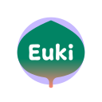

Wenn du eine bestimmte Lösung für etwas suchst, gibt es diese Empfehlungen von Hardware und Software in einer Vielzahl von Kategorien. Unsere empfohlenen Privatsphären-Tools sind hauptsächlich wegen ihren Sicherheitsfeatures ausgewählt, mit zusätzlichen Schwerpunkt auf dezentralisierte und quelloffene Tools. Sie sind auf eine Vielzahl von Bedrohungsmodellen anwendbar, von Schutz vor globale Massenüberwachung und Vermeidung von Big Tech bis zur Verminderung von Angriffen, aber nur du kannst bestimmen was am besten für dir funktioniert.

[VPN-Anbieter](vpn.md){ .md-button }
[Password Managers](passwords.md){ .md-button }
[E-Mail-Anbieter](email.md){ .md-button }
[Browser Extensions](browser-extensions.md){ .md-button }
[DNS Server](dns.md){ .md-button }
[Email-Aliasing-Dienste](email-aliasing.md){ .md-button }
[Foto-Organisation-Tools](photo-management.md){ .md-button }

[Self-hosting Empfehlungen](self-hosting/index.md) wurden in ihrer eigenen Kategorie bewegt.

Wenn du Hilfe mit dem Herausfinden von den besten Privatsphären-Tools oder alternativen Programmen brauchst, kannst du eine Diskussion in unserem [Forum](https://discuss.privacyguides.net) oder in unserem [Matrix](https://matrix.to/#/#privacyguides:matrix.org) Kanal erstellen!

Drücke auf den "Mehr lernen" link oder auf die Empfehlung selber für mehr Details über das Projekt, warum wir es ausgewählt haben und zusätzliche Tipps und Tricks die wir Empfehlen.

- [x] **Werbungsfreie Empfehlungen**
- [x] **Häufige Updates**
- [x] **Von Lesern vertraut**

- [x] **Komplette redaktionelle Unabhängigkeit**
- [x] **Quelloffene Beiträge**
- [x] **Von Journalisten vertraut**

## Private Web-Browser

{ align=left }

**Tor Browser** (Desktop & Android) ist die beste Wahl, falls du anonymität brauchst, da es dir zum **Tor** Netzwerk zugriff gibt, das Tor Netzwerk ist eine Gruppe von Freiwilligen-betriebenen Servern die dir erlauben, dich kostenlos zu verbinden um deine Privatsphäre und Sicherheit im Internet zu verbessern. Einzelpersonen und Organisationen können auch Informationen über das Tor-Netzwerk mit ".onion versteckten Diensten" austauschen, ohne ihre Privatsphäre zu gefährden. Da der Tor-Verkehr schwer zu blockieren und zurückzuverfolgen ist, ist Tor ein effektives Werkzeug zur Zensur Umgehung.

[Lese unsere vollständige Review :material-arrow-right-drop-circle:](tor.md){ .md-button .md-button--primary }

- { .lg .middle .twemoji } **Mullvad Browser**

    ---

    **Mullvad Browser** ist eine Version vom [Tor Browser](tor.md#tor-browser) ohne Tor Integrationen, ausgerichtet um Tor Browsers Anti-Fingerprinting Technologien VPN Nutzern anzubieten.

    - [Lese die vollständige Review :material-arrow-right-drop-circle:](desktop-browsers.md#mullvad-browser)

- { .lg .middle .twemoji } **Firefox**

    ---

    **Firefox** ist eine gute Chromium Alternative die starke Privatsphären-Einstellungen bietet, wie [Erweiterter Schutz vor Aktivitätenverfolgung](https://support.mozilla.org/kb/enhanced-tracking-protection-firefox-desktop), was mehrere [Arten von Tracking](https://support.mozilla.org/kb/enhanced-tracking-protection-firefox-desktop#w_what-enhanced-tracking-protection-blocks) blockiert.

    - [Lese die vollständige Review :material-arrow-right-drop-circle:](desktop-browsers.md#firefox)

- { .lg .middle .twemoji } **Brave Browser**

    ---

    **Brave** ist ein "private-by-default" Browser dass auf Chromium basiert, also sollte es sich vertraut anfühlen und sollte minimale Kompatibilitätsprobleme mit Webseiten haben.

    - [Brave Desktop Review :material-arrow-right-drop-circle:](desktop-browsers.md#brave)
    - [Brave Mobile Review :material-arrow-right-drop-circle:](mobile-browsers.md#brave)

- { .lg .middle .twemoji } **Cromite (Android)**

    ---

    **Cromite** ist ein Chromium-basierter Android browser mit eingebautes ad-blocking and [Privatsphären-Verbesserungen](https://github.com/uazo/cromite/blob/master/docs/FEATURES.md). Es ist ein Fork des bekannten und eingestellten Bromite Browser.

    - [Lese die vollständige Review :material-arrow-right-drop-circle:](mobile-browsers.md#cromite-android)

- { .lg .middle .twemoji } **Safari (iOS)**

    ---

    wir empfehlen **Safari** wegen die [Anti-Fingerprinting](https://webkit.org/blog/15697/private-browsing-2-0)-Features sowie das standardmäßige Tracker-Blocking. Es trennt deine Cookies im Privaten-Browsing-Modus, um Tracking zwischen Tabs zu verhindern.

    - [Lese die vollständige Review :material-arrow-right-drop-circle:](mobile-browsers.md#safari-ios)

### Browsererweiterungen

- { .twemoji loading=lazy } [uBlock Origin](browser-extensions.md#ublock-origin)
- { .twemoji loading=lazy } [uBlock Origin Lite](browser-extensions.md#ublock-origin-lite)
- { .twemoji loading=lazy } [AdGuard für iOS](browser-extensions.md#adguard)

### Mehr Tor-Netzwerk Tools

- { .twemoji loading=lazy } [Onion Browser (Tor für iOS)](tor.md#onion-browser-ios)

## Top 3 Private VPN-Anbieter

VPNs bieten keine Anonymität

Das Nutzen eines VPNs wird **nicht** deine Browsing-Angewohnheiten anonymisieren, es wird auch nicht zusätzliche Sicherheit zu nicht-sicheren (HTTP) Verkehr hinzufügen.

Wenn du **Anonymität** suchst, solltest du Tor Browser benutzen.

Wenn du zusätzliche **Sicherheit** suchst, solltest du immer sicherstellen, dass du dich zu Webseiten über HTTPS verbindest. Ein VPN ist kein guter Ersatz für gute Sicherheitspraktiken.

[Lerne mehr :material-arrow-right-drop-circle:](vpn.md)

- { .lg .middle .twemoji } **Proton VPN**

    ---

    - [x] **112+ Länder**
    - [x] Unterstützt WireGuard
    - [x] Bargeldzahlungen
    - [x] Unterstützt Port-Weiterleitung
    - [ ] Kein IPv6

    [Lese die vollständige Review :material-arrow-right-drop-circle:](vpn.md#proton-vpn)

- { .lg .middle .twemoji } **IVPN**

    ---

    - [x] **37+ Länder**
    - [x] Unterstützt WireGuard
    - [x] Monero- & Bargeldzahlungen
    - [ ] Keine Port-Weiterleitung
    - [ ] Kein IPv6

    [Lese die vollständige Review :material-arrow-right-drop-circle:](vpn.md#ivpn)

- { .lg .middle .twemoji } **Mullvad**

    ---

    - [x] **49+ Länder**
    - [x] Unterstützt WireGuard
    - [x] Monero- & Bargeldzahlungen
    - [ ] Keine Port-Weiterleitung
    - [x] Unterstützt IPv6

    [Lese die vollständige Review :material-arrow-right-drop-circle:](vpn.md#mullvad)

## Top 3 private E-Mail-Anbieter

- { .lg .middle .twemoji } **Proton Mail**

    ---

    Proton Mail ist ein E-Mail-Dienst mit Fokus auf Privatsphäre, Verschlüsselung, Sicherheit, und Bedienkomfort. Sie sind seit 2013 in Betrieb. Die Proton AG hat ihren Sitz in Genf, Schweiz. Der Proton Mail Free Tarif beinhaltet 500 MB Mailspeicher, den du kostenlos auf bis zu 1 GB erweitern kannst.

    [Lese die vollständige Review :material-arrow-right-drop-circle:](email.md#proton-mail)

- { .lg .middle .twemoji } **Mailbox Mail**

    ---

    **Mailbox Mail** (ehemalig *Mailbox.org*) ist ein E-Mail-Anbieter mit Fokus auf Sicherheit sowie Werbungsfreiheit und wird von 100% umweltverträglicher Energie betrieben. Es wird seit 2014 betrieben. Mailbox Mail hat ihren Sitz in Berlin, Deutschland. Konten beginnen mit 2 GB Speicherplatz, der nach Bedarf erweitert werden kann.

    [Lese die vollständige Review :material-arrow-right-drop-circle:](email.md#mailbox-mail)

- { .lg .middle .twemoji }{ .lg .middle .twemoji } **Tuta**

    ---

    Tuta (ehemalig *Tutanota*) ist ein E-Mail-Dienst mit Fokus auf Sicherheit and Privatsphäre über Verschlüsselung. Tuta ist seit 2011 in Betrieb und hat seinen Sitz in Hannover, Deutschland. Kostenlose Konten starten mit 1 GB Speicher.

    [Lese die vollständige Review :material-arrow-right-drop-circle:](email.md#tuta)

### Email-Aliasing-Dienste

- { .twemoji loading=lazy } [Addy.io](email-aliasing.md#addyio)
- { .twemoji loading=lazy } [SimpleLogin](email-aliasing.md#simplelogin)

### Sichere Email-Clients

- { .twemoji loading=lazy } [Thunderbird](email-clients.md#thunderbird)
- { .twemoji loading=lazy } [Apple Mail (macOS)](email-clients.md#apple-mail-macos)
- { .twemoji loading=lazy } [FairEmail (Android)](email-clients.md#fairemail-android)
- { .twemoji loading=lazy } [GNOME Evolution (Linux)](email-clients.md#gnome-evolution-gnome)
- { .twemoji loading=lazy } [Kontact (Linux)](email-clients.md#kontact-kde)
- { .twemoji loading=lazy } [Mailvelope (PGP in standard webmail)](email-clients.md#mailvelope-browser)
- { .twemoji loading=lazy } [NeoMutt (CLI)](email-clients.md#neomutt-cli)

[Lerne mehr :material-arrow-right-drop-circle:](email-clients.md)

## Mehr private Dienstanbieter

### Cloudspeicher

- { .twemoji loading=lazy } [Proton Drive](cloud.md#proton-drive)
- { .twemoji loading=lazy } [Tresorit](cloud.md#tresorit)
- { .twemoji loading=lazy } [Peergos](cloud.md#peergos)

[Lerne mehr :material-arrow-right-drop-circle:](cloud.md)

### Datenentfernungsdienste

- { .twemoji loading=lazy } [EasyOptOuts](data-broker-removals.md#easyoptouts-paid)
- { .twemoji loading=lazy } [Google *Results about you*](data-broker-removals.md#google-results-about-you-free)

[Lerne mehr :material-arrow-right-drop-circle:](data-broker-removals.md)

### DNS

#### DNS-Anbieter

Wir [empfehlen](dns.md#recommended-providers) eine Mehrzahl von verschlüsselten DNS-Servern aufgrund verschiedenen Kriterien, wie z.B. [Mullvad](https://mullvad.net/en/help/dns-over-https-and-dns-over-tls) und [Quad9](https://quad9.net) sowie andere. Wir empfehlen dir unsere Seiten die DNS besprechen zu lesen bevor du einen Anbieter wählst. In vielen Fällen ist das Nutzen eines alternativen DNS-Anbieters nicht empfehlbar.

[Lerne mehr :material-arrow-right-drop-circle:](dns.md)

#### Verschlüsselte DNS-Proxies

- { .twemoji loading=lazy }{ .twemoji loading=lazy } [RethinkDNS](dns.md#rethinkdns)
- { .twemoji loading=lazy } [DNSCrypt-Proxy](dns.md#dnscrypt-proxy)

[Lerne mehr :material-arrow-right-drop-circle:](dns.md#encrypted-dns-proxies)

### Finanziele Dienste

#### Zahlungabdeckungsdienste

- { .twemoji loading=lazy }{ .twemoji loading=lazy } [Privacy.com](financial-services.md#privacycom-us)
- { .twemoji loading=lazy }{ .twemoji loading=lazy } [MySudo](financial-services.md#mysudo-us-paid)

[Lerne mehr :material-arrow-right-drop-circle:](financial-services.md#payment-masking-services)

#### Online Geschenkkartenmärkte

- { .twemoji loading=lazy } [Coincards](financial-services.md#coincards)

[Lerne mehr :material-arrow-right-drop-circle:](financial-services.md#gift-card-marketplaces)

### Fotomanagement

- { .twemoji loading=lazy } [Ente Photos](photo-management.md#ente-photos)

[Lerne mehr :material-arrow-right-drop-circle:](photo-management.md)

### Suchmaschinen

- { .twemoji loading=lazy } [Brave Search](search-engines.md#brave-search)
- { .twemoji loading=lazy } [DuckDuckGo](search-engines.md#duckduckgo)
- { .twemoji loading=lazy } [SearXNG](search-engines.md#searxng)
- { .twemoji loading=lazy }{ .twemoji loading=lazy } [Startpage](search-engines.md#startpage)

[Lerne mehr :material-arrow-right-drop-circle:](search-engines.md)

## Software

### KI Chat

- { .twemoji loading=lazy } [Kobold.cpp](ai-chat.md#koboldcpp)
- { .twemoji loading=lazy } [Llamafile](ai-chat.md#llamafile)
- { .twemoji loading=lazy } [Ollama (CLI)](ai-chat.md#ollama-cli)

[Lerne mehr :material-arrow-right-drop-circle:](ai-chat.md)

### Kalendersynchronisierung

- { .twemoji loading=lazy }{ .twemoji loading=lazy } [Tuta](calendar.md#tuta)
- { .twemoji loading=lazy } [Proton Calendar](calendar.md#proton-calendar)

[Lerne mehr :material-arrow-right-drop-circle:](calendar.md)

### Kryptowährung

- { .twemoji loading=lazy } [Monero](cryptocurrency.md#monero)

[Lerne mehr :material-arrow-right-drop-circle:](cryptocurrency.md)

### Daten- und Metadatenschwärzung

- { .twemoji loading=lazy } [MAT2](data-redaction.md#mat2)
- { .twemoji loading=lazy } [ExifEraser (Android)](data-redaction.md#exiferaser-android)
- { .twemoji loading=lazy } [ExifTool (CLI)](data-redaction.md#exiftool-cli)

[Lerne mehr :material-arrow-right-drop-circle:](data-redaction.md)

### Dokumentenzusammenarbeit

- { .twemoji loading=lazy } [CryptPad](document-collaboration.md#cryptpad)

[Lerne mehr :material-arrow-right-drop-circle:](document-collaboration.md)

### Verschlüsselungssoftware

Betriebssystemverschlüsselung

Um deine OS Festplatte zu verschlüsseln, empfehlen wir typischerweise das Verschlüsselungs-Tool, dass dein Betriebssystem anbietet, wie **BitLocker** auf Windows, **FileVault** auf macOS, oder **LUKS** auf Linux. Diese Tools sind mit dem Betriebssystem enthalten und nutzen Hardware-Verschlüsselungs-Elemente wie den [Kryptoprozessor](basics/hardware.md/#tpmsecure-cryptoprocessor).

[Lerne mehr :material-arrow-right-drop-circle:](encryption.md#operating-system-encryption)

#### Platformunabhängige Tools

- { .twemoji loading=lazy } [Cryptomator](encryption.md#cryptomator-cloud)
- { .twemoji loading=lazy }{ .twemoji loading=lazy } [VeraCrypt (FDE)](encryption.md#veracrypt-disk)
- { .twemoji loading=lazy } [Kryptor](encryption.md#kryptor)
- { .twemoji loading=lazy } [Tomb](encryption.md#tomb)

[Lerne mehr :material-arrow-right-drop-circle:](encryption.md)

#### OpenPGP Clients

- { .twemoji loading=lazy } [GnuPG](encryption.md#gnu-privacy-guard)
- { .twemoji loading=lazy } [GPG4Win (Windows)](encryption.md#gpg4win)
- { .twemoji loading=lazy } [GPG Suite (macOS)](encryption.md#gpg-suite)
- { .twemoji loading=lazy } [OpenKeychain](encryption.md#openkeychain)

[Lerne mehr :material-arrow-right-drop-circle:](encryption.md#openpgp)

### File-Sharing und Synchronisation

- { .twemoji loading=lazy } [Send](file-sharing.md#send)
- { .twemoji loading=lazy } [OnionShare](file-sharing.md#onionshare)
- { .twemoji loading=lazy } [Syncthing](file-sharing.md#syncthing-p2p)

[Lerne mehr :material-arrow-right-drop-circle:](file-sharing.md)

### Frontends

- { .twemoji loading=lazy } [Redlib (Reddit, Web)](frontends.md#redlib)
- { .twemoji loading=lazy } [ProxiTok (TikTok, Web)](frontends.md#proxitok)
- { .twemoji loading=lazy } [FreeTube (YouTube, Desktop)](frontends.md#freetube)
- { .twemoji loading=lazy }{ .twemoji loading=lazy } [LibreTube (YouTube, Android)](frontends.md#libretube-android)
- { .twemoji loading=lazy } [NewPipe (YouTube, Android)](frontends.md#newpipe-android)
- { .twemoji loading=lazy }{ .twemoji loading=lazy } [Invidious (YouTube, Web)](frontends.md#invidious)
- { .twemoji loading=lazy } [Piped (YouTube, Web)](frontends.md#piped)

[Lerne mehr :material-arrow-right-drop-circle:](frontends.md)

### Gesundheits- und Wohlbefinden Apps

- { .twemoji loading=lazy } [Drip](health-and-wellness.md#drip)
- { .twemoji loading=lazy } [Euki](health-and-wellness.md#euki)
- { .twemoji loading=lazy } [Apple Fitness](health-and-wellness.md#apple-fitness)
- { .twemoji loading=lazy }{ .twemoji loading=lazy } [Gadgetbridge](health-and-wellness.md#gadgetbridge)
- { .twemoji loading=lazy } { .twemoji loading=lazy } [Apple Health Records](health-and-wellness.md#apple-health-records)
- { .twemoji loading=lazy } [CommonHealth](health-and-wellness.md#commonhealth)

[Lerne mehr :material-arrow-right-drop-circle:](health-and-wellness.md)

### Sprach-Tools

- { .twemoji loading=lazy }{ .twemoji loading=lazy } [LanguageTool](language-tools.md#languagetool)
- { .twemoji } [LibreTranslate](language-tools.md#libretranslate)

[Lerne mehr :material-arrow-right-drop-circle:](language-tools.md)

### Karten und Navigation Apps

- { .twemoji loading=lazy } [Organic Maps](maps.md#organic-maps)
- { .twemoji loading=lazy } [OsmAnd](maps.md#osmand)

[Lerne mehr :material-arrow-right-drop-circle:](maps.md)

### Multi-Faktor-Authentifizierungs Tools

**Hinweis:** [Hardware-Sicherheits-Schlüssel](#security-keys) wurden in ihre eigene Kategorie bewegt.

- { .twemoji loading=lazy } [Ente Auth](multi-factor-authentication.md#ente-auth)
- { .twemoji loading=lazy } [Aegis Authenticator (Android)](multi-factor-authentication.md#aegis-authenticator-android)

[Lerne mehr :material-arrow-right-drop-circle:](multi-factor-authentication.md)

### News-Aggregatoren

- { .twemoji loading=lazy } [Akregator](news-aggregators.md#akregator)
- { .twemoji loading=lazy } [NewsFlash](news-aggregators.md#newsflash)
- { .twemoji} [Feeder (Android)](news-aggregators.md#feeder)
- { .twemoji loading=lazy }{ .twemoji loading=lazy } [Miniflux](news-aggregators.md#miniflux)
- { .twemoji loading=lazy } [NetNewsWire](news-aggregators.md#netnewswire)
- { .twemoji loading=lazy } [Newsboat](news-aggregators.md#newsboat)

[Lerne mehr :material-arrow-right-drop-circle:](news-aggregators.md)

### Notizen

- { .twemoji loading=lazy } [Standard Notes](notebooks.md#standard-notes)
- { .twemoji loading=lazy } [Notesnook](notebooks.md#notesnook)
- { .twemoji loading=lazy } [Joplin](notebooks.md#joplin)
- { .twemoji loading=lazy }{ .twemoji loading=lazy } [Cryptee](notebooks.md#cryptee)
- { .twemoji loading=lazy } [Org-mode](notebooks.md#org-mode)

[Lerne mehr :material-arrow-right-drop-circle:](notebooks.md)

### Office-Suites

- { .twemoji loading=lazy } [LibreOffice](office-suites.md#libreoffice)
- { .twemoji loading=lazy } [OnlyOffice](office-suites.md#onlyoffice)

[Lerne mehr :material-arrow-right-drop-circle:](office-suites.md)

### Passwortmanager

- { .twemoji loading=lazy } [Bitwarden](passwords.md#bitwarden)
- { .twemoji loading=lazy } [Proton Pass](passwords.md#proton-pass)
- { .twemoji loading=lazy } [1Password](passwords.md#1password)
- { .twemoji loading=lazy } [Psono](passwords.md#psono)
- { .twemoji loading=lazy } [KeePassXC](passwords.md#keepassxc)
- { .twemoji loading=lazy } [KeePassDX (Android)](passwords.md#keepassdx-android)
- { .twemoji loading=lazy } [KeePassium (iOS & macOS)](passwords.md#keepassium-ios-macos)
- { .twemoji loading=lazy } [Gopass (CLI)](passwords.md#gopass-cli)

[Lerne mehr :material-arrow-right-drop-circle:](passwords.md)

### Pastebins

- { .twemoji loading=lazy } [PrivateBin](pastebins.md#privatebin)
- { .twemoji loading=lazy } [Paaster](pastebins.md#paaster)

[Lerne mehr :material-arrow-right-drop-circle:](pastebins.md)

### Echtzeit-Kommunikation

- { .twemoji loading=lazy } [Signal](real-time-communication.md#signal)
- { .twemoji loading=lazy } [Briar](real-time-communication.md#briar)
- { .twemoji loading=lazy } [SimpleX Chat](real-time-communication.md#simplex-chat)

[Lerne mehr :material-arrow-right-drop-circle:](real-time-communication.md)

### Soziale Netzwerke

- { .twemoji loading=lazy } [Mastodon](social-networks.md#mastodon)
- { .twemoji loading=lazy } [Element](social-networks.md#element)

[Lerne mehr :material-arrow-right-drop-circle:](social-networks.md)

## Hardware

### Sicherheitsschlüssel

- { .twemoji loading=lazy } [Yubico Security Key](security-keys.md#yubico-security-key)
- { .twemoji loading=lazy } [YubiKey](security-keys.md#yubikey)
- { .twemoji loading=lazy } [Nitrokey](security-keys.md#nitrokey)

[Lerne mehr :material-arrow-right-drop-circle:](security-keys.md)

### Handys

- { .twemoji loading=lazy } [Google Pixel](mobile-phones.md#google-pixel)

[Lerne mehr :material-arrow-right-drop-circle:](mobile-phones.md)

## Betriebssysteme

### Handy

#### Android Betriebssysteme

- { .twemoji loading=lazy }{ .twemoji loading=lazy } [GrapheneOS](android/distributions.md#grapheneos)

[Lerne mehr :material-arrow-right-drop-circle:](android/distributions.md)

#### Android Apps

- { .twemoji loading=lazy } [Shelter (Work Profiles)](android/general-apps.md#shelter)
- { .twemoji loading=lazy }{ .twemoji loading=lazy } [Secure Camera](android/general-apps.md#secure-camera)
- { .twemoji loading=lazy }{ .twemoji loading=lazy } [Secure PDF Viewer](android/general-apps.md#secure-pdf-viewer)

[Lerne mehr :material-arrow-right-drop-circle:](android/general-apps.md)

#### Wege Android Apps zu erhalten

- { .twemoji loading=lazy } [Obtainium (App Manager)](android/obtaining-apps.md#obtainium)
- { .twemoji loading=lazy } [Aurora Store (Google Play Client)](android/obtaining-apps.md#aurora-store)

[Lerne mehr :material-arrow-right-drop-circle:](android/obtaining-apps.md)

### Desktop/PC

- { .twemoji loading=lazy } [Qubes OS (Xen VM Distribution)](desktop.md#qubes-os)
- { .twemoji loading=lazy } [Fedora Linux](desktop.md#fedora-linux)
- { .twemoji loading=lazy } [openSUSE Tumbleweed](desktop.md#opensuse-tumbleweed)
- { .twemoji loading=lazy } [Arch Linux](desktop.md#arch-linux)
- { .twemoji loading=lazy } [Fedora Atomic Desktops](desktop.md#fedora-atomic-desktops)
- { .twemoji loading=lazy } [NixOS](desktop.md#nixos)
- { .twemoji loading=lazy } [Whonix (Tor)](desktop.md#whonix)
- { .twemoji loading=lazy } [Tails (Live Boot)](desktop.md#tails)
- { .twemoji loading=lazy } [Secureblue](desktop.md#secureblue)
- { .twemoji loading=lazy } [Kicksecure](desktop.md#kicksecure)

[Lerne mehr :material-arrow-right-drop-circle:](desktop.md)

### Router-Firmware

- { .twemoji loading=lazy }{ .twemoji loading=lazy } [OpenWrt](router.md#openwrt)
- { .twemoji loading=lazy } [OPNsense](router.md#opnsense)

[Lerne mehr :material-arrow-right-drop-circle:](router.md)

## Fortgeschrittene Tools

Diese Tools können einen Nutzwert für manche Personen haben. Sie bieten Funktionen an, die die meisten Personen nicht brauchen und benötigen auch oft ausführliches Wissen um sie effektiv zu benutzen.

### Alternative Netzwerke

- { .twemoji loading=lazy } { .twemoji loading=lazy } [I2P](alternative-networks.md#i2p-the-invisible-internet-project)
- { .twemoji loading=lazy } [Tor](alternative-networks.md#tor)
- { .twemoji loading=lazy } [Orbot (Mobile Tor Proxy)](alternative-networks.md#orbot)
- { .twemoji loading=lazy }{ .twemoji loading=lazy } [Snowflake](alternative-networks.md#snowflake)

[Lerne mehr :material-arrow-right-drop-circle:](alternative-networks.md)

### Gerät-Integritäts-Überprüfung

- { .twemoji loading=lazy }{ .twemoji loading=lazy } [Mobile Verification Toolkit](device-integrity.md#mobile-verification-toolkit)
- { .twemoji loading=lazy } [iMazing (iOS)](device-integrity.md#imazing-ios)
- { .twemoji loading=lazy }{ .twemoji loading=lazy } [Auditor (Android)](device-integrity.md#auditor-android)

[Lerne mehr :material-arrow-right-drop-circle:](device-integrity.md)
