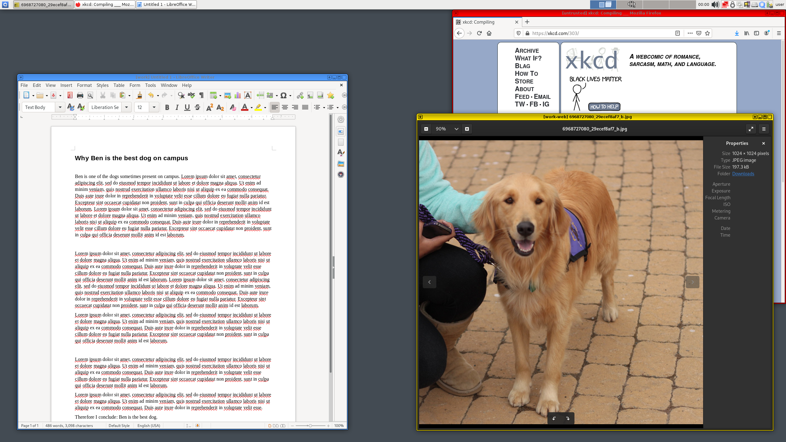

[**Qubes OS**](../desktop.md#qubes-os) est un système d'exploitation open source qui utilise l'hyperviseur [Xen](https://fr.wikipedia.org/wiki/Xen) pour fournir une sécurité forte pour l'informatique de bureau par le biais de *qubes* isolés (qui sont des machines virtuelles). Vous pouvez attribuer à chaque *qube* un niveau de confiance en fonction de son objectif. Qubes OS assure la sécurité en utilisant l'isolation. It only permits actions on a per-case basis and therefore is the opposite of [badness enumeration](https://ranum.com/security/computer_security/editorials/dumb).

## Comment fonctionne Qubes OS ?

Qubes uses [compartmentalization](https://qubes-os.org/intro) to keep the system secure. Les Qubes sont créés à partir de modèles, ceux par défaut étant pour Fedora, Debian et [Whonix](../desktop.md#whonix). Qubes OS also allows you to create once-use [disposable](https://qubes-os.org/doc/how-to-use-disposables) *qubes*.

The term <em>qubes</em> is gradually being updated to avoid referring to them as "virtual machines".

Certaines des informations présentées ici et dans la documentation du système d'exploitation Qubes OS peuvent être contradictoires, car le terme "appVM" est progressivement remplacé par "qube". Les qubes ne sont pas des machines virtuelles à part entière, mais ils conservent des fonctionnalités similaires à celles des VMs.

<figcaption>Architecture de Qubes, Crédit : Intro de Qu'est-ce que Qubes OS</figcaption>

Each qube has a [colored border](https://qubes-os.org/screenshots) that can help you keep track of the domain in which it runs. Vous pouvez, par exemple, utiliser une couleur spécifique pour votre navigateur bancaire, tout en utilisant une couleur différente pour un navigateur général non fiable.

<figcaption>Bordures de fenêtres de Qubes, Crédit : Captures d'écran Qubes</figcaption>

## Pourquoi devrais-je utiliser Qubes ?

Qubes OS est utile si votre [modèle de menace](../basics/threat-modeling.md) exige une sécurité et une isolation fortes, par exemple si vous pensez ouvrir des fichiers non fiables provenant de sources non fiables. Une raison typique d'utiliser Qubes OS est d'ouvrir des documents provenant de sources inconnues, mais l'idée est que si un seul qube est compromis, cela n'affectera pas le reste du système.

Qubes OS utilise une VM Web [dom0](https://wiki.xenproject.org/wiki/Dom0) pour contrôler d'autres *qubes* sur l'OS hôte, qui affichent tous des fenêtres d'application individuelles dans l'environnement de bureau de dom0. Les utilisations de ce type d'architecture sont multiples. Voici quelques tâches que vous pouvez effectuer. Vous pouvez constater à quel point ces processus sont sécurisés par l'incorporation de plusieurs étapes.

### Copier et coller du texte

You can [copy and paste text](https://qubes-os.org/doc/how-to-copy-and-paste-text) using `qvm-copy-to-vm` or the below instructions:

1. Appuyez sur **Ctrl+C** pour indiquer au *qube* dans lequel vous vous trouvez que vous souhaitez copier quelque chose.
2. Appuyez sur **Ctrl+Maj+C** pour demander au *qube* de mettre ce tampon à la disposition du presse-papiers global.
3. Appuyez sur **Ctrl+Maj+V** dans le *qube* de destination pour rendre le presse-papiers global disponible.
4. Appuyez sur **Ctrl+V** dans lr *qube* de destination pour coller le contenu dans le tampon.

### Échange de fichiers

Pour copier et coller des fichiers et des répertoires (dossiers) d'un *qube* à un autre, vous pouvez utiliser l'option **Copier vers une autre AppVM...** ou **Déplacer vers une autre AppVM...**. La différence est que l'option **Déplacer** supprime le fichier d'origine. L'une ou l'autre option protégera votre presse-papiers contre les fuites vers d'autres *qubes*. Cette méthode est plus sûre que le transfert de fichiers air-gapped. Un ordinateur air-gapped sera toujours obligé d'analyser les partitions ou les systèmes de fichiers. Cela n'est pas nécessaire avec le système de copie inter-qube.

Qubes do not have their own filesystems.

You can [copy and move files](https://qubes-os.org/doc/how-to-copy-and-move-files) between *qubes*. Ce faisant, les changements ne sont pas immédiats et peuvent être facilement annulés en cas d'accident. When you run a *qube*, it does not have a persistent filesystem. Vous pouvez créer et supprimer des fichiers, mais ces modifications sont éphémères.

### Interactions inter-VM

The [qrexec framework](https://qubes-os.org/doc/qrexec) is a core part of Qubes which allows communication between domains. It is built on top of the Xen library *vchan*, which facilitates [isolation through policies](https://qubes-os.org/news/2020/06/22/new-qrexec-policy-system).

## Se connecter à Tor via un VPN

Nous [recommandons](../advanced/tor-overview.md) de se connecter au réseau Tor via un fournisseur [VPN](../vpn.md), et heureusement Qubes rend cela très simple à faire avec une combinaison de ProxyVMs et Whonix.

Après [avoir créé un nouveau ProxyVM](https://github.com/Qubes-Community/Contents/blob/master/docs/configuration/vpn.md) qui se connecte au VPN de votre choix, vous pouvez enchaîner vos qubes Whonix à ce ProxyVM **avant** qu'ils se connectent au réseau Tor, en paramétrant le NetVM de votre **passerelle** Whonix (`sys-whonix`) au ProxyVM nouvellement créé.

Vos qubes devraient être configurés de la manière suivante :

| Nom du cube     | Description du Qube                                                                                                    | NetVM           |
| --------------- | ---------------------------------------------------------------------------------------------------------------------- | --------------- |
| sys-net         | *Votre qube réseau par défaut (pré-installé)*                                                                          | *n/a*           |
| sys-firewall    | *Votre qube pare-feu par défaut (pré-installé)*                                                                        | sys-net         |
| ==sys-proxyvm== | Le ProxyVM VPN que vous [avez créé](https://github.com/Qubes-Community/Contents/blob/master/docs/configuration/vpn.md) | sys-firewall    |
| sys-whonix      | Votre VM passerelle Whonix                                                                                             | ==sys-proxyvm== |
| anon-whonix     | Votre VM station de travail Whonix                                                                                     | sys-whonix      |

## Ressources supplémentaires

For additional information we encourage you to consult the extensive Qubes OS documentation pages located on the [Qubes OS Website](https://qubes-os.org/doc). Des copies hors ligne peuvent être téléchargées à partir du [dépôt de documentationde](https://github.com/QubesOS/qubes-doc) Qubes OS.

- [Sans doute le système d'exploitation le plus sécurisé du monde](https://opentech.fund/news/qubes-os-arguably-the-worlds-most-secure-operating-system-motherboard) (Open Technology Fund)
- [Comparaison entre le cloisonnement des logiciels et la séparation physique](https://invisiblethingslab.com/resources/2014/Software_compartmentalization_vs_physical_separation.pdf) (J. Rutkowska)
- [Partitionner ma vie numérique en domaines de sécurité](https://blog.invisiblethings.org/2011/03/13/partitioning-my-digital-life-into.html) (J. Rutkowska)
- [Articles associés](https://qubes-os.org/news/categories/#articles) (Qubes OS)
