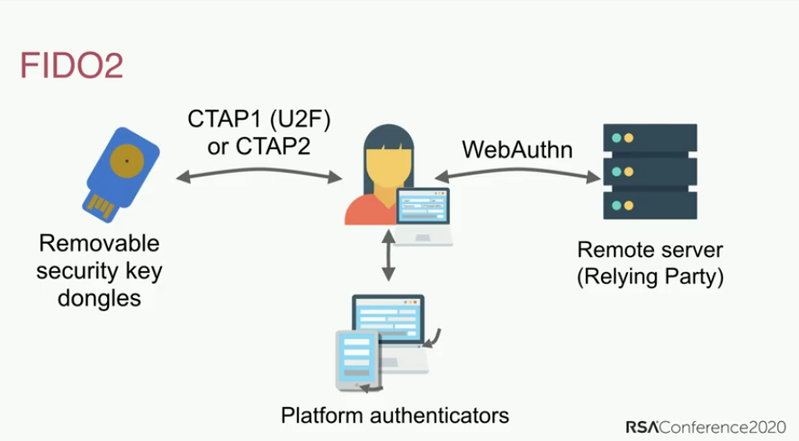

**Autentikasi Multifaktor** (**Multi-Factor Authentication; MFA**) adalah mekanisme keamanan yang memerlukan langkah tambahan selain memasukkan nama pengguna (atau surel) dan kata sandi Anda. Metode yang paling umum adalah kode terbatas waktu yang mungkin Anda terima dari SMS atau aplikasi.

Biasanya, jika seorang peretas (atau musuh) berhasil mengetahui kata sandi Anda, mereka akan mendapatkan akses ke akun pemilik kata sandi tersebut. Akun dengan MFA memaksa peretas untuk mendapatkan kata sandi (sesuatu yang Anda *tahu*) dan perangkat yang Anda miliki (sesuatu yang Anda *miliki*), seperti ponsel Anda.

Metode MFA memiliki keamanan yang berbeda-beda, tetapi didasarkan pada premis bahwa semakin sulit bagi penyerang untuk mendapatkan akses ke metode MFA Anda, maka semakin baik. Contoh metode MFA (dari yang paling lemah hingga yang paling kuat) adalah SMS, kode surel, notifikasi push aplikasi, TOTP, OTP Yubico, dan FIDO.

## Perbandingan Metode MFA

### MFA melalui SMS atau Surel

Menerima kode OTP melalui SMS atau surel adalah salah satu cara yang lemah untuk mengamankan akun Anda dengan MFA. Mendapatkan kode melalui surel atau SMS menghilangkan gagasan "sesuatu yang Anda *miliki*", karena ada berbagai cara seorang peretas dapat [mengambil alih nomor telepon Anda](https://en.wikipedia.org/wiki/SIM_swap_scam) atau mendapatkan akses ke surel Anda tanpa memiliki akses fisik ke perangkat Anda sama sekali. Jika orang yang tidak berwenang mendapatkan akses ke surel Anda, orang tersebut akan dapat menggunakan akses tersebut untuk mengatur ulang kata sandi dan menerima kode autentikasi, sehingga memberikan akses penuh ke akun Anda.

### Notifikasi Push

MFA Notifikasi Push berbentuk pesan yang dikirim ke aplikasi di ponsel Anda yang meminta Anda untuk mengonfirmasi log masuk akun baru. Metode ini jauh lebih baik daripada SMS atau surel, karena penyerang biasanya tidak akan bisa mendapatkan notifikasi Push ini tanpa memiliki perangkat yang sudah masuk log, yang berarti mereka harus membobol salah satu perangkat Anda yang lain terlebih dahulu.

Kita semua pernah melakukan kesalahan, dan ada risiko bahwa Anda mungkin menerima upaya log masuk secara tidak sengaja. Otorisasi masuk melalui notifikasi Push biasanya dikirim ke *semua* perangkat Anda sekaligus, sehingga memperluas ketersediaan kode MFA jika Anda memiliki banyak perangkat.

Keamanan MFA notifikasi Push bergantung pada kualitas aplikasi, komponen server, dan kepercayaan pengembang yang memproduksinya. Menginstal aplikasi mungkin juga mengharuskan Anda untuk menyetujui hak istimewa invasif yang memberikan akses ke data lain di perangkat Anda. Aplikasi individual juga mengharuskan Anda memiliki aplikasi khusus untuk setiap layanan yang mungkin tidak memerlukan kata sandi untuk membukanya, tidak seperti aplikasi generator TOTP yang bagus.

### Time-based One-time Password (TOTP)

TOTP adalah salah satu bentuk MFA yang paling umum yang tersedia. Ketika Anda menyiapkan TOTP, Anda biasanya diminta untuk memindai [Kode QR](https://en.wikipedia.org/wiki/QR_code) yang membentuk "[rahasia bersama](https://en.wikipedia.org/wiki/Shared_secret)" dengan layanan yang ingin Anda gunakan. Rahasia bersama tersebut diamankan dalam data aplikasi autentikator, dan terkadang dilindungi oleh kata sandi.

Kode terbatas waktunya kemudian diperoleh dari rahasia bersama dan waktu saat ini. Karena kode hanya berlaku untuk waktu yang singkat, tanpa akses ke rahasia bersama, musuh tidak dapat membuat kode baru.

If you have a hardware security key with TOTP support (such as a YubiKey with [Yubico Authenticator](https://yubico.com/products/yubico-authenticator)), we recommend that you store your "shared secrets" on the hardware. Perangkat keras seperti YubiKey dikembangkan dengan tujuan untuk membuat "rahasia bersama" menjadi sulit untuk diekstrak dan disalin. YubiKey juga tidak terhubung ke Internet, tidak seperti ponsel dengan aplikasi TOTP.

Tidak seperti [WebAuthn](#fido-fast-identity-online), TOTP tidak menawarkan perlindungan terhadap [pengelabuan](https://en.wikipedia.org/wiki/Phishing) atau serangan penggunaan ulang. Jika musuh mendapatkan kode yang valid dari Anda, mereka bisa menggunakannya sebanyak yang mereka suka sampai kode tersebut kedaluwarsa (umumnya 60 detik).

Musuh dapat membuat situs web untuk meniru layanan resmi dalam upaya mengelabui Anda untuk memberikan nama pengguna, kata sandi, dan kode TOTP Anda saat ini. Jika musuh kemudian menggunakan kredensial yang berhasil dicatat tersebut, mereka mungkin dapat masuk ke layanan yang sebenarnya dan membajak akun tersebut.

Meskipun tidak sempurna, TOTP cukup aman untuk kebanyakan orang, dan ketika [kunci keamanan perangkat keras](../multi-factor-authentication.md#hardware-security-keys) tidak didukung, [aplikasi autentikator](../multi-factor-authentication.md#authenticator-apps) masih menjadi pilihan yang baik.

### Kunci keamanan perangkat keras

YubiKey menyimpan data dalam cip solid yang tahan terhadap kerusakan, yang [tidak mungkin diakses](https://security.stackexchange.com/a/245772) secara nondestruktif tanpa proses yang memakan biaya dan laboratorium forensik.

Kunci ini umumnya multifungsi dan menyediakan sejumlah metode untuk melakukan autentikasi. Di bawah ini adalah metode-metode yang paling umum.

#### OTP Yubico

Yubico OTP adalah protokol autentikasi yang biasanya diimplementasikan dalam kunci keamanan perangkat keras. Ketika Anda memutuskan untuk menggunakan OTP Yubico, kunci tersebut akan menghasilkan pengenal publik, pengenal pribadi, dan Kunci Rahasia yang kemudian diunggah ke server OTP Yubico.

Saat masuk ke situs web, yang perlu Anda lakukan hanyalah menyentuh kunci keamanan secara fisik. Kunci keamanan tersebut akan mengemulasi papan tombol dan mencetak kata sandi sekali pakai ke dalam bidang kata sandi.

Layanan ini kemudian akan meneruskan kata sandi sekali pakai ke server OTP Yubico untuk divalidasi. A counter is incremented both on the key and Yubico's validation server. The OTP can only be used once, and when a successful authentication occurs, the counter is increased which prevents reuse of the OTP. Yubico provides a [detailed document](https://developers.yubico.com/OTP/OTPs_Explained.html) about the process.

<figure markdown>
  
</figure>

There are some benefits and disadvantages to using Yubico OTP when compared to TOTP.

The Yubico validation server is a cloud based service, and you're placing trust in Yubico that they are storing data securely and not profiling you. The public ID associated with Yubico OTP is reused on every website and could be another avenue for third-parties to profile you. Like TOTP, Yubico OTP does not provide phishing resistance.

If your threat model requires you to have different identities on different websites, **do not** use Yubico OTP with the same hardware security key across those websites as public ID is unique to each security key.

#### FIDO (Fast IDentity Online)

[FIDO](https://en.wikipedia.org/wiki/FIDO_Alliance) includes a number of standards, first there was U2F and then later [FIDO2](https://en.wikipedia.org/wiki/FIDO2_Project) which includes the web standard [WebAuthn](https://en.wikipedia.org/wiki/WebAuthn).

U2F and FIDO2 refer to the [Client to Authenticator Protocol](https://en.wikipedia.org/wiki/Client_to_Authenticator_Protocol), which is the protocol between the security key and the computer, such as a laptop or phone. It complements WebAuthn which is the component used to authenticate with the website (the "Relying Party") you're trying to log in on.

WebAuthn is the most secure and private form of second factor authentication. While the authentication experience is similar to Yubico OTP, the key does not print out a one-time password and validate with a third-party server. Instead, it uses [public key cryptography](https://en.wikipedia.org/wiki/Public-key_cryptography) for authentication.

<figure markdown>
  
</figure>

When you create an account, the public key is sent to the service, then when you log in, the service will require you to "sign" some data with your private key. The benefit of this is that no password data is ever stored by the service, so there is nothing for an adversary to steal.

This presentation discusses the history of password authentication, the pitfalls (such as password reuse), and discussion of FIDO2 and [WebAuthn](https://webauthn.guide) standards.

<div class="yt-embed">
  <iframe width="560" height="315" src="https://invidious.privacyguides.net/embed/aMo4ZlWznao?local=true" title="How FIDO2 and WebAuthn Stop Account Takeovers" frameborder="0" allow="accelerometer; autoplay; clipboard-write; encrypted-media; gyroscope; picture-in-picture" allowfullscreen></iframe>
</div>

FIDO2 and WebAuthn have superior security and privacy properties when compared to any MFA methods.

Typically for web services it is used with WebAuthn which is a part of the [W3C recommendations](https://en.wikipedia.org/wiki/World_Wide_Web_Consortium#W3C_recommendation_(REC)). It uses public key authentication and is more secure than shared secrets used in Yubico OTP and TOTP methods, as it includes the origin name (usually, the domain name) during authentication. Attestation is provided to protect you from phishing attacks, as it helps you to determine that you are using the authentic service and not a fake copy.

Unlike Yubico OTP, WebAuthn does not use any public ID, so the key is **not** identifiable across different websites. It also does not use any third-party cloud server for authentication. All communication is completed between the key and the website you are logging into. FIDO also uses a counter which is incremented upon use in order to prevent session reuse and cloned keys.

If a website or service supports WebAuthn for the authentication, it is highly recommended that you use it over any other form of MFA.

## General Recommendations

We have these general recommendations:

### Which Method Should I Use?

When configuring your MFA method, keep in mind that it is only as secure as your weakest authentication method you use. This means it is important that you only use the best MFA method available. For instance, if you are already using TOTP, you should disable email and SMS MFA. If you are already using FIDO2/WebAuthn, you should not be using Yubico OTP or TOTP on your account.

### Backups

You should always have backups for your MFA method. Hardware security keys can get lost, stolen or simply stop working over time. It is recommended that you have a pair of hardware security keys with the same access to your accounts instead of just one.

When using TOTP with an authenticator app, be sure to back up your recovery keys or the app itself, or copy the "shared secrets" to another instance of the app on a different phone or to an encrypted container (e.g. [VeraCrypt](../encryption.md#veracrypt)).

### Initial Set Up

When buying a security key, it is important that you change the default credentials, set up password protection for the key, and enable touch confirmation if your key supports it. Products such as the YubiKey have multiple interfaces with separate credentials for each one of them, so you should go over each interface and set up protection as well.

### Email and SMS

If you have to use email for MFA, make sure that the email account itself is secured with a proper MFA method.

If you use SMS MFA, use a carrier who will not switch your phone number to a new SIM card without account access, or use a dedicated VoIP number from a provider with similar security to avoid a [SIM swap attack](https://en.wikipedia.org/wiki/SIM_swap_scam).

[MFA tools we recommend](../multi-factor-authentication.md ""){.md-button}

## More Places to Set Up MFA

Beyond just securing your website logins, multi-factor authentication can be used to secure your local logins, SSH keys or even password databases as well.

### Windows

Yubico has a dedicated [Credential Provider](https://learn.microsoft.com/windows/win32/secauthn/credential-providers-in-windows) that adds Challenge-Response authentication for the username + password login flow for local Windows accounts. If you have a YubiKey with Challenge-Response authentication support, take a look at the [Yubico Login for Windows Configuration Guide](https://support.yubico.com/hc/articles/360013708460-Yubico-Login-for-Windows-Configuration-Guide), which will allow you to set up MFA on your Windows computer.

### macOS

macOS has [native support](https://support.apple.com/guide/deployment/intro-to-smart-card-integration-depd0b888248/web) for authentication with smart cards (PIV). If you have a smartcard or a hardware security key that supports the PIV interface such as the YubiKey, we recommend that you follow your smartcard/hardware security vendor's documentation and set up second factor authentication for your macOS computer.

Yubico have a guide [Using Your YubiKey as a Smart Card in macOS](https://support.yubico.com/hc/articles/360016649059) which can help you set up your YubiKey on macOS.

After your smartcard/security key is set up, we recommend running this command in the Terminal:

```text
sudo defaults write /Library/Preferences/com.apple.loginwindow DisableFDEAutoLogin -bool YES
```

The command will prevent an adversary from bypassing MFA when the computer boots.

### Linux

<div class="admonition warning" markdown>
<p class="admonition-title">Warning</p>

If the hostname of your system changes (such as due to DHCP), you would be unable to login. It is vital that you set up a proper hostname for your computer before following this guide.

</div>

The `pam_u2f` module on Linux can provide two-factor authentication for logging in on most popular Linux distributions. If you have a hardware security key that supports U2F, you can set up MFA authentication for your login. Yubico has a guide [Ubuntu Linux Login Guide - U2F](https://support.yubico.com/hc/articles/360016649099-Ubuntu-Linux-Login-Guide-U2F) which should work on any distribution. The package manager commands—such as `apt-get`—and package names may however differ. This guide does **not** apply to Qubes OS.

### Qubes OS

Qubes OS has support for Challenge-Response authentication with YubiKeys. If you have a YubiKey with Challenge-Response authentication support, take a look at the Qubes OS [YubiKey documentation](https://qubes-os.org/doc/yubikey) if you want to set up MFA on Qubes OS.

### SSH

#### Hardware Security Keys

SSH MFA could be set up using multiple different authentication methods that are popular with hardware security keys. We recommend that you check out Yubico's [documentation](https://developers.yubico.com/SSH) on how to set this up.

#### Time-based One-time Password (TOTP)

SSH MFA can also be set up using TOTP. DigitalOcean has provided a tutorial [How To Set Up Multi-Factor Authentication for SSH on Ubuntu 20.04](https://digitalocean.com/community/tutorials/how-to-set-up-multi-factor-authentication-for-ssh-on-ubuntu-20-04). Most things should be the same regardless of distribution, however the package manager commands—such as `apt-get`—and package names may differ.

### KeePass (and KeePassXC)

KeePass and KeePassXC databases can be secured using Challenge-Response or HOTP as a second-factor authentication. Yubico has provided a document for KeePass [Using Your YubiKey with KeePass](https://support.yubico.com/hc/articles/360013779759-Using-Your-YubiKey-with-KeePass) and there is also one on the [KeePassXC](https://keepassxc.org/docs/#faq-yubikey-2fa) website.
