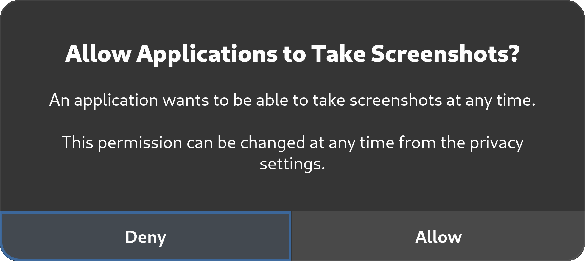

**Linux** adalah alternatif sistem operasi komputer sumber terbuka yang berfokus pada privasi. In the face of pervasive telemetry and other privacy-encroaching technologies in mainstream operating systems, desktop Linux has remained the clear choice for people looking for total control over their computers from the ground up.

Situs web kami umumnya menggunakan istilah "Linux" untuk menjelaskan distribusi Linux **desktop**. Sistem operasi lain yang juga menggunakan kernel Linux seperti ChromeOS, Android, dan Qubes OS tidak dibahas di halaman ini.

[Rekomendasi Linux kami :material-arrow-right-drop-circle:](../desktop.md ""){.md-button}

## Catatan Privasi

Ada beberapa masalah privasi penting pada Linux yang harus Anda sadari. Terlepas dari kekurangan ini, distribusi Linux desktop masih bagus untuk kebanyakan orang yang ingin:

- Menghindari telemetri yang sering kali disertakan dengan sistem operasi berpemilik
- Menjaga [kebebasan perangkat lunak](https://gnu.org/philosophy/free-sw.en.html#four-freedoms)
- Use privacy-focused systems such as [Whonix](../desktop.md#whonix) or [Tails](../desktop.md#tails)

### Keamanan Sumber Terbuka

It is a [common misconception](../basics/common-misconceptions.md#open-source-software-is-always-secure-or-proprietary-software-is-more-secure) that Linux and other open-source software are inherently secure simply because the source code is available. Ada ekspektasi bahwa verifikasi komunitas dilakukan secara teratur, tetapi tidak selalu [demikian](https://seirdy.one/posts/2022/02/02/floss-security).

Kenyataannya, keamanan distro bergantung pada sejumlah faktor, seperti aktivitas proyek, pengalaman pengembang, tingkat ketelitian yang diterapkan pada tinjauan kode, dan seberapa sering perhatian diberikan pada bagian tertentu dari basis kode yang mungkin tidak tersentuh selama bertahun-tahun.

### Fitur Keamanan yang tidak terdapat pada Linux

Saat ini, Linux [tertinggal jika dibandingkan alternatif](https://discussion.fedoraproject.org/t/fedora-strategy-2028-proposal-fedora-linux-is-as-secure-as-macos/46899/9) seperti macOS atau Android dalam hal fitur keamanan tertentu. Kami berharap dapat melihat peningkatan di area ini di masa depan.

- **Boot terverifikasi** di Linux tidak sekuat alternatif seperti [Secure Boot](https://support.apple.com/guide/security/secac71d5623/web)-nya Apple atau [Verified Boot](https://source.android.com/security/verifiedboot)-nya Android. Boot terverifikasi mencegah gangguan terus-menerus oleh *malware* dan [serangan pembantu jahat](https://en.wikipedia.org/wiki/Evil_Maid_attack), tetapi sebagian besar masih belum [tersedia pada distribusi yang paling canggih](https://discussion.fedoraproject.org/t/has-silverblue-achieved-verified-boot/27251/3) sekalipun.

- ***Sandboxing* yang kuat** untuk aplikasi di Linux sangat kurang, bahkan dengan aplikasi yang terkontainerisasi seperti Flatpaks atau solusi *sandbox* seperti Firejail. Flatpak is the most promising sandboxing utility for Linux thus far, but is still deficient in many areas and allows for [unsafe defaults](https://flatkill.org/2020) which permit most apps to trivially bypass their sandbox.

Selain itu, Linux tertinggal dalam mengimplementasikan [mitigasi eksploitasi](https://madaidans-insecurities.github.io/linux.html#exploit-mitigations) yang sekarang menjadi standar pada sistem operasi lain, seperti Arbitrary Code Guard pada Windows atau Hardened Runtime pada macOS. Sebagian besar program Linux dan Linux itu sendiri juga dikodekan dalam bahasa yang tidak aman untuk memori. *Bug* korupsi memori bertanggung jawab atas [sebagian besar kerentanan](https://msrc.microsoft.com/blog/2019/07/a-proactive-approach-to-more-secure-code) yang diperbaiki dan diberi CVE. Meskipun hal ini juga berlaku untuk Windows dan macOS, kedua sistem operasi tersebut dengan cepat membuat kemajuan dalam mengadopsi bahasa yang aman dari segi memori - masing-masing seperti Rust dan Swift - sementara tidak ada upaya yang sama untuk menulis ulang Linux dalam bahasa yang aman dari segi memori seperti Rust.

## Memilih distribusi Anda

Tidak semua distribusi Linux diciptakan sama. [Halaman rekomendasi Linux](../desktop.md) kami tidak dimaksudkan sebagai sumber otoritatif tentang distribusi mana yang harus Anda gunakan, tetapi rekomendasi kami *selaras* dengan pedoman berikut. Berikut ini adalah beberapa hal yang harus Anda ingat ketika memilih distribusi:

### Siklus rilis

Kami sangat menyarankan agar Anda memilih distribusi yang dekat dengan rilis perangkat lunak hulu yang stabil, yang sering disebut sebagai distribusi *rolling release*. Hal ini karena distribusi siklus *frozen release* sering kali tidak memperbarui versi paket dan tertinggal dalam pembaruan keamanan.

Untuk distribusi *frozen* seperti [Debian](https://debian.org/security/faq#handling), pengelola paket diharapkan untuk melakukan *backport patch* untuk memperbaiki kerentanan daripada memindahkan perangkat lunak ke "versi berikutnya" yang dirilis oleh pengembang hulu. Some security fixes (particularly for less popular software) [do not](https://arxiv.org/abs/2105.14565) receive a [CVE ID](https://en.wikipedia.org/wiki/Common_Vulnerabilities_and_Exposures) at all and therefore do not make it into the distribution with this patching model. As a result, minor security fixes are sometimes held back until the next major release.

Kami tidak percaya bahwa menahan paket dan menerapkan tambalan sementara adalah ide yang bagus, karena hal ini menyimpang dari cara kerja perangkat lunak yang diinginkan oleh pengembang. [Richard Brown](https://rootco.de/aboutme) memiliki presentasi tentang hal ini:

- [Regular Releases are Wrong, Roll for your life](https://youtu.be/i8c0mg_mS7U) <small>(YouTube)</small>

### Traditional vs Atomic Updates

Secara tradisional, distribusi Linux melakukan pembaruan dengan memperbarui paket yang diinginkan secara berurutan. Traditional updates such as those used in Fedora, Arch Linux, and Debian-based distributions can be less reliable if an error occurs while updating.

Atomic updating distributions, on the other hand, apply updates in full or not at all. On an atomic distribution, if an error occurs while updating (perhaps due to a power failure), nothing is changed on the system.

The atomic update method can achieve reliability with this model and is used for [distributions](../desktop.md#atomic-distributions) like Silverblue and NixOS. [Adam Šamalík](https://twitter.com/adsamalik) provides a presentation on how `rpm-ostree` works with Silverblue:

- [Let's try Fedora Silverblue — an immutable desktop OS! - Adam Šamalik](https://youtu.be/aMo4ZlWznao) <small>(YouTube)</small>

### Distribusi yang "berfokus pada keamanan"

Sering kali terdapat kebingungan antara distribusi "yang berfokus pada keamanan" dan distribusi "pentesting". Pencarian cepat untuk "distribusi Linux yang paling aman" sering kali memberikan hasil seperti Kali Linux, Black Arch, atau Parrot OS. Distribusi ini adalah distribusi pengujian penetrasi ofensif yang menggabungkan alat-alat untuk menguji sistem lain. Distribusi-distribusi tersebut tidak menyertakan "keamanan ekstra" atau mitigasi pertahanan yang dimaksudkan untuk penggunaan biasa.

### Distribusi berbasis Arch

Arch dan distribusi berbasis Arch tidak direkomendasikan bagi mereka yang baru mengenal Linux (apa pun distribusinya) karena memerlukan [pemeliharaan sistem](https://wiki.archlinux.org/title/System_maintenance) secara teratur. Arch tidak memiliki mekanisme pembaruan distribusi untuk pilihan perangkat lunak yang mendasarinya. As a result you have to stay aware with current trends and adopt technologies on your own as they supersede older practices.

For a secure system, you are also expected to have sufficient Linux knowledge to properly set up security for their system such as adopting a [mandatory access control](#mandatory-access-control) system, setting up [kernel module](https://en.wikipedia.org/wiki/Loadable_kernel_module#Security) blacklists, hardening boot parameters, manipulating [sysctl](https://en.wikipedia.org/wiki/Sysctl) parameters, and knowing what components they need such as [Polkit](https://en.wikipedia.org/wiki/Polkit).

Siapa pun yang menggunakan [Arch User Repository (AUR)](https://wiki.archlinux.org/title/Arch_User_Repository) **tidak boleh** segan untuk mengaudit PKGBUILD yang mereka unduh dari layanan tersebut. AUR packages are community-produced content and are not vetted in any way, and therefore are vulnerable to software [:material-package-variant-closed-remove: Supply Chain Attacks](../basics/common-threats.md#attacks-against-certain-organizations ""){.pg-viridian}, which has in fact happened [in the past](https://bleepingcomputer.com/news/security/malware-found-in-arch-linux-aur-package-repository).

AUR harus selalu digunakan dengan hemat, dan sering kali ada banyak saran buruk di berbagai halaman yang mengarahkan orang untuk secara membabi buta menggunakan [pembantu AUR](https://wiki.archlinux.org/title/AUR_helpers) tanpa peringatan yang memadai. Similar warnings apply to the use of third-party Personal Package Archives (PPAs) on Debian-based distributions or Community Projects (COPR) on Fedora.

Jika Anda berpengalaman dengan Linux dan ingin menggunakan distribusi berbasis Arch, kami umumnya merekomendasikan Arch Linux *mainline* daripada turunannya.

Selain itu, kami merekomendasikan untuk **tidak** menggunakan kedua turunan Arch ini secara khusus:

- **Manjaro**: Distribusi ini menahan paket selama 2 minggu untuk memastikan bahwa perubahan yang mereka buat tidak rusak, bukan untuk memastikan bahwa hulu stabil. Ketika paket AUR digunakan, paket ini sering kali dibuat berdasarkan [pustaka](https://en.wikipedia.org/wiki/Library_(computing)) terbaru dari repositori Arch.
- **Garuda**: Mereka menggunakan [Chaotic-AUR](https://aur.chaotic.cx) yang secara otomatis dan membabi buta mengkompilasi paket-paket dari AUR. Tidak ada proses verifikasi untuk memastikan bahwa paket AUR tidak mengalami serangan rantai pasok.

### Kernel Linux-libre dan distribusi "Libre"

Kami menyarankan untuk **tidak** menggunakan kernel Linux-libre, karena kernel ini [menghilangkan mitigasi keamanan](https://phoronix.com/news/GNU-Linux-Libre-5.7-Released) dan [[menahan peringatan kernel](https://news.ycombinator.com/item?id=29674846)](https://news.ycombinator.com/item?id=29674846) tentang kode mikro yang rentan.

### Mandatory access control

Mandatory access control is a set of additional security controls which help to confine parts of the system such as apps and system services. The two common forms of mandatory access control found in Linux distributions are [SELinux](https://github.com/SELinuxProject) and [AppArmor](https://apparmor.net). While Fedora uses SELinux by default, Tumbleweed [defaults](https://en.opensuse.org/Portal:SELinux) to AppArmor in the installer, with an option to [choose](https://en.opensuse.org/Portal:SELinux/Setup) SELinux instead.

SELinux on [Fedora](https://docs.fedoraproject.org/en-US/quick-docs/selinux-getting-started) confines Linux containers, virtual machines, and service daemons by default. AppArmor is used by the snap daemon for [sandboxing](https://snapcraft.io/docs/security-sandboxing) snaps which have [strict](https://snapcraft.io/docs/snap-confinement) confinement such as [Firefox](https://snapcraft.io/firefox). There is a community effort to confine more parts of the system in Fedora with the [ConfinedUsers](https://fedoraproject.org/wiki/SIGs/ConfinedUsers) special interest group.

## Rekomendasi Umum

### Enkripsi Kandar

Sebagian besar distribusi Linux memiliki opsi dalam pemasang untuk mengaktifkan [LUKS](../encryption.md#linux-unified-key-setup) FDE. Jika opsi ini tidak diatur pada saat instalasi, Anda harus membuat cadangan data dan menginstal ulang, karena enkripsi diterapkan setelah [partisi diska](https://en.wikipedia.org/wiki/Disk_partitioning), tetapi sebelum [sistem berkas](https://en.wikipedia.org/wiki/File_system) diformat. Kami juga menyarankan untuk menghapus perangkat penyimpanan Anda dengan aman:

- [Penghapusan Data yang Aman :material-arrow-right-drop-circle:](https://blog.privacyguides.org/2022/05/25/secure-data-erasure)

### Swap

Pertimbangkan untuk menggunakan [ZRAM](https://wiki.archlinux.org/title/Zram#Using_zram-generator) alih-alih berkas atau partisi swap tradisional untuk menghindari penulisan data memori yang mungkin sensitif ke penyimpanan persisten (dan meningkatkan kinerja). Distribusi berbasis Fedora [menggunakan ZRAM secara bawaan](https://fedoraproject.org/wiki/Changes/SwapOnZRAM).

Jika Anda memerlukan fungsi suspend-to-disk (hibernasi), Anda masih perlu menggunakan berkas atau partisi swap tradisional. Pastikan ruang swap yang Anda miliki pada perangkat penyimpanan persisten, paling tidak, [dienkripsi](https://wiki.archlinux.org/title/Dm-crypt/Swap_encryption) untuk mengurangi sebagian ancaman ini.

### Proprietary Firmware (Microcode Updates)

Some Linux distributions (such as [Linux-libre](https://en.wikipedia.org/wiki/Linux-libre)-based or DIY distros) don’t come with the proprietary [microcode](https://en.wikipedia.org/wiki/Microcode) updates which patch critical security vulnerabilities. Some notable examples of these vulnerabilities include [Spectre](https://en.wikipedia.org/wiki/Spectre_(security_vulnerability)), [Meltdown](https://en.wikipedia.org/wiki/Meltdown_(security_vulnerability)), [SSB](https://en.wikipedia.org/wiki/Speculative_Store_Bypass), [Foreshadow](https://en.wikipedia.org/wiki/Foreshadow), [MDS](https://en.wikipedia.org/wiki/Microarchitectural_Data_Sampling), [SWAPGS](https://en.wikipedia.org/wiki/SWAPGS_(security_vulnerability)), and other [hardware vulnerabilities](https://kernel.org/doc/html/latest/admin-guide/hw-vuln/index.html).

We **highly recommend** that you install microcode updates, as they contain important security patches for the CPU which can not be fully mitigated in software alone. Fedora and openSUSE both apply microcode updates by default.

### Updates

Most Linux distributions will automatically install updates or remind you to do so. It is important to keep your OS up to date so that your software is patched when a vulnerability is found.

Some distributions (particularly those aimed at advanced users) are more bare bones and expect you to do things yourself (e.g. Arch or Debian). These will require running the "package manager" (`apt`, `pacman`, `dnf`, etc.) manually in order to receive important security updates.

Additionally, some distributions will not download firmware updates automatically. For that, you will need to install [`fwupd`](https://wiki.archlinux.org/title/Fwupd).

### Permission Controls

Desktop environments (DEs) that support the [Wayland](https://wayland.freedesktop.org) display protocol are [more secure](https://lwn.net/Articles/589147) than those that only support X11. However, not all DEs take full advantage of Wayland's architectural security improvements.

For example, GNOME has a notable edge in security compared to other DEs by implementing permission controls for third-party software that tries to [capture your screen](https://gitlab.gnome.org/GNOME/gnome-shell/-/issues/3943). That is, when a third-party application attempts to capture your screen, you are prompted for your permission to share your screen with the app.

<figure markdown>
  { width="450" }
  <figcaption>GNOME's screenshot permission dialog</figcaption>
</figure>

Many alternatives don't provide these same permission controls yet,[^1] while some are waiting for Wayland to implement these controls upstream.[^2]

## Privacy Tweaks

### MAC Address Randomization

Many desktop Linux distributions (Fedora, openSUSE, etc.) come with [NetworkManager](https://en.wikipedia.org/wiki/NetworkManager) to configure Ethernet and Wi-Fi settings.

It is possible to [randomize](https://fedoramagazine.org/randomize-mac-address-nm) the [MAC address](https://en.wikipedia.org/wiki/MAC_address) when using NetworkManager. This provides a bit more privacy on Wi-Fi networks as it makes it harder to track specific devices on the network you’re connected to. It does [**not**](https://papers.mathyvanhoef.com/wisec2016.pdf) make you anonymous.

We recommend changing the setting to **random** instead of **stable**, as suggested in the [article](https://fedoramagazine.org/randomize-mac-address-nm).

If you are using [systemd-networkd](https://en.wikipedia.org/wiki/Systemd#Ancillary_components), you will need to set [`MACAddressPolicy=random`](https://freedesktop.org/software/systemd/man/systemd.link.html#MACAddressPolicy=) which will enable [RFC 7844 (Anonymity Profiles for DHCP Clients)](https://freedesktop.org/software/systemd/man/systemd.network.html#Anonymize=).

MAC address randomization is primarily beneficial for Wi-Fi connections. For Ethernet connections, randomizing your MAC address provides little (if any) benefit, because a network administrator can trivially identify your device by other means (such as inspecting the port you are connected to on the network switch). Randomizing Wi-Fi MAC addresses depends on support from the Wi-Fi’s firmware.

### Other Identifiers

There are other system identifiers which you may wish to be careful about. You should give this some thought to see if it applies to your [threat model](../basics/threat-modeling.md):

- **Hostnames:** Your system's hostname is shared with the networks you connect to. You should avoid including identifying terms like your name or operating system in your hostname, instead sticking to generic terms or random strings.
- **Usernames:** Similarly, your username is used in a variety of ways across your system. Consider using generic terms like "user" rather than your actual name.
- **Machine ID:** During installation, a unique machine ID is generated and stored on your device. Consider [setting it to a generic ID](https://madaidans-insecurities.github.io/guides/linux-hardening.html#machine-id).

### System Counting

The Fedora Project [counts](https://fedoraproject.org/wiki/Changes/DNF_Better_Counting) how many unique systems access its mirrors by using a [`countme`](https://fedoraproject.org/wiki/Changes/DNF_Better_Counting#Detailed_Description) variable instead of a unique ID. Fedora does this to determine load and provision better servers for updates where necessary.

This [option](https://dnf.readthedocs.io/en/latest/conf_ref.html#options-for-both-main-and-repo) is currently off by default. We recommend adding `countme=false` to `/etc/dnf/dnf.conf` just in case it is enabled in the future. On systems that use `rpm-ostree` such as Silverblue, the countme option is disabled by masking the [rpm-ostree-countme](https://fedoramagazine.org/getting-better-at-counting-rpm-ostree-based-systems) timer.

openSUSE also uses a [unique ID](https://en.opensuse.org/openSUSE:Statistics) to count systems, which can be disabled by emptying the `/var/lib/zypp/AnonymousUniqueId` file.

[^1]: KDE currently has an open proposal to add controls for screen captures: <https://invent.kde.org/plasma/xdg-desktop-portal-kde/-/issues/7>
[^2]: Sway is waiting to add specific security controls until they "know how security as a whole is going to play out" in Wayland: <https://github.com/swaywm/sway/issues/5118#issuecomment-600054496>
