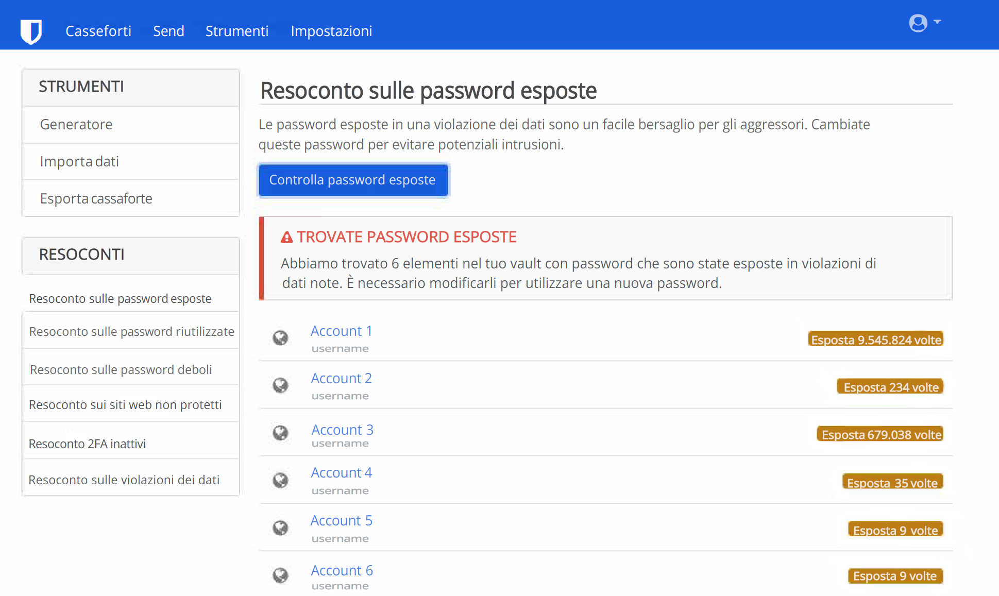

Con il tempo, può essere facile accumulare numerosi profili online, molti dei quali non sono più utilizzati. L'eliminazione di tali profili inutilizzati è un passaggio importante per rivendicare la propria privacy, poiché i profili inattivi sono vulnerabili alle violazioni di dati. Una violazione dei dati si verifica quando la sicurezza di un servizio viene compromessa, e le informazioni protette vengono visualizzate, trasmesse o rubate da utenti non autorizzati. Le violazioni dei dati, oggi, sono sfortunatamente tutte [troppo comuni](https://haveibeenpwned.com/PwnedWebsites); quindi, praticare una buona igiene digitale è il metodo migliore per minimizzarne l'impatto sulla tua vita. Lo scopo di questa guida, quindi, è aiutarti a superare il fastidioso processo di eliminazione dei profili, spesso reso difficile dal [design ingannevole](https://www.deceptive.design/), per migliorare la propria presenza online.

## Trovare i vecchi account

### Gestore di password

Se hai un gestore di password che hai utilizzato per tutta la tua vita digitale, questa parte sarà molto semplice. Spesso, includono la funzionalità integrata per rilevare se le tue credenziali sono state esposte a violazioni di dati, come il [Rapporto sulle Violazioni dei Dati](https://bitwarden.com/blog/have-you-been-pwned/) di Bitwarden.

<figure markdown>
  
</figure>

Anche se non hai mai utilizzato un gestore di password, è probabile che tu abbia utilizzato quello del tuo browser o del tuo telefono senza nemmeno accorgetene. Ad esempio: [Gestore Password Firefox ](https://support.mozilla.org/kb/password-manager-remember-delete-edit-logins),[Gestore Password Google](https://passwords.google.com/intro) e [ Gestore Password Edge ](https://support.microsoft.com/en-us/microsoft-edge/save-or-forget-passwords-in-microsoft-edge-b4beecb0-f2a8-1ca0-f26f-9ec247a3f336).

Le piattaforme desktop dispongono spesso di un gestore di password che può aiutarvi a recuperare le password dimenticate:

- [Gestione credenziali](https://support.microsoft.com/en-us/windows/accessing-credential-manager-1b5c916a-6a16-889f-8581-fc16e8165ac0) di Windows
- [Password](https://support.apple.com/en-us/HT211145) di macOS
- [ Password](https://support.apple.com/en-us/HT211146) di iOS
- Gnome Keyring di Linux, accessibile tramite [Seahorse](https://wiki.gnome.org/Apps/Seahorse) o [KDE Wallet Manager](https://userbase.kde.org/KDE_Wallet_Manager)

### Email

Se non hai mai utilizzato un gestore di password in passato, o pensi di possedere profili mai aggiunti a esso, un'altra opzione è cercre i profili email con cui credi di esserti iscritto. Sul tuo client email, cerca parole chiave come "verifica" o "benvenuto." Quasi ogni volta che crei un profilo online, il servizio ti invierà un collegmento di verifica o un messaggio introduttivo, alla tua email. Questo può essere un ottimo modo per trovare vecchi profili dimenticati.

## Eliminazione dei vecchi profili

### Accedi

Per eliminare i tuoi vecchi profili, dovrai prima assicurarti di potervi accedere. Ancora, se il profilo era nel tuo gestore di password, questo passaggio è facile. Altrimenti, puoi provare a indovinare la password. Altrimenti, tipicamente, esistono delle opzioni per riottenere l'accesso al tuo profilo, disponibili comunemente tramite un collegamento "password dimenticata", sulla pagina d'accesso. Inoltre, è possibile che i profili che hai abbandonato siano già stati eliminati: talvolta, i servizi eliminano tutti i vecchi profili.

Tentando di recuperare l'accesso, se il sito restituisce un messaggio d'errore che indica che l'email non è associata a un profilo, o se ricevi un collegamento di ripristino dopo svariati tentaativi, non hai un profilo sotto tale indirizzo email e dovresti provare con uno differente. Se non riesci a capire quale indirizzo email hai utilizzato, o non hai più accesso aa tale email, puoi provare a contattare il supporto clienti del servizio. Purtroppo, non vi è alcuna garanzia di poter riottenere l'accesso al profilo.

### GDPR (solo per i residenti nello SEE)

I residenti SEE hanno ulteriori diritti relativi alla cancellazione dei dati, specificati all'[Articolo 17](https://www.gdpr.org/regulation/article-17.html) del RGPD. Se applicabile, leggi la politica sulla privacy per qualsiasi dato servizio, per trovare le informazioni su come esercitare il tuo diritto alla cancellazione. Leggere la politica sulla privacy può rivelarsi importante, poiché alcuni servizi hanno un'opzione "Elimina Profilo" che disabilita il tuo profilo, mentre per l'eliminazione reale devi intraprendere ulteriori azioni. Talvolta, l'eliminazione effettiva potrebbe richiedere la compilazione di sondaggi, il contatto del responsabile della protezione dei dati, o persino la dimostrazione della tua residenza nel SEE. Se intendi procedere in questo modo, **non** sovrascrivere le informazioni del profilo: la tua identità come residente del SEE potrebbe venirti richiesta. Nota che la posizione geografica del servizio non ha alcuna importanza; il RGPD si applica a chiunque serva utenti europei. Se il servizio non rispetta il tuo diritto alla cancellazione, puoi contattare l'[Autorità di Protezione dei Dati](https://ec.europa.eu/info/law/law-topic/data-protection/reform/rights-citizens/redress/what-should-i-do-if-i-think-my-personal-data-protection-rights-havent-been-respected_en) nazionale, e potresti anche avere diritto a un risarcimento in denaro.

### Sovrascrivere informazioni del profilo

In alcune situazioni in cui pianifichi di abbandonare un profilo, può avere senso sovrascrivere le informazioni dello stesso con dati falsi. Una volta che sei sicuro di poter accedere, modifica tutte le informazioni di quel profilo con delle informazioni false. Il motivo è che molti siti conservano le informazioni precedentemente in possesso dell'utente anche dopo la cancellazione del profilo. La speranza è che sovrascrivano le informazioni precedenti con i dati più recenti da te inseriti. Tuttavia, non è garantito che non vi siano backup con le informazioni precedenti.

Per l'email del profilo, crea un nuovo indirizzo email alternativo tramite il tuo fornitore, o scegli o crea un alias, utilizzando un [servizio di alias email](../email.md#email-aliasing-services). Quindi, puoi eliminare l'indirizzo email alternativo, una volta terminato. Sconsigliamo l'utilizzo di fornitori di email temporanee, poiché è talvolta possibile riattivarle.

### Elimina

Puoi consultare [JustDeleteMe](https://justdeleteme.xyz) per le istruzioni su come eliminare il profilo per un servizio specifico. Alcuni siti, fortunatamente, offrono l'opzione "Elimina profilo", mentre altri si spingono fino a costringerti a parlare con un agente di supporto. Il processo di eliminazione può variare da un sito all'altro, e in alcuni casi la cancellazione del profilo sarà impossibile.

Per i servizi che non permettono l'eliminazione del profilo, la cosa migliore da fare è quella di falsificare tutte le informazioni (come detto in precedenza) e di rafforzare la sicurezza del profilo. Per farlo, abilita l'[AFM](multi-factor-authentication.md) e qualsiasi altra funzionalità offerta dal sito. Inoltre, cambia la password con una generata casualmente che sia della lunghezza massima consentita (un [gestore di password](../passwords.md) può esserti utile per farlo).

Se sei soddisfatto della rimozione di tutte le informazioni che ti, puoii tranquillamente dimenticarti di questo profilo. Altrimenti, potrebbe essere una buona idea conservare le credenziali con le altre tue password, accedendo nuovamente in modo occasionale, per ripristinare la password.

Anche quando riesci a eliminare un profilo, non vi è alcuna garanzia che tutte le tue informazioni siano rimosse. Infatti, alcune aziende sono tenute per legge a conservare certe informazioni, in particolare quando si tratta di operazioni finanziarie. È per lo più fuori dal tuo controllo ciò che accade ai tuoi dati quando si tratta di siti Web e servizi su cloud.

## Evita i nuovi profili

Come dice il vecchio detto, "un grammo di prevenzione è sempre meglio di un chilo di cura." Ogni volta che ti senti tentato di registrare un nuovo profilo, chiediti: "Ne ho davvero bisogno? Posso realizzare ciò che mi serve senza un profilo?" Spesso è molto più difficile eliminare un profilo, piuttosto che crearne uno. E anche dopo averne eliminate o modificate le informaazioni, potrebbe esserci una versione nella cache da una terza parte, come [Internet Archive](https://archive.org/). Quando possibile, evita la tentazione: il te stesso del futuro ti ringrazierà!
