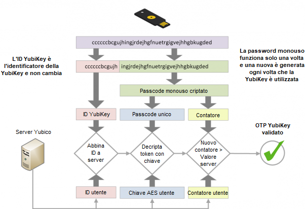
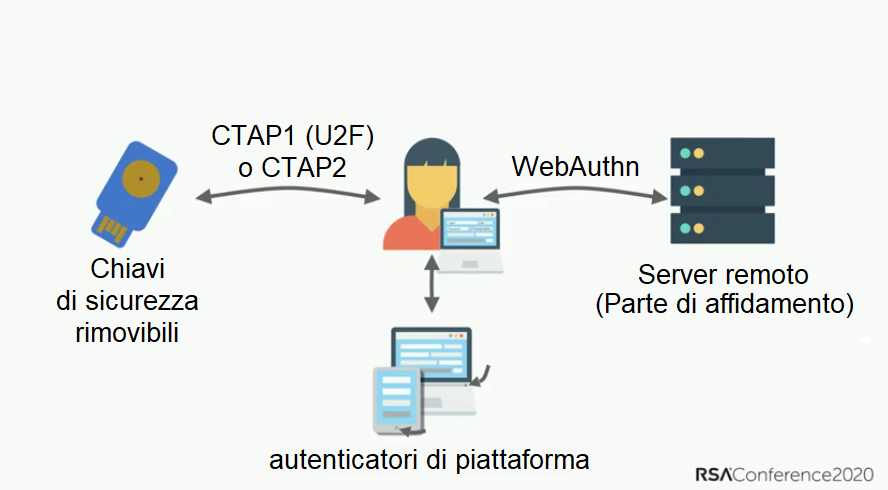

L'**Autenticazione a Fattori Multipli** (**AFM**) è un meccanismo di sicurezza che richiede ulteriori passaggi oltre all'inserimento del tuo nome utente (o email) e la password. Il metodo più comune è quello dei codici a tempo limitato, che potresti ricevere via SMS o da un'app.

Solitamente, se un hacker (o avversario) è in grado di scoprire la tua password, otterrebbe l'accesso al tuo profilo, cui appartiene tale password. Un proflo con l'AFM forza l'hacker ad avere sia la password (qualcosa che *conosci*) che un dispositivo che possiedi (qualcosa che *possiedi*), come il tuo telefono.

I metodi AFM variano in termini di sicurezza, ma si basano sulla premessa che più è difficile, per un malintenzionato, ottenere l'accesso al tuo metodo AFM, meglio è. Esempi di metodi AFM (dal più debole al più forte), includono SMS, codici email, notifiche push delle app, TOTP, Yubico OTP e FIDO.

## Confronto tra Metodi AFM

### AFM via SMS o Email

Ricevere codici OTP via SMS o email è uno dei metodi più deboli per proteggere i tuoi profili con l'AFM. Ottenere un codice via email o SMS elimina l'idea di "qualcosa che *possiedi*", perché esistono svariati modi in cui un hacker potrebbe [impossessarsi del tuo numero di telefono](https://en.wikipedia.org/wiki/SIM_swap_scam) od ottenere accesso alla tua email, senza dover accedere affatto ad alcun tuo dispositivo. Se una persona non autorizzata ottiene l'accesso alla tua email, potrebbe utilizzare tale accesso per ripristinare la tua password e ricevere il codice d'autenticazione, ottenendo così l'accesso completo al tuo profilo.

### Notifiche Push

L'AFM con notifiche push prende la forma di un messaggio inviato a un'app sul tuo telefono, chiedendoti di confermare i nuovi accessi al profilo. Questo metodo è molto migliore di SMS o email, poiché un malintenzionato non sarebbe tipicamente in grado di ricevere tali notifiche push senza dover avere un dispositivo già connesso, il che significa che dovrebbe prima compromettere uno dei tuoi altri dispositivi.

Tutti commettono errori ed esiste il rischio che tu possa accettare per errore il tentativo d'accesso. Le autorizzazioni d'accesso tramite notifiche push sono tipicamente inviate a *tutti* i tuoi dispositivi in una volta, ampliando la disponibilità del codice AFM se possiedi molti dispositivi.

La sicurezza dell'AFM con notifiche push dipende dalla qualità dell'app, dalla componente server e dalla fiducia nello sviluppatore che la produce. Anche installare un'app potrebbe richiederti di accettare privilegi invasivi, che concedano l'accesso ad altri dati sul tuo dispositivo. Inoltre, una singola app richiede che tu abbia un'app specifica per ogni servizio che potrebbe non richiedere una password per l'apertura, a differenza dell'app di generazione di TOTP.

### Password Una Tantum basata sul Tempo (TOTP)

La TOTP è una delle forme di AFM più comuni disponibili. Quando configuri la TOTP, devi generalmente scansionare un [Codice QR](https://en.wikipedia.org/wiki/QR_code), che stabilisce un "[codice segreto](https://en.wikipedia.org/wiki/Shared_secret)" con il servizio che intendi utilizzare. Questo è protetto tra i dati dell'app d'autenticazione ed è talvolta protetto da una password.

Il codice a tempo limitato deriva dal codice segreto e dall'ora corrente. Poiché il codice è valido soltanto per un breve periodo di tempo, senza l'accesso al codice segreto condiviso, un avversario non può generare nuovi codici.

Se possiedi una chiave di sicurezza hardware con supporto a TOTP (come una YubiKey con [Yubico Authenticator](https://www.yubico.com/products/yubico-authenticator/)), consigliamo di conservare i tuoi "codici segreti condivisi" sul hardware. Gli hardware come la YubiKey sono stati sviluppato con l'intento di rendere difficile l'estrazione e la copia del "codice segreto condiviso". Inoltre, una YubiKey non è connessa a Internet, a differenza di un telefono con un'app di TOTP.

A differenza di [WebAuthn](#fido-fast-identity-online), TOTP non offre alcuna protezione dal [phishing](https://en.wikipedia.org/wiki/Phishing) o dagli attacchi di riutilizzo. Se un malitenzionato ottiene un codice valido da te, potrebbe utilizzarlo quante volte preferisce, fino alla sua scadenza (generalmente 60 secondi).

Un malintenzionato potrebbe configurare un sito web che imiti un servizio ufficiale, nel tentativo di ingannarti nel comunicare il tuo nome utente, la tua password e il codice TOTP corrente. Se questi, poi, utilizza tali credenziali registrate, potrebbe riuscire ad accedere al servizio reale e dirottare il profilo.

Sebbene non sia perfetta, la TOTP è abbastanza sicura per gran parte delle persone e, quando le [chiavi di sicurezza hardware](../multi-factor-authentication.md#hardware-security-keys) non sono supportate, le [app d'autenticazione](../multi-factor-authentication.md#authenticator-apps) restano una buona opzione.

### Chiavi di sicurezza hardware

La YubiKey memorizza i dati su un chip allo stato solido resistente alla manomissione, [impossibile da accedere](https://security.stackexchange.com/a/245772) in modo non distruttivo, senza un procedimento costoso e un laboratorio forense.

Queste chiavi sono generalmente multifunzione e forniscono numerosi metodi d'autenticazione. Seguono alcuni dei più comuni.

#### Yubico OTP

Yubico OTP è un protocollo d'autenticazione tipicamente implementato nelle chiavi di sicurezza hardware. Quando decidi di utilizzarlo, la chiave genererà un ID pubblico, un ID privato e una Chiave Segreta, poi caricati sul server di Yubico OTP.

Accedendo a un sito web, dovrai soltanto toccare fisicamente la chiave di sicurezza. Questa emulerà una tastiera, producendo una password una tantum e inserendola nel campo della password.

Quindi, il servizio inoltrerà la password una tantum al server di Yubico OTP per la convalida. Un contatore incrementerà sia sulla chiave che sul server di convalida di Yubico. L'OTP è utilizzabile soltanto una volta e, quando un'autenticazione si verifica positivamente, il contatore incrementa, impedendone il riutilizzo. Yubico fornisce una [documentazione dettagliata](https://developers.yubico.com/OTP/OTPs_Explained.html) sul procedimento.

<figure markdown>
  
</figure>

L'utilizzo di Yubico OTP comporta benefici e svantaggi rispetto alla TOTP.

Il server di convalida di Yubico è un servizio basato su cloud e, l'utente, si affida a Yubico per la memorizzazione sicura dei dati e la tua non profilazione. L'ID pubblico associato a Yubico OTP è riutilizzato su ogni sito web e potrebbe essere un altro mezzo per la profilazione da terze parti. Come la TOTP, Yubico OTP non fornisce la resistenza al phishing.

Se il tuo modello di minaccia ti richiede di avere identità differenti su siti web differenti, **non** utilizzare Yubico OTP con la stessa chiave di sicurezza hardware su quei siti web, poiché l'ID pubblico è univoco per ogni chiave di sicurezza.

#### FIDO (IDentità Veloce Online)

[FIDO](https://en.wikipedia.org/wiki/FIDO_Alliance) include numerosi standard, prima U2F e, in seguito, [FIDO2](https://en.wikipedia.org/wiki/FIDO2_Project), che include lo standard web [WebAuthn](https://en.wikipedia.org/wiki/WebAuthn).

U2F e FIDO2 si riferiscono al [Protocollo dal Client all'Autenticatore](https://en.wikipedia.org/wiki/Client_to_Authenticator_Protocol), che è il protocollo tra la chiave di sicurezza e il dispositivo, come un laptop o telefono. Complementa WebAuthn, utilizzato per autenticarsi con il sito web (la "Parte Facente Affidamento"), a cui stai provando ad accedere.

WebAuthn è la forma più sicura e privata di autenticazione a due fattori. Sebbene l'esperienza d'autenticazione sia simile a quella di Yubico OTP, la chiave non produce una password una tantum, né convalida con una terza parte. Piuttosto, utilizza la [crittografia a chiave pubblica](https://en.wikipedia.org/wiki/Public-key_cryptography) per l'autenticazione.

<figure markdown>
  
</figure>

Quando crei un profilo, la chiave pubblica è inviata al servizio, così, quando accedi, il servizio ti richiederà di "firmare" alcuni dati con la tua chiave privata. Il vantaggio di ciò è che nessun dato della password è mai memorizzato dal servizio, così che un malintenzionato non possa rubare nulla.

Questa presentazione discute della storia dell'autenticazione con password, le insidie (come il riutilizzo delle password) e la discussione sugli standard FIDO2 e [WebAuthn](https://webauthn.guide).

<div class="yt-embed">
  <iframe width="560" height="315" src="https://invidious.privacyguides.net/embed/aMo4ZlWznao?local=true" title="Come FIDO2 e WebAuthn impediscono l'appropriazione dei profili" frameborder="0" allow="accelerometer; autoplay; clipboard-write; encrypted-media; gyroscope; picture-in-picture" allowfullscreen></iframe>
</div>

FIDO2 e WebAuthn hanno proprietà di sicurezza e privacy superiori, rispetto a qualsiasi metodo AFM.

Tipicamente, per i servizi web è utilizzato con WebAuthn, parte dei [consigli W3C](https://en.wikipedia.org/wiki/World_Wide_Web_Consortium#W3C_recommendation_(REC)). Utilizza l'autenticazione a chiave pubblica ed è più sicuro dei codici segreti condivisi utilizzati dai metodi di Yubico OTP e TOTP, poiché include il nome originale (solitamente, il nome di dominio), durante l'autenticazione. L'attestazione è fornita per proteggerti dagli attacchi di phishing, poiché ti aiuta a determinare che stai utilizzando il servizio autentico e non una copia falsa.

Diversamente da Yubico OTP, WebAuthn non utilizza alcun ID pubblico, quindi la chiave **non** è identificabile tra siti web differenti. Inoltre, non utilizza alcun server su cloud di terze parti per l'autenticazione. Tutte le comunicazioni sono completate tra la chiave e il sito web cui stai accedendo. Inoltre, FIDO utilizza un contatore che incrementa all'utilizzo, per impedire il riutilizzo della sessione e la clonazione delle chiavi.

Se un sito web o servizio supporta WebAuthn per l'autenticazione, consigliamo vivamente di utilizzarlo, piuttosto che qualsiasi altra forma di AFM.

## Consigli generali

Abbiamo questi consigli generali:

### Quale metodo dovrei utilizzare?

Configurando il tuo metodo AFM, tieni a mente che è sicuro soltanto quanto il metodo d'autenticazione più debole che utilizzi. Ciò significa che è importante che tu utilizzi soltanto il miglior metodo AFM disponibile. Ad esempio, se utilizzi già TOTP, dovresti disabilitare l'AFM via email e SMS. Se utilizzi già FIDO2/WebAuthn, non dovresti utilizzare Yubico OTP o la TOTP sul tuo profilo.

### Backup

Dovresti sempre avere dei backup per il tuo metodo di AFM. Le chiavi di sicurezza potrebbero essere perdute, rubate o semplicemente smettere di funzionare nel tempo. Consigliamo di avere una coppia di chiavi di sicurezza con lo stesso accesso ai tuoi profili, anziché una sola.

Utilizzando TOTP con un'app d'autenticazione, assicurati di eseguire il backup delle tue chiavi di recupero o della stessa app, o di copiare i "codici segreti condivisi" in un'altra istanza dell'app su un telefono differente o in un contenitore crittografato (es. [VeraCrypt](../encryption.md#veracrypt)).

### Configurazione iniziale

Acquistando una chiave di sicurezza, è importante modificare le credenziali predefinite, configurare la protezione con password per la chiave e abilitare la conferma tattile, se supportata. I prodotti come YubiKey dispongono di più interfacce con credenziali separate per ognuna di esse, quindi, dovresti esaminare ogni interfaccia e configurarne la protezione.

### Email e SMS

Se utilizzi l'email per l'AFM, assicurati che lo stesso profilo email sia protetto da un adeguato metodo AFM.

Se utilizzi gli SMS per l'AFM, utilizza un operatore che non cambi il tuo numero telefonico a una nuova scheda SIM senza l'accesso al profilo, o un numero VoIP dedicato da un fornitore, con sicurezza simile, per evitare un [attacco di cambio SIM](https://en.wikipedia.org/wiki/SIM_swap_scam).

[Strumenti MFA consigliati](../multi-factor-authentication.md ""){.md-button}

## Altri posti per configurare l'AFM

Oltre a proteggere i tuoi accessi ai siti web, l'autenticazione a più fattori è utilizzabile per proteggere i tuoi accessi locali, le chiavi SSH o persino i database di password.

### Windows

Yubico ha un [Fornitore di Credenziali](https://docs.microsoft.com/en-us/windows/win32/secauthn/credential-providers-in-windows) dedicato, che aggiunge l'autenticazione Contestazione-Risposta al flusso d'accesso con nome utente + password, per i profili locali di Windows. Se possiedi una YubiKey con supporto all'autenticazione Contestazione-Risposta, consulta la [Guida di Configurazione dell'Accesso per Windows di Yubico](https://support.yubico.com/hc/en-us/articles/360013708460-Yubico-Login-for-Windows-Configuration-Guide), che ti consentirà di configurare l'AFM sul tuo computer Windows.

### macOS

macOS [supporta nativamente](https://support.apple.com/guide/deployment/intro-to-smart-card-integration-depd0b888248/web) l'autenticazione con smart card (PIV). Se possiedi una smartcard o una chiave di sicurezza hardware che supporta l'interfaccia PIV, come YubiKey, consigliamo di seguire la documentazione del tuo fornitore di sicurezza con smartcard/hardware e di configurare l'autenticazione a due fattori per il tuo computer macOS.

Yubico ha una guida all'[Utilizzo della tua YubiKey come Smart Card su macOS](https://support.yubico.com/hc/en-us/articles/360016649059), che può aiutarti a configurarla su macOS.

Dopo aver configurato la tua smartcard/chiave di sicurezza, consigliamo di eseguire questo comando nel Terminale:

```text
sudo defaults write /Library/Preferences/com.apple.loginwindow DisableFDEAutoLogin -bool YES
```

Il comando impedirà ai malintenzionati di aggirare l'AFM, all'avvio del computer.

### Linux

<div class="admonition warning" markdown>
<p class="admonition-title">Avviso</p>

Se il nome del host del tuo sistema cambia (ad esempio, a causa del DHCP), non potrai accedere. È fondamentale che tu configuri un nome del host adeguato per il tuo computer, prima di seguire questa guida.

</div>

Il modulo `pam_u2f` su Linux può fornire l'autenticazione a due fattori per accedere alle distribuzioni più popolari di Linux. Se possiedi una chiave di sicurezza hardware che supporta U2F, puoi configurare l'autenticazione AFM per il tuo accesso. Yubico dispone della [Guida di Accesso a Linux Ubuntu - U2F](https://support.yubico.com/hc/en-us/articles/360016649099-Ubuntu-Linux-Login-Guide-U2F), che dovrebbe funzionare su qualsiasi distribuzione. I comandi del gestore di pacchetti, come `apt-get` e i nomi dei pacchetti, tuttavia, potrebbero variare. Questa guida **non** si applica a Qubes OS.

### Qubes OS

Qubes OS supporta l'autenticazione Contestazione-Risposta con le YubiKey. Se possiedi una YubiKey con supporto all'autenticazione Contestazione-Risposta, consulta la [documentazione di YubiKey](https://www.qubes-os.org/doc/yubikey/) per Qubes OS, se vorresti configurarvi l'AFM.

### SSH

#### Chiavi di Sicurezza Hardware

L'AFM SSH potrebbe essere configurata utilizzando svariati metodi d'autenticazione differenti, popolari con le chiavi di sicurezza hardware. Ti consigliamo di consultare la [documentazione](https://developers.yubico.com/SSH/) su come configurarli.

#### Password Monouso basata sul Tempo (TOTP)

L'AFM SSH può anche essere configurata utilizzando TOTP. DigitalOcean ha fornito il tutorial "[Come Configurare l'Autenticazione a Più Fattori per SSH su Ubuntu 20.04](https://www.digitalocean.com/community/tutorials/how-to-set-up-multi-factor-authentication-for-ssh-on-ubuntu-20-04). Gran parte delle cose dovrebbe essere le stesse indipendentemente dalla distribuzione, tuttavia, i comandi del gestore di pacchetti, come `apt-get`, e i nomi dei pacchetti, potrebbero variare.

### KeePass (e KeePassXC)

I database di KeePass e KeePassXC possono essere protetti utilizzando la Challenge-Response o HOTP come autenticazione di secondo fattore. Yubico ha fornito della documentazione per l'[Utilizzo della tua YubiKey con KeePass](https://support.yubico.com/hc/en-us/articles/360013779759-Using-Your-YubiKey-with-KeePass), nonché un documento sul sito web di [KeePassXC](https://keepassxc.org/docs/#faq-yubikey-2fa).
