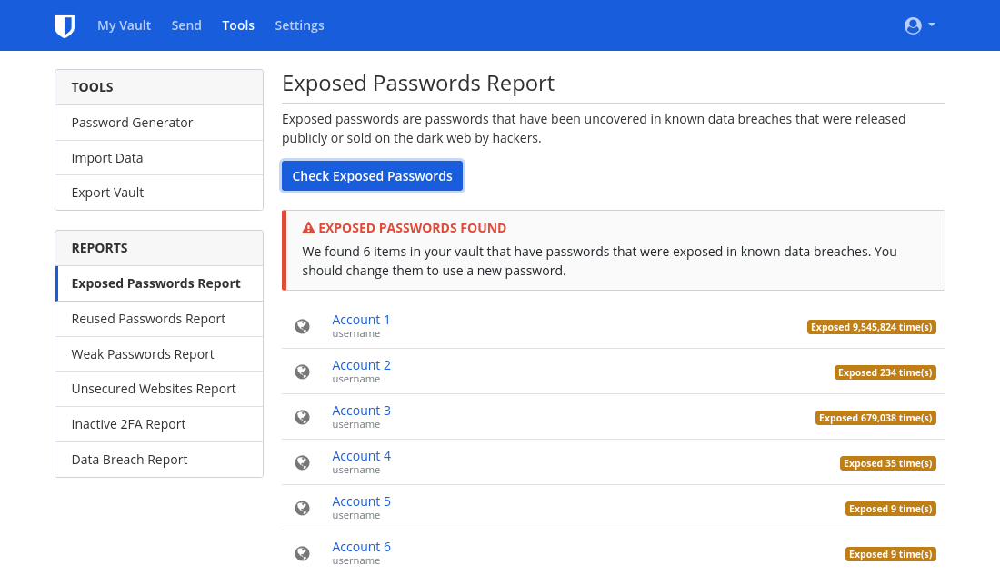

온라인 계정은 시간이 지날수록 쌓여갑니다. 그리고 그 중 상당수는 더 이상 사용하지 않는 계정일 겁니다. 휴면 계정은 데이터 유출에 취약하므로 '사용하지 않는 계정을 삭제하는 것'은 프라이버시 보호에 있어서 중요합니다. 데이터 유출이란, 보호되어야 할 정보가 서비스 보안 손상으로 인해 무단으로 열람, 전송, 도난당하는 것을 말합니다. 안타깝게도 최근에는 데이터 유출 사고가 [너무 많이 발생합니다](https://haveibeenpwned.com/PwnedWebsites). 데이터 유출 사고가 여러분의 삶에 미치는 영향을 최소화하고자 한다면 디지털에서도 위생 관념을 철저히 해야 합니다. 본 내용은 온라인 상에서 여러분의 발자취를 지우기 어렵게 만드는 각종 [다크 패턴](https://www.deceptive.design/)으로 인해 복잡해진 계정 삭제 절차를 안내하는 것을 목적으로 작성되었습니다.

## 오래된 계정 찾기

### 비밀번호 관리자

디지털 생활 내내 비밀번호 관리자를 사용해 왔다면 이는 매우 간단합니다. 비밀번호 관리자는 데이터 유출로 자격 증명 노출이 발생했는지 감지하는 기능이 내장되어있는 경우도 있습니다(예시: Bitwarden [데이터 유출 보고서](https://bitwarden.com/blog/have-you-been-pwned/) 기능).

<figure markdown>
  
</figure>

비밀번호 관리자를 따로 사용한 적이 없더라도, 자신도 모르는 사이 브라우저나 휴대폰 내장 비밀번호 관리자를 사용했을 가능성이 있습니다. (예시: [Firefox 비밀번호 관리자](https://support.mozilla.org/kb/password-manager-remember-delete-edit-logins), [Google 비밀번호 관리자](https://passwords.google.com/intro), [Edge 암호 관리자](https://support.microsoft.com/en-us/microsoft-edge/save-or-forget-passwords-in-microsoft-edge-b4beecb0-f2a8-1ca0-f26f-9ec247a3f336))

데스크톱 플랫폼에도 보통 비밀번호 관리자가 있기 때문에, 잊어버린 비밀번호를 복구하는 데에 유용할 수 있습니다:

- Windows [자격 증명 관리자](https://support.microsoft.com/en-us/windows/accessing-credential-manager-1b5c916a-6a16-889f-8581-fc16e8165ac0)
- macOS [암호](https://support.apple.com/en-us/HT211145)
- iOS [암호](https://support.apple.com/en-us/HT211146)
- Linux, Gnome Keyring, which can be accessed through [Seahorse](https://wiki.gnome.org/Apps/Seahorse) or [KDE Wallet Manager](https://userbase.kde.org/KDE_Wallet_Manager)

### 이메일

비밀번호 관리자를 사용한 적이 없거나 등록하지 않은 계정이 있는 경우, 가입하는 데에 사용했을 법한 이메일 계정에서 검색해보는 방법이 있습니다. 이메일 클라이언트에서 '환영합니다', '인증', '확인' 같은 키워드를 검색해보세요. 거의 모든 서비스는 계정 생성 시에 인증 링크나 소개 메시지를 이메일로 보냅니다. 이를 이용하면 잊어버린 오래된 계정을 찾을 수 있습니다.

## 오래된 계정 삭제하기

### 로그인

이전 계정을 삭제하려면, 먼저 해당 계정에 로그인해야 합니다. 비밀번호 관리자에서 해당 계정을 관리 중이었다면 이는 간단합니다. 아니라면 비밀번호를 추측해 봅시다. 비밀번호를 떠올리지 못 한 경우, 일반적으로 로그인 페이지에서 제공하는 '비밀번호 찾기' 링크를 통해 계정을 되찾을 수 있습니다. 서비스에서 자체적으로 오래된 계정을 정리하는 경우도 있기 때문에, 이미 해당 계정은 삭제되었을 수도 있습니다.

계정을 찾으려고 할 때 사이트에서 이메일에 연결된 계정이 없다거나 여러분 시도해도 재설정 링크가 나타나지 않는 경우, 해당 이메일 주소가 아닌 다른 이메일 주소로 가입했을지도 모릅니다. 다만 어떤 이메일 주소를 사용했는지 알 수 없거나, 더 이상 사용할 수 없는 이메일일 경우 서비스 고객센터에 문의해봐야 합니다. 이 경우, 계정을 되찾을 수 있다는 보장은 없습니다.

### GDPR (EEA 거주자만 해당)

EEA 거주자는 GDPR [제17조](https://www.gdpr.org/regulation/article-17.html)에 명시된 데이터 삭제권을 보장받습니다. EEA 거주자이신 경우, 해당 서비스의 프라이버시 정책(개인정보 처리방침)을 읽고 삭제권을 행사하는 방법을 찾아보세요. 일부 서비스는 '계정 삭제' 옵션이 계정을 비활성화할 뿐 실제 삭제를 위해서는 추가 조치가 필요하기에, 프라이버시 정책을 읽어보는 것은 중요합니다. 실제로 데이터를 삭제하려면 설문을 작성해야 하거나, 해당 서비스 데이터 보호 책임자에게 이메일을 보내야 하거나, EEA 거주자임을 증명해야 하는 경우도 있습니다. 따라서, 이 방법을 사용하고자 한다면 계정 정보 덮어쓰기를 해선 **안** 됩니다. EEA 거주자 신원이 필요할 수도 있기 때문입니다. 알아두실 점은, GDPR은 서비스 업체 위치에 무관하게 적용된다는 것입니다. GDPR은 유럽 사용자를 고객으로 삼는 서비스라면 모두 적용됩니다. 만약 서비스가 EEA 거주자의 삭제권을 존중하지 않는 경우, 여러분은 자기 나라의 [데이터 보호 기관](https://ec.europa.eu/info/law/law-topic/data-protection/reform/rights-citizens/redress/what-should-i-do-if-i-think-my-personal-data-protection-rights-havent-been-respected_en)에 연락하시면 됩니다(금전적 보상을 받을 수도 있습니다).

### 계정 정보 덮어쓰기

계정을 버리려는 경우 중 일부 상황에서는 계정 정보를 가짜 데이터로 덮어씌우는 게 합리적일 수도 있습니다. 계정에 로그인한 뒤, 계정의 모든 정보를 위조된 정보로 변경하세요. 계정 정보를 덮어씌워야 하는 이유는, 많은 사이트가 사용자의 계정 삭제 후에도 이전에 가지고 있던 정보를 보관하기 때문입니다. 이상적인 결과는 기존 정보가 모두 위조된 데이터로 덮어씌워지는 것입니다. 하지만 서비스 업체가 여러분의 기존 정보가 포함된 백업을 가지고 있을 가능성은 여전히 존재합니다.

계정 이메일의 경우, 이메일 제공 업체를 선택해 대체할 이메일 계정을 새로 생성하거나, [이메일 별칭 서비스](../email.md#email-aliasing-services)를 사용해 별칭을 만드세요. 그런 다음, 대체한 이메일 주소를 삭제할 수 있습니다. 임시 이메일 서비스 사용은 추천드리지 않습니다. 임시 이메일은 다시 활성화할 수 있는 경우가 종종 있기 때문입니다.

### 삭제

특정 서비스의 계정 삭제 방법은 [JustDeleteMe](https://justdeleteme.xyz)에서 확인할 수 있습니다. 몇몇 사이트는 '계정 삭제' 옵션을 제공해주지만, 일부 사이트는 고객센터에 직접 연락해야만 하는 경우도 있습니다. 삭제 절차는 사이트마다 다를 수 있으며, 일부 사이트는 계정 삭제가 불가능할 수도 있습니다.

계정 삭제가 불가능한 서비스의 경우, 앞선 내용대로 모든 정보를 위조하고 계정 보안을 강화하는 것이 최선의 방법입니다. [MFA](multi-factor-authentication.md) 및 제공되는 추가 보안 기능을 활성화해 계정 보안을 강화하세요. 또한, 허용하는 최대 길이로 랜덤 생성한 비밀번호로 변경하세요([비밀번호 관리자](../passwords.md)를 사용하면 좋습니다).

중요한 정보를 모두 제거했다면 해당 계정은 안심하고 머릿속에서 잊어버리셔도 됩니다. 제대로 제거하지 못했다면 자격 증명을 여러분의 다른 비밀번호들과 같이 저장해 두었다가 가끔씩 로그인하여 비밀번호를 재설정하는 것이 좋습니다.

계정을 삭제할 수 있다고 해도 모든 정보가 제거된다는 보장은 없습니다. 실제로, 일부 회사는 법 규정으로 인해 (특히 금융 거래 관련) 특정 정보를 보관해야 합니다. 웹사이트나 클라우드 서비스에서는 대부분 여러분의 데이터에 발생하는 일을 여러분이 통제할 수 없습니다.

## 계정 새로 생성하지 않기

"예방이 치료보다 낫다"라는 말도 있습니다. 새 계정을 가입하고 싶은 마음이 생길 때마다 한 번씩 생각해보세요. '이 계정이 정말 필요한가?' '계정 없이도 내가 원하는 작업을 할 수 있나?' 계정 생성보다 삭제가 훨씬 더 어려운 경우가 많습니다. 게다가 계정을 삭제하거나 계정 정보를 변경한 이후에도 [인터넷 아카이브](https://archive.org/) 등 외부에 캐시된 버전이 존재할 수 있습니다. 미래에 후회하지 않기 위해서는 피할 수 있을 때 유혹을 피해야 합니다.
