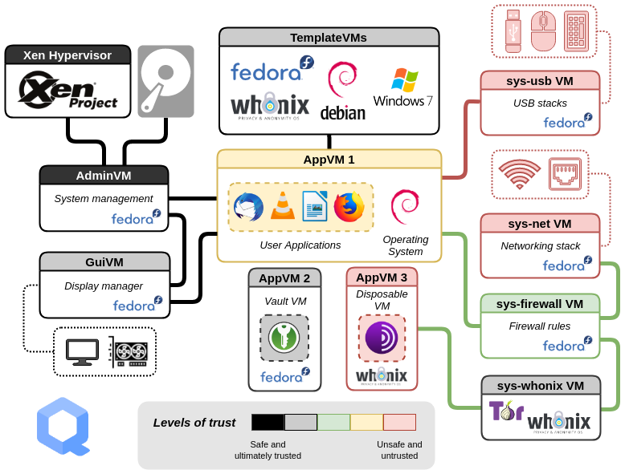

[**Qubes OS**](../desktop.md#qubes-os) is an open-source operating system which uses the [Xen](https://en.wikipedia.org/wiki/Xen) hypervisor to provide strong security for desktop computing through isolated *qubes*, (which are Virtual Machines). You can assign each *qube* a level of trust based on its purpose. Qubes OS provides security by using isolation. It only permits actions on a per-case basis and therefore is the opposite of [badness enumeration](https://ranum.com/security/computer_security/editorials/dumb).

## Hoe werkt Qubes OS?

Qubes uses [compartmentalization](https://qubes-os.org/intro) to keep the system secure. Qubes worden aangemaakt op basis van sjablonen, waarbij de standaard opties Fedora, Debian en [Whonix](../desktop.md#whonix)zijn. Qubes OS also allows you to create once-use [disposable](https://qubes-os.org/doc/how-to-use-disposables) *qubes*.

The term <em>qubes</em> is gradually being updated to avoid referring to them as "virtual machines".

Some of the information here and on the Qubes OS documentation may contain conflicting language as the "appVM" term is gradually being changed to "qube". Qubes are not entire virtual machines, but maintain similar functionalities to VMs.

<figcaption>Qubes Architectuur, Krediet: Wat is Qubes OS Intro</figcaption>

Each qube has a [colored border](https://qubes-os.org/screenshots) that can help you keep track of the domain in which it runs. Je kunt bijvoorbeeld een specifieke kleur gebruiken voor jouw bankbrowser, en een andere kleur voor een algemene niet-vertrouwde browser.

<figcaption>Qubes vensterranden, krediet: Qubes Screenshots</figcaption>

## Waarom zou ik Qubes gebruiken?

Qubes OS is useful if your [threat model](../basics/threat-modeling.md) requires strong security and isolation, such as if you think you'll be opening untrusted files from untrusted sources. A typical reason for using Qubes OS is to open documents from unknown sources, but the idea is that if a single qube is compromised it won't affect the rest of the system.

Qubes OS utilizes [dom0](https://wiki.xenproject.org/wiki/Dom0) Xen VM for controlling other *qubes* on the host OS, all of which display individual application windows within dom0's desktop environment. There are many uses for this type of architecture. Here are some tasks you can perform. You can see just how much more secure these processes are made by incorporating multiple steps.

### Tekst kopiëren en plakken

You can [copy and paste text](https://qubes-os.org/doc/how-to-copy-and-paste-text) using `qvm-copy-to-vm` or the below instructions:

1. Press **Ctrl+C** to tell the *qube* you're in that you want to copy something.
2. Press **Ctrl+Shift+C** to tell the *qube* to make this buffer available to the global clipboard.
3. Press **Ctrl+Shift+V** in the destination *qube* to make the global clipboard available.
4. Press **Ctrl+V** in the destination *qube* to paste the contents in the buffer.

### Bestandsuitwisseling

To copy and paste files and directories (folders) from one *qube* to another, you can use the option **Copy to Other AppVM...** or **Move to Other AppVM...**. Het verschil is dat de optie **Verplaatsen** het oorspronkelijke bestand verwijdert. Either option will protect your clipboard from being leaked to any other *qubes*. This is more secure than air-gapped file transfer. An air-gapped computer will still be forced to parse partitions or file systems. Dat is niet nodig met het inter-qube kopieersysteem.

Qubes do not have their own filesystems.

You can [copy and move files](https://qubes-os.org/doc/how-to-copy-and-move-files) between *qubes*. Daarbij worden de wijzigingen niet onmiddellijk aangebracht en kunnen ze bij een ongeval gemakkelijk ongedaan worden gemaakt. When you run a *qube*, it does not have a persistent filesystem. You can create and delete files, but these changes are ephemeral.

### Inter-VM Interacties

The [qrexec framework](https://qubes-os.org/doc/qrexec) is a core part of Qubes which allows communication between domains. It is built on top of the Xen library *vchan*, which facilitates [isolation through policies](https://qubes-os.org/news/2020/06/22/new-qrexec-policy-system).

## Connecting to Tor via a VPN

We [recommend](../advanced/tor-overview.md) connecting to the Tor network via a [VPN](../vpn.md) provider, and luckily Qubes makes this easy to do with a combination of ProxyVMs and Whonix.

After [creating a new ProxyVM](https://github.com/Qubes-Community/Contents/blob/master/docs/configuration/vpn.md) which connects to the VPN of your choice, you can chain your Whonix qubes to that ProxyVM **before** they connect to the Tor network, by setting the NetVM of your Whonix **Gateway** (`sys-whonix`) to the newly-created ProxyVM.

Your qubes should be configured in a manner similar to this:

| Qube name       | Qube description                                                                                                 | NetVM           |
| --------------- | ---------------------------------------------------------------------------------------------------------------- | --------------- |
| sys-net         | *Your default network qube (pre-installed)*                                                                      | *n/a*           |
| sys-firewall    | *Your default firewall qube (pre-installed)*                                                                     | sys-net         |
| ==sys-proxyvm== | The VPN ProxyVM you [created](https://github.com/Qubes-Community/Contents/blob/master/docs/configuration/vpn.md) | sys-firewall    |
| sys-whonix      | Your Whonix Gateway VM                                                                                           | ==sys-proxyvm== |
| anon-whonix     | Your Whonix Workstation VM                                                                                       | sys-whonix      |

## Extra bronnen

For additional information we encourage you to consult the extensive Qubes OS documentation pages located on the [Qubes OS Website](https://qubes-os.org/doc). Offline kopieën kunnen worden gedownload van het Qubes OS [documentatie archief](https://github.com/QubesOS/qubes-doc).

- [Arguably the world's most secure operating system](https://opentech.fund/news/qubes-os-arguably-the-worlds-most-secure-operating-system-motherboard) (Open Technology Fund)
- [Software compartmentalization vs. physical separation](https://invisiblethingslab.com/resources/2014/Software_compartmentalization_vs_physical_separation.pdf) (J. Rutkowska)
- [Partitioning my digital life into security domains](https://blog.invisiblethings.org/2011/03/13/partitioning-my-digital-life-into.html) (J. Rutkowska)
- [Related Articles](https://qubes-os.org/news/categories/#articles) (Qubes OS)
