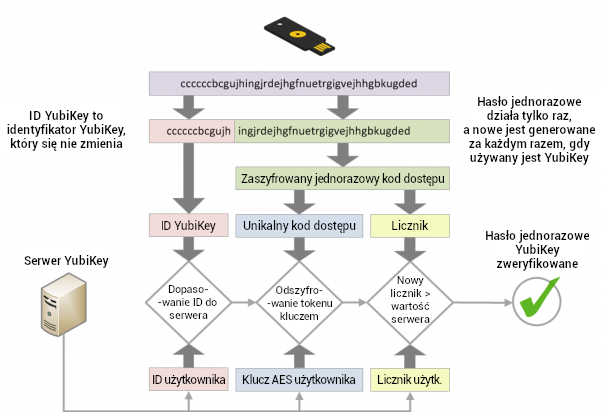
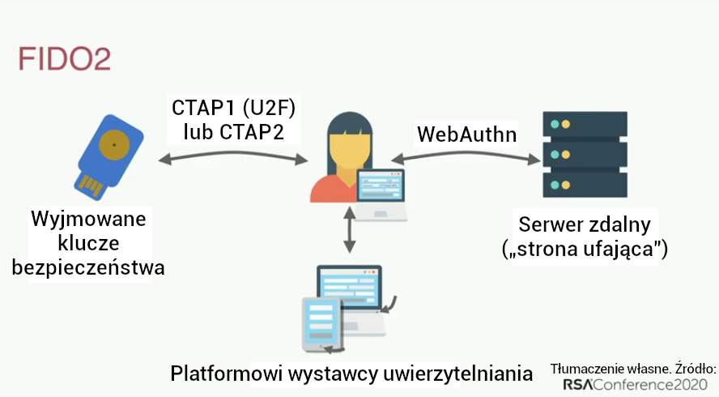

**Uwierzytelnianie wieloskładnikowe** (**MFA**) to mechanizm bezpieczeństwa, który wymaga dodatkowych kroków poza podaniem nazwy użytkownika (lub adresu e-mail) i hasła. Najczęstszą metodą są jednorazowe kody ograniczone czasowo, które otrzymuje się SMS-em lub z aplikacji.

Zazwyczaj, jeśli haker (lub przeciwnik) odgadnie hasło, uzyskuje dostęp do konta, do którego to hasło należy. Konto zabezpieczone MFA wymusza, aby atakujący posiadał zarówno hasło (coś, co *znasz*), jak i Twoje urządzenie (coś, co *masz*), np. telefon.

Metody MFA różnią się poziomem bezpieczeństwa, ale opierają się na założeniu, że im trudniej atakującemu uzyskać dostęp do użytej metody MFA, tym lepiej. Przykłady metod MFA (od najsłabszych do najsilniejszych) obejmują SMS, kody e-mail, powiadomienia push w aplikacji, TOTP, Yubico OTP i FIDO.

## Porównanie metod MFA

### MFA przez SMS lub e-mail

Otrzymywanie kodów OTP przez SMS lub e-mail to jedna ze słabszych metod zabezpieczenia kont za pomocą MFA. Uzyskanie kodu e-mailem lub SMS-em osłabia ideę „czegoś, co *masz*”, ponieważ istnieje wiele sposobów, w jakie atakujący może [przejąć Twój numer telefonu](https://en.wikipedia.org/wiki/SIM_swap_scam) lub uzyskać dostęp do skrzynki e-mail bez fizycznego dostępu do któregokolwiek z Twoich urządzeń. Jeśli nieuprawniona osoba uzyskałaby dostęp do e-maila, mogłaby wykorzystać go zarówno do zresetowania hasła, jak i do odebrania kodu uwierzytelniającego, co dawałoby jej pełny dostęp do konta.

### Powiadomienia push

MFA przez powiadomienia push przyjmuje formę wiadomości wysyłanej do aplikacji na telefonie z prośbą o potwierdzenie nowego logowania do konta. Ta metoda jest o wiele lepsza niż przez SMS czy e-mail, ponieważ atakujący zwykle nie będzie w stanie otrzymać tych powiadomień bez uprzednio zalogowanego urządzenia, co oznacza konieczność wcześniejszego przejęcia jednego z pozostałych urządzeń.

Wszyscy popełniamy błędy i istnieje ryzyko przypadkowego zaakceptowania próby logowania. Autoryzacje logowania przez powiadomienia push są zwykle wysyłane jednocześnie na *wszystkie* Twoje urządzenia, co zwiększa dostępność kodu MFA, jeśli posiadasz wiele urządzeń.

Bezpieczeństwo MFA opartego na powiadomieniach push zależy zarówno od jakości aplikacji, komponentu serwerowego, jak i od wiarygodności dewelopera ją tworzącego. Instalacja aplikacji może także wymagać przyznania inwazyjnych uprawnień, które dają dostęp do innych danych na urządzeniu. Ponadto pojedyncza aplikacja wymusza posiadanie odrębnej aplikacji dla każdej usługi — aplikacja ta może nie wymagać hasła do uruchomienia, w przeciwieństwie do dobrej aplikacji generującej TOTP.

### Hasło jednorazowe ograniczone czasowo (TOTP)

TOTP jest jedną z najpowszechniejszych form MFA. Podczas konfiguracji TOTP zazwyczaj trzeba zeskanować [kod QR](https://en.wikipedia.org/wiki/QR_code), który ustanawia „[sekret współdzielony](https://en.wikipedia.org/wiki/Shared_secret)” z usługą, z której zamierza się korzystać. Sekret współdzielony jest przechowywany w danych aplikacji uwierzytelniającej i bywa czasem chroniony hasłem.

Kod ograniczony czasowo jest następnie generowany na podstawie sekretu współdzielonego i bieżącego czasu. Ponieważ kod jest ważny tylko przez krótki czas, bez dostępu do sekretu współdzielonego przeciwnik nie jest w stanie wygenerować nowych kodów.

Jeżeli posiadasz sprzętowy klucz bezpieczeństwa z obsługą TOTP (na przykład YubiKey z [Yubico Authenticator](https://yubico.com/products/yubico-authenticator)), zaleca się przechowywać tam swoje „sekrety współdzielone”. Sprzęt taki jak YubiKey został zaprojektowany tak, by utrudniać wyodrębnienie i skopiowanie „sekretu współdzielonego”. YubiKey nie jest też podłączony do Internetu, w przeciwieństwie do telefonu z aplikacją generującą TOTP.

W przeciwieńśtwie do [WebAuthn](#fido-fast-identity-online), TOTP nie chroni przed [phishingiem](https://pl.wikipedia.org/wiki/Phishing) ani atakami polegającymi na ponownym użyciu kodu. Jeśli przeciwnik uzyska od Ciebie ważny kod, może go użyć tyle razy, ile chce, dopóki nie wygaśnie (zazwyczaj po 60 sekundach).

Przeciwnik może stworzyć stronę podszywającą się pod oficjalną usługę w celu wyłudzenia nazwy użytkownika, hasła i aktualnego kodu TOTP. Jeśli następnie użyje przechwyconych danych, może zalogować się do prawdziwej usługi i przejąć konto.

Choć nie jest to rozwiązanie idealne, TOTP jest wystarczająco bezpieczny dla większości osób, a gdy [sprzętowe klucze bezpieczeństwa](../security-keys.md) nie są obsługiwane, [aplikacje uwierzytelniające](../multi-factor-authentication.md) wciąż stanowią dobrą opcję.

### Sprzętowe klucze bezpieczeństwa

YubiKey przechowuje dane na odpornym na manipulacje układzie półprzewodnikowym, do którego [nie da się nieinwazyjnie uzyskać dostępu](https://security.stackexchange.com/a/245772) bez kosztownego procesu i laboratorium kryminalistycznego.

Klucze te zwykle pełnią wiele funkcji i udostępniają kilka metod uwierzytelniania. Poniżej opisano najczęściej spotykane.

#### Yubico OTP

Yubico OTP to protokół uwierzytelniania zwykle implementowany w sprzętowych kluczach bezpieczeństwa. Po wybraniu Yubico OTP klucz wygeneruje identyfikator publiczny, identyfikator prywatny oraz klucz tajny, który następnie jest przesyłany na serwer Yubico OTP.

Podczas logowania na stronę wystarczy fizycznie dotknąć klucza bezpieczeństwa. Klucz emuluje klawiaturę i wpisuje jednorazowe hasło w pole hasła.

Usługa przekaże następnie jednorazowe hasło do serwera Yubico OTP w celu weryfikacji. Licznik jest zwiększany zarówno na kluczu, jak i na serwerze walidacyjnym Yubico. OTP można użyć tylko raz — po pomyślnej autoryzacji licznik rośnie, co uniemożliwia ponowne użycie tego samego OTP. Yubico udostępnia [szczegółowy dokument](https://developers.yubico.com/OTP/OTPs_Explained.html) opisujący ten proces.

<figure markdown>
  
</figure>

W porównaniu z TOTP korzystanie z Yubico OTP ma swoje zalety i wady.

Serwer walidacyjny Yubico to usługa oparta na chmurze, co wymaga zaufania, że Yubico przechowuje Twoje dane bezpiecznie i nie profiluje Cię. Publiczny identyfikator powiązany z Yubico OTP jest ponownie używany na każdej stronie internetowej i może stanowić kolejny kanał do profilowania przez podmioty trzecie. Podobnie jak TOTP, Yubico OTP nie zapewnia odporności na phishing.

Jeśli w Twoim modelu zagrożeń wymagana jest inna tożsamość na różnych stronach, **nie używaj** Yubico OTP z tym samym sprzętowym kluczem bezpieczeństwa na tych stronach, ponieważ identyfikator publiczny jest unikalny dla każdego klucza.

#### FIDO (Fast IDentity Online)

[FIDO](https://en.wikipedia.org/wiki/FIDO_Alliance) obejmuje szereg standardów — najpierw powstało [U2F](https://en.wikipedia.org/wiki/Universal_2nd_Factor), a później [FIDO2](https://en.wikipedia.org/wiki/FIDO2_Project), w ramach którego znajduje się standard sieciowy [WebAuthn](https://en.wikipedia.org/wiki/WebAuthn).

U2F i FIDO2 odnoszą się do [Client to Authenticator Protocol](https://en.wikipedia.org/wiki/Client_to_Authenticator_Protocol), czyli protokołu między kluczem bezpieczeństwa a komputerem, takim jak laptop czy telefon. Uzupełnia on WebAuthn, który jest komponentem używanym do uwierzytelniania wobec witryny („strona ufająca”), na którą próbujemy się zalogować.

WebAuthn jest najbezpieczniejszą i najbardziej prywatną formą uwierzytelniania drugiego czynnika. Chociaż doświadczenie uwierzytelniania jest podobne do Yubico OTP, klucz nie generuje jednorazowego hasła i nie weryfikuje go za pośrednictwem zewnętrznego serwera. Zamiast tego do uwierzytelniania stosuje [kryptografię klucza publicznego](https://en.wikipedia.org/wiki/Public-key_cryptography).

<figure markdown>
  
</figure>

Podczas tworzenia konta klucz publiczny jest wysyłany do usługi, a przy logowaniu usługa wymaga „podpisania” pewnych danych kluczem prywatnym. Dzięki temu usługa nie przechowuje danych haseł, więc nie ma niczego, co przeciwnik mógłby ukraść.

Ta prezentacja omawia historię uwierzytelniania hasłem, jego pułapki (takie jak ponowne używanie haseł) oraz standardy FIDO2 i [WebAuthn](https://webauthn.guide):

- [How FIDO2 and WebAuthn Stop Account Takeovers](https://youtu.be/aMo4ZlWznao) <small>(po angielsku; YouTube)</small>

FIDO2 i WebAuthn mają lepsze właściwości w zakresie bezpieczeństwa i prywatności w porównaniu z innymi metodami MFA.

Zazwyczaj w usługach internetowych używa się ich wraz z WebAuthn, który jest częścią [zaleceń W3C](https://en.wikipedia.org/wiki/World_Wide_Web_Consortium#W3C_recommendation_(REC)). Wykorzystuje uwierzytelnianie za pomocą klucza publicznego i jest bezpieczniejszy niż sekrety współdzielone stosowane w Yubico OTP i TOTP, ponieważ podczas uwierzytelniania uwzględniana jest nazwa pochodzenia (zazwyczaj nazwa domeny). Atestacja pomaga chronić przed phishingiem, ponieważ umożliwia ustalenie, że korzysta się z autentycznej usługi, a nie z jej fałszywej kopii.

W przeciwieństwie do Yubico OTP, WebAuthn nie używa żadnego identyfikatora publicznego, więc klucz **nie jest** identyfikowalny na różnych witrynach. Nie korzysta też z żadnego zewnętrznego serwera w chmurze do uwierzytelniania. Cała komunikacja odbywa się między kluczem a witryną, do której się logujesz. FIDO stosuje również licznik, który jest zwiększany przy użyciu, aby zapobiec ponownemu wykorzystaniu sesji i klonowaniu kluczy.

Jeżeli witryna lub usługa obsługuje WebAuthn do uwierzytelniania, zaleca się korzystanie z niego zamiast innych form MFA.

## Ogólne zalecenia

Mamy następujące ogólne zalecenia:

### Którą metodę wybrać?

Konfigurując metodę MFA, pamiętaj, że jej bezpieczeństwo jest ograniczone najsłabszą stosowaną przez Ciebie metodą uwierzytelniania. Oznacza to, że warto korzystać wyłącznie z najlepszej dostępnej metody MFA. Na przykład, jeśli używasz już TOTP, najlepiej wyłączyć MFA przez e-mail i SMS. Jeśli korzystasz z FIDO2/WebAuthn, nie używaj na swoim koncie Yubico OTP ani TOTP.

### Kopie zapasowe

Zawsze miej kopie zapasowe swojej metody MFA. Sprzętowe klucze bezpieczeństwa mogą zostać zgubione, skradzione lub po prostu przestać działać z upływem czasu. Zaleca się posiadanie pary sprzętowych kluczy bezpieczeństwa mających ten sam dostęp do kont, zamiast tylko jednego.

W przypadku TOTP w aplikacji uwierzytelniającej upewnij się, że została utworzona kopia zapasowa kluczy odzyskiwania lub samej aplikacji, albo skopiuj „sekrety współdzielone” do innej instancji aplikacji na innym telefonie lub do zaszyfrowanego kontenera (np. [VeraCrypt](../encryption.md#veracrypt-disk)).

### Konfiguracja początkowa

Kupując klucz bezpieczeństwa, zmień domyślne dane uwierzytelniające, skonfiguruj ochronę hasłem dla klucza i włącz potwierdzenie dotknięciem, jeśli klucz to obsługuje. Produkty takie jak YubiKey mają wiele interfejsów z oddzielnymi danymi uwierzytelniającymi dla każdego z nich, więc należy przejść przez każdy interfejs i skonfigurować ochronę także tam.

### E-mail i SMS

Jeśli musisz używać e-maila do MFA, upewnij się, że samo konto e-mail jest zabezpieczone odpowiednią metodą MFA.

Jeżeli korzystasz z MFA przez SMS, wybierz operatora, który nie przeniesie Twojego numeru na nową kartę SIM bez dostępu do konta, albo użyj dedykowanego numeru VoIP od dostawcy o porównywalnym poziomie bezpieczeństwa, aby uniknąć ataku typu [SIM swap](https://en.wikipedia.org/wiki/SIM_swap_scam).

[Zalecane narzędzia MFA](../multi-factor-authentication.md ""){.md-button}

## Dodatkowe miejsca konfiguracji MFA

Oprócz zabezpieczania logowań do witryn uwierzytelnianie wieloskładnikowe można wykorzystać także do ochrony logowań lokalnych, kluczy SSH czy nawet baz haseł.

### macOS

macOS oferuje [natywną obsługę](https://support.apple.com/guide/deployment/intro-to-smart-card-integration-depd0b888248/web) uwierzytelniania kartami inteligentnymi (PIV). Jeśli posiadasz kartę inteligentną lub sprzętowy klucz bezpieczeństwa obsługujący interfejs PIV, taki jak YubiKey, zalecamy postępować zgodnie z dokumentacją dostawcy karty lub klucza i skonfigurować uwierzytelnianie drugiego czynnika na komputerze z systemem macOS.

Yubico przygotowało przewodnik [Using Your YubiKey as a Smart Card in macOS](https://support.yubico.com/hc/articles/360016649059) [Korzystanie z YubiKey jako karty inteligentnej w systemie macOS], który może pomóc w konfiguracji YubiKey na macOS.

Po skonfigurowaniu karty inteligentnej/klucza bezpieczeństwa zaleca się uruchomienie w Terminalu następującego polecenia:

```text
sudo defaults write /Library/Preferences/com.apple.loginwindow DisableFDEAutoLogin -bool YES
```

Polecenie to uniemożliwi obejście MFA przez przeciwnika podczas uruchamiania komputera.

### Linux

<div class="admonition warning" markdown>
<p class="admonition-title">Ostrzeżenie</p>

Jeśli nazwa hosta systemu ulegnie zmianie (np. wskutek DHCP), nie będzie możliwe zalogowanie się. Przed wykonaniem tego przewodnika konieczne jest poprawne ustawienie nazwy hosta komputera.

</div>

Moduł `pam_u2f` w systemie Linux może zapewnić uwierzytelnianie dwuskładnikowe przy logowaniu w większości popularnych dystrybucji. Jeśli posiadasz sprzętowy klucz bezpieczeństwa obsługujący U2F, można skonfigurować MFA dla logowania. Yubico przygotowało przewodnik [Ubuntu Linux Login Guide - U2F](https://support.yubico.com/hc/articles/360016649099-Ubuntu-Linux-Login-Guide-U2F) [Przewodnik logowania do Ubuntu Linux – U2F], który powinien działać na dowolnej dystrybucji. Polecenia menedżera pakietów — takie jak `apt-get` — oraz nazwy pakietów mogą się jednak różnić. Ten przewodnik **nie** dotyczy sytemu Qubes OS.

### Qubes OS

Qubes OS obsługuje uwierzytelnianie typu challenge-response z użyciem YubiKey. Jeśli masz YubiKey z obsługą uwierzytelniania typu challenge-response, zapoznaj się z [dokumentacją YubiKey](https://qubes-os.org/doc/yubikey) w systemie Qubes OS, jeśli chcesz skonfigurować MFA w Qubes OS.

### SSH

#### Sprzętowe klucze bezpieczeństwa

MFA dla SSH można skonfigurować przy użyciu kilku różnych metod uwierzytelniania popularnych wśród sprzętowych kluczy bezpieczeństwa. Zalecamy zapoznanie się z [dokumentacją Yubico](https://developers.yubico.com/SSH) na temat konfiguracji.

#### TOTP

MFA dla SSH można też skonfigurować przy użyciu TOTP. DigitalOcean udostępnił poradnik [How To Set Up Multi-Factor Authentication for SSH on Ubuntu 20.04](https://digitalocean.com/community/tutorials/how-to-set-up-multi-factor-authentication-for-ssh-on-ubuntu-20-04) [Jak skonfigurować uwierzytelnianie wieloskładnikowe dla SSH na Ubuntu 20.04]. Większość kroków powinna być taka sama niezależnie od dystrybucji, jednak polecenia menedżera pakietów — np. `apt-get` — oraz nazwy pakietów mogą się różnić.

### KeePass (i KeePassXC)

Bazy danych KeePass i KeePassXC można zabezpieczyć, korzystając z HOTP lub challenge–response jako drugiego czynnika uwierzytelniania. Yubico przygotowało dokumentację dla KeePass [Using Your YubiKey with KeePass](https://support.yubico.com/hc/articles/360013779759-Using-Your-YubiKey-with-KeePass) [Korzystanie z klucza YubiKey z KeePass], a na stronie [KeePassXC](https://keepassxc.org/docs/#faq-yubikey-2fa) również znajduje się odpowiedni materiał.
