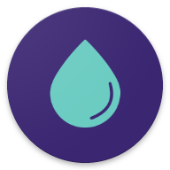
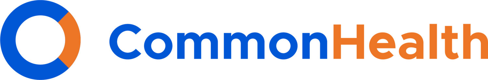

<small>Chroni przed następującymi zagrożeniami:</small>

- [:material-server-network: Dostawcy usług](basics/common-threats.md#privacy-from-service-providers){ .pg-teal }

Śledź swoje cele związane ze zdrowiem i sprawnością dzięki tym aplikacjom. Unlike their mainstream alternatives, your personal health information will be kept private.

## Śledzenie cyklu menstruacyjnego

Popular menstrual trackers like [Flo](https://techcrunch.com/2021/01/13/flo-gets-ftc-slap-for-sharing-user-data-when-it-promised-privacy) are notorious for collecting and sharing your user data. Depending on your jurisdiction, this may lead to [legal consequences](https://forbes.com/sites/abigaildubiniecki/2024/11/14/post-roe-your-period-app-data-could-be-used-against-you) affecting your reproductive autonomy.

### Drip

{ align=right }

**Drip** is a gender-inclusive and open source menstrual cycle tracker available on all mobile platforms. It relies on the "sympto-thermal method" to predict ovulation. All user data is stored locally on your device and can be protected with a password.

[:octicons-home-16: Strona główna](https://bloodyhealth.gitlab.io){ .md-button .md-button--primary }
[:octicons-eye-16:](https://bloodyhealth.gitlab.io/privacy-policy.html){ .card-link title="Polityka prywatności" }
[:octicons-info-16:](https://bloodyhealth.gitlab.io/faq){ .card-link title="Dokumentacja" }
[:octicons-code-16:](https://gitlab.com/bloodyhealth/drip){ .card-link title="Kod źródłowy" }

<0>Pobierz</0>

- [:simple-googleplay: Google Play](https://play.google.com/store/apps/details?id=com.drip)
- [:simple-appstore: App Store](https://apps.apple.com/us/app/drip/id1584564949)
- [:simple-android: Android](https://bloodyhealth.gitlab.io)

### Euki

{ align=right }

**Euki** is a nonprofit-backed menstrual cycle tracker that also doubles as a medication tracker and sexual wellness knowledge base. It allows you to schedule the automatic deletion of your personal data in the app. All user data is stored locally on your device and can be protected with a password.

[:octicons-home-16: Strona główna](https://eukiapp.org){ .md-button .md-button--primary }
[:octicons-eye-16:](https://eukiapp.org/privacy-policy){ .card-link title=:"Polityka prywatności:}
[:octicons-code-16:](https://github.com/Euki-Inc/Euki-Android){ .card-link title="Kod źródłowy" }
[:octicons-heart-16:](https://every.org/euki-app){ .card-link title=Wesprzyj" }

<0>Pobierz</0>

- [:simple-googleplay: Google Play](https://play.google.com/store/apps/details?id=com.kollectivemobile.euki)
- [:simple-appstore: App Store](https://apps.apple.com/app/euki/id1469213846)

### Apple Zdrowie

{ align=right }{ align=right }

Apple Health jest jedną z domyślnych aplikacji zainstalowanych na urządzeniach iOS. It includes many health and wellness features (see [Health Records](#apple-health-records)), including menstrual cycle tracking. It also uses gender-neutral language. Apple Health always uses end-to-end encryption when syncing across multiple devices.

[:octicons-home-16: Strona Główna](https://apple.com/health){ .md-button .md-button--primary }
[:octicons-eye-16:](https://apple.com/legal/privacy/consumer-health-personal-data/en-ww){ .card-link title="Polityka prywatności" }

<0>Pobierz</0>

- [:simple-appstore: App Store](https://apps.apple.com/app/apple-health/id1242545199)

## Fitness Trackers

These general purpose apps can do everything from counting steps and tracking sleep to measuring your heartbeat.

### Apple Fitness

{ align=right }

**Apple Fitness** jest domyślną aplikacją fitness dla iOS. Apple Fitness always uses end-to-end encryption when syncing across multiple devices. Additionally, almost all measured data is processed on your device.

[:octicons-eye-16:](https://apple.com/legal/privacy/consumer-health-personal-data/en-ww){ .card-link title="Polityka prywatności" }

Pobierz

- [:simple-appstore: App Store](https://apps.apple.com/app/id1208224953)

### Gadgetbridge

{ align=right }{ align=right }

**Gadgetbridge** jest aplikacją open-source dla systemu Android, która pozwala na parowanie i zarządzanie urządzeniem Bluetooth bez polegania na aplikacji producenta. When paired with a compatible smartwatch, it can mimic the health and wellness functionality of these watches without third-party data collection.

[:octicons-home-16: Strona główna](https://gadgetbridge.org){ .md-button .md-button--primary }
[:octicons-info-16:](https://gadgetbridge.org/basics){ .card-link title="Dokumentacja" }
[:octicons-code-16:](https://codeberg.org/Freeyourgadget/Gadgetbridge){ .card-link title="Kod źródłowy" }
[:octicons-heart-16:](https://liberapay.com/Gadgetbridge/donate){ .card-link title="Wesprzyj" }

<0>Pobierz</0>

- [:simple-fdroid: F-Droid](https://f-droid.org/packages/nodomain.freeyourgadget.gadgetbridge)

Gadgetbridge's app functionality includes, but is not limited to: step counting, sleep tracking, heart rate monitoring, etc.

Make sure to review the smartwatch [compatibility list](https://gadgetbridge.org/gadgets) before purchasing a device. Some devices require you to download the vendor's app and connect the smartwatch to their servers prior to installing Gadgetbridge.

## Dokumentacja medyczna

These apps help you collect and manage personal health data and share it with health providers, organizations, and other apps.

### Apple Rekordy zdrowotne

{ align=right }{ align=right }

**Apple Health Records** is a built-in feature within [Apple Health](#apple-health) that allows you to view, store, and share your health records.

[:octicons-home-16: Strona Główna](https://apple.com/health){ .md-button .md-button--primary }
[:octicons-eye-16:](https://apple.com/legal/privacy/consumer-health-personal-data/en-ww){ .card-link title="Polityka prywatności" }

<0>Pobierz</0>

- [:simple-appstore: App Store](https://apps.apple.com/app/apple-health/id1242545199)

### CommonHealth

{ align=right }

**CommonHealth** is a privacy-respecting Android app that allows people to access their electronic health records and securely share it to providers. All health data is stored on your device and can be protected with a passcode or biometric authentication.

[:octicons-home-16: Strona Główna](https://commonhealth.org){ .md-button .md-button--primary }
[:octicons-eye-16:](https://commonhealth.org/privacy){ .card-link title="Polityka prywatności" }

<0>Pobierz</0>

- [:simple-googleplay: Google Play](https://play.google.com/store/apps/details?id=org.thecommonsproject.android.phr)

CommonHealth jest dostępna tylko w Stanach Zjednoczonych. Although the app itself is closed source, the [developer SDK is open source](https://github.com/the-commons-project).

## Kryteria

**Należy pamiętać, że nie jesteśmy powiązani z żadnym z polecanych przez nas projektów.** Oprócz [naszych standardowych kryteriów](about/criteria.md) opracowaliśmy jasny zestaw wymagań, które pozwalają nam formułować obiektywne zalecenia. Sugerujemy zapoznanie się z tą listą przed wyborem projektu oraz przeprowadzenie własnych badań, aby upewnić się, że jest to odpowiedni wybór dla Ciebie.

### Minimalne wymagania

- Musi obsługiwać automatyczne aktualizacje.
- Nie może przechowywać niezaszyfrowanych danych poza urządzeniem.
- Musi działać offline.
