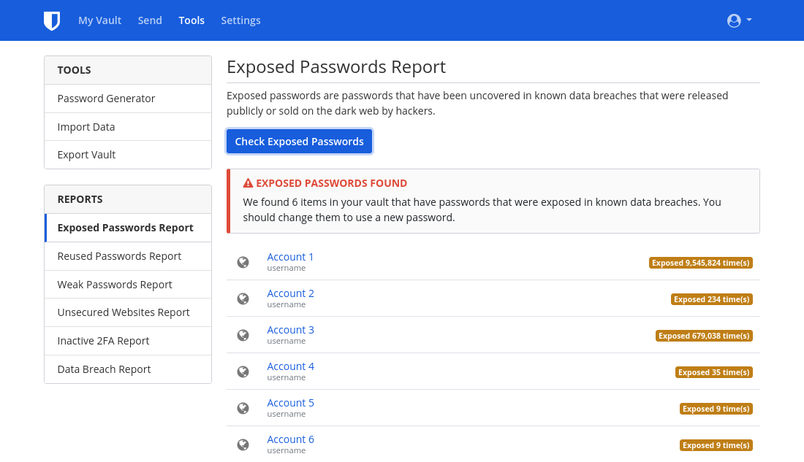

Со временем можно легко накопить множество учетных записей в интернете, многие из которых вы можете уже не использовать. Удаление этих неиспользуемых учетных записей - важный шаг в восстановлении конфиденциальности, поскольку неиспользуемые учетные записи уязвимы для утечки данных. Утечка данных - это когда безопасность сервиса скомпрометирована, и защищенная информация просматривается, передается или похищается неавторизованными лицами. К сожалению, утечки данных - [слишком частое](https://haveibeenpwned.com/PwnedWebsites) явление в наши дни, поэтому соблюдение правил цифровой гигиены - лучший способ минимизировать их влияние на вашу жизнь. Цель данного руководства - помочь вам пройти через неприятный процесс удаления учетной записи (который часто усложняется [обманчивым дизайном](https://www.deceptive.design/)) для улучшения вашего присутствия в интернете.

## Поиск старых аккаунтов

### Менеджер паролей

Если у вас есть менеджер паролей, которым вы пользовались на протяжении всей своей цифровой жизни, то эта часть будет очень простой. Часто они включают встроенные функции для обнаружения того, что ваши учетные данные были раскрыты в результате утечки данных - например, отчеты в Bitwarden о [скомпрометированных паролях](https://bitwarden.com/blog/have-you-been-pwned/).

<figure markdown>
  
</figure>

Даже если вы раньше не использовали отдельный менеджер паролей, есть вероятность, что вы пользовались им в браузере или на телефоне, даже не подозревая об этом. Например: [Firefox Password Manager](https://support.mozilla.org/ru/kb/sohranyonnye-paroli-zapominajte-udalyajte-redaktir), [Google Password Manager](https://passwords.google.com/intro) и [Edge Password Manager](https://support.microsoft.com/ru-ru/microsoft-edge/%D0%B7%D0%B0%D0%BF%D0%BE%D0%BC%D0%B8%D0%BD%D0%B0%D0%BD%D0%B8%D0%B5-%D0%B8-%D1%83%D0%B4%D0%B0%D0%BB%D0%B5%D0%BD%D0%B8%D0%B5-%D0%BF%D0%B0%D1%80%D0%BE%D0%BB%D0%B5%D0%B9-%D0%B2-microsoft-edge-b4beecb0-f2a8-1ca0-f26f-9ec247a3f336).

Также на настольных платформах часто есть менеджер паролей, который может помочь вам восстановить забытые пароли:

- Windows: [Диспетчер учетных данных](https://support.microsoft.com/ru-ru/windows/%D0%B4%D0%BE%D1%81%D1%82%D1%83%D0%BF-%D0%BA-%D0%B4%D0%B8%D1%81%D0%BF%D0%B5%D1%82%D1%87%D0%B5%D1%80%D1%83-%D1%83%D1%87%D0%B5%D1%82%D0%BD%D1%8B%D1%85-%D0%B4%D0%B0%D0%BD%D0%BD%D1%8B%D1%85-1b5c916a-6a16-889f-8581-fc16e8165ac0)
- macOS: [Пароли](https://support.apple.com/ru-ru/HT211145)
- iOS: [Пароли](https://support.apple.com/ru-ru/HT211146)
- Linux: Gnome Keyring, доступ к которому можно получить с помощью [Seahorse](https://wiki.gnome.org/Apps/Seahorse) или [KDE Wallet Manager](https://userbase.kde.org/KDE_Wallet_Manager)

### Электронная почта

Если в прошлом вы не пользовались менеджером паролей или считаете, что у вас есть учетные записи, которые никогда не добавлялись в менеджер паролей, другой вариант - поискать учетную запись(и) электронной почты, с которой, по вашему мнению, вы зарегистрировались. В своем почтовом клиенте найдите такие ключевые слова, как "подтверждение" или "приветствие." Почти каждый раз, когда вы регистрируетесь где-либо в интернете, сервис отправляет на вашу электронную почту проверочную ссылку или вводное сообщение. Это может быть хорошим способом найти старые, забытые аккаунты.

## Удаление старых аккаунтов

### Вход

Чтобы удалить свои старые учетные записи, сначала нужно убедиться, что вы можете войти в них. Опять же, если учетная запись была в вашем менеджере паролей, этот шаг прост. Если нет, вы можете попытаться угадать свой пароль. В противном случае, как правило, существуют варианты восстановления доступа к вашей учетной записи, обычно доступные через ссылку "забыл пароль" на странице входа в аккаунт. Возможно, что аккаунты, в которые вы давно не заходили, уже были удалены - иногда сервисы удаляют все старые учетные записи.

При попытке восстановить доступ, если сайт выдает сообщение об ошибке, говорящее, что этот адрес электронной почты не связан с учетной записью, или вы не получаете ссылку на сброс пароля после нескольких попыток, значит, у вас нет учетной записи под этим адресом электронной почты и вам следует попробовать другой адрес. Если вы не можете выяснить, какой адрес электронной почты вы использовали или у вас больше нет доступа к этому адресу, вы можете попробовать обратиться в службу поддержки. К сожалению, нет никакой гарантии, что вы сможете восстановить доступ к своему аккаунту.

### GDPR (только для резидентов ЕЭЗ)

Жители ЕЭЗ имеют дополнительные права в отношении стирания данных, указанные в [статье 17](https://www.gdpr.org/regulation/article-17.html) GDPR. Если к вам это применимо, прочитайте политику конфиденциальности для конкретного сервиса, чтобы найти информацию о том, как воспользоваться своим правом на удаление данных. Чтение политики конфиденциальности может оказаться важным, поскольку некоторые сервисы имеют опцию "Удалить аккаунт", которая только отключает ваш аккаунт, а для реального удаления необходимо предпринять дополнительные действия. Иногда для фактического удаления может потребоваться заполнение анкет, отправка электронного письма сотруднику службы по защите данных или даже подтверждение вашего проживания в ЕЭЗ. Если вы планируете пойти этим путем, **не** перезаписывайте информацию в аккаунте - может потребоваться ваша личность как резидента ЕЭЗ. Обратите внимание, что местонахождение службы не имеет значения; GDPR применяется ко всем, кто обслуживает европейских пользователей. Если служба не соблюдает ваше право на удаление данных, вы можете обратиться в национальный [орган по защите данных](https://ec.europa.eu/info/law/law-topic/data-protection/reform/rights-citizens/redress/what-should-i-do-if-i-think-my-personal-data-protection-rights-havent-been-respected_en), и вам может быть предоставлено право на денежную компенсацию.

### Перезапись информации в аккаунте

В некоторых ситуациях, когда вы планируете отказаться от аккаунта, может иметь смысл перезаписать информацию об аккаунте поддельными данными. Убедившись, что вы можете войти в систему, измените всю информацию в своем аккаунте на фальсифицированную. Это связано с тем, что многие сайты сохраняют последнюю записанную в аккаунте информацию, даже после удаления аккаунта. Надеемся, что они перезапишут предыдущую информацию самыми новыми данными, которые вы ввели. Однако нет гарантии, что не появятся резервные копии с предыдущей информацией.

Для учетной записи электронной почты либо создайте новую альтернативную учетную запись электронной почты через выбранного вами провайдера, либо создайте псевдоним с помощью [сервиса псевдонимов электронной почты](../email.md#email-aliasing-services). После этого вы можете удалить свой альтернативный адрес электронной почты. Мы не рекомендуем использовать временных провайдеров электронной почты, так как часто бывает, что временные почтовые ящики можно активировать повторно.

### Удаление

Вы можете проверить [JustDeleteMe](https://justdeleteme.xyz) для получения инструкций по удалению учетной записи для конкретного сервиса. Некоторые сайты любезно предоставят опцию "Удалить аккаунт", в то время как другие будут вынуждать вас общаться с сотрудником службы поддержки. Процесс удаления может варьироваться от сайта к сайту, на некоторых из них удаление аккаунта невозможно.

Для сервисов, которые не позволяют удалить аккаунт, лучше всего подделать всю информацию, как уже говорилось ранее, и усилить защиту аккаунта. Для этого включите [МФА](multi-factor-authentication.md) и все предлагаемые дополнительные функции безопасности. Кроме того, измените пароль на сгенерированный случайным образом пароль максимально допустимого размера (для этого может быть полезен [менеджер паролей](../passwords.md)).

Если вы убедились, что вся важная для вас информация удалена, можете смело забыть об этой учетной записи. Если нет, то, возможно, имеет смысл хранить учетные данные вместе с другими паролями и время от времени заходить в систему, чтобы изменить пароль.

Даже если вы сможете удалить учетную запись, нет гарантии, что вся ваша информация будет удалена. Более того, некоторые компании по закону обязаны хранить определенную информацию, особенно если она связана с финансовыми операциями. Вы не можете контролировать, что происходит с вашими данными, когда речь идет о веб-сайтах и облачных сервисах.

## Избегайте новых аккаунтов

Как гласит старая поговорка, "Болен — лечись, здоров — берегись." Всякий раз, когда вы хотите создать новый аккаунт, спросите себя: "Действительно ли мне это нужно? Могу ли я достичь того, что мне нужно, не имея аккаунта?" Зачастую удалить учетную запись гораздо сложнее, чем создать ее. И даже после удаления или изменения информации в вашем аккаунте может остаться кэшированная версия от стороннего разработчика - например, [Internet Archive](https://archive.org/). Избегайте создания аккаунтов, когда у вас есть возможность - ваше будущее будет вам благодарно!
