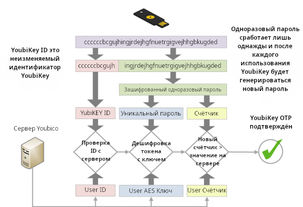
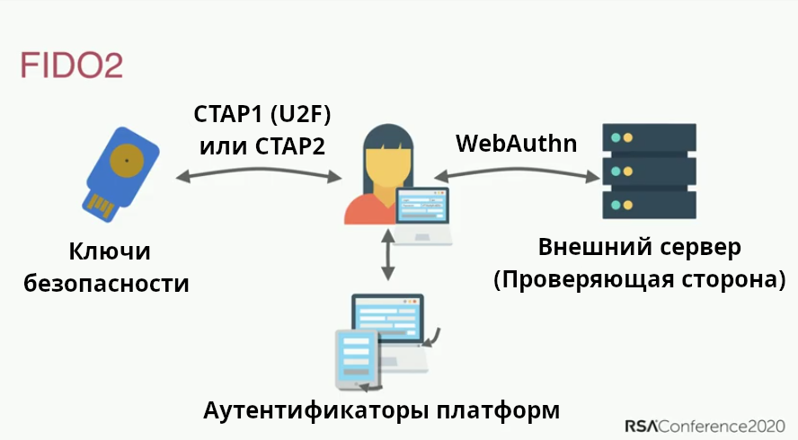

**Multifactor Authentication** (**MFA**) is a security mechanism that requires additional steps beyond entering your username (or email) and password. Самым распространенным методом являются одноразовые пароли, которые вы можете получить по СМС или в приложении.

Обычно, если хакеру (или злоумышленнику) удается узнать ваш пароль, то он получает доступ к учетной записи, которую этот пароль защищал. Чтобы взломать учетную запись с включенной MFA хакеру необходимо заполучить как пароль (то, что вы *знаете*), так и устройство (например телефон), которым вы владеете (то, что у вас *есть*).

Методы MFA различаются по степени безопасности, но в их основе лежит принцип: чем сложнее злоумышленнику получить доступ к вашему методу MFA, тем лучше. Методы MFA (от самого слабого к самому сильному): СМС, пароли по электронной почте, пуш-уведомления из приложений, TOTP, Yubico OTP и FIDO.

## Сравнение методов MFA

### Пароль по СМС или электронной почте

Получение одноразовых паролей (англ. OTP) по СМС или электронной почте - один из самых слабых вариантов MFA. Получение пароля по электронной почте или СМС невилирует принцип "что-то, что у вас *есть*", поскольку существует множество способов, которыми хакер может [завладеть вашим телефонным номером](https://en.wikipedia.org/wiki/SIM_swap_scam) или получить доступ к вашей электронной почте, не имея физического доступа ни к одному из ваших устройств. Если злоумышленник получит доступ к вашей электронной почте, то он сможет использовать её как для сброса пароля, так и для получения одноразового пароля, что даст ему полный доступ к вашей учетной записи.

### Пуш-уведомления

MFA с помощью пуш-уведомления представляет собой сообщение, отправленное в приложении на вашем телефоне с просьбой подтвердить новый вход в учетную запись. Этот метод гораздо безопаснее, чем пароль из СМС или электронной почты, потому что злоумышленник не сможет получить пуш-уведомления без доступа к уже авторизованному устройству. Это означает, что для этого ему сначала нужно будет взломать одно из ваших других устройств.

Мы все иногда ошибаемся, поэтому существует вероятность, что вы случайно подтвердите вход в систему. Пуш-уведомления с подтверждением авторизации обычно приходят на *все* ваши устройства сразу - это облегчает доступ к кодам MFA, если у вас несколько устройств.

Безопасность MFA с помощью пуш-уведомления зависит не только от качества приложения и серверной части, но и от доверия к разработчику, который его создает. Установка приложений может также потребовать предоставления разрешений, которые позволяют получить доступ к другим данным на вашем устройстве. Каждый сервис также требует использования отдельного приложения, которое может быть не защищено паролем, в отличие от хорошего приложения для генерации TOTP.

### Одноразовый пароль основанный на времени (TOTP)

TOTP - одна из наиболее распространенных форм MFA. При настройке TOTP обычно необходимо отсканировать [QR-код](https://en.wikipedia.org/wiki/QR_code), который содержит "[общий секрет](https://en.wikipedia.org/wiki/Shared_secret)" для сервиса, который вы собираетесь использовать. The shared secret is secured inside the authenticator app's data, and is sometimes protected by a password.

Код с ограничением по времени затем генерируется на основе общего секрета и текущего времени. Поскольку код действителен лишь в течение ограниченного времени, злоумышленник не сможет сгенерировать новые коды без доступа к общему секрету.

Если у вас есть аппаратный ключ безопасности с поддержкой TOTP (например, YubiKey с поддержкой [аутентификатора Yubico](https://yubico.com/products/yubico-authenticator)), мы рекомендуем хранить ваши "общие секреты" на этом аппаратном ключе. Такое оборудование, как YubiKey, было разработано с целью сделать "общий секрет" трудноизвлекаемым и копируемым. YubiKey также не подключен к интернету, в отличие от телефона с приложением TOTP.

В отличие от [WebAuthn](#fido-fast-identity-online), TOTP не обеспечивает защиту от [фишинга](https://ru.wikipedia.org/wiki/фишинг) или повторных атак. Если злоумышленник получает от вас действующий код, он может использовать его сколько угодно раз, пока не истечет срок его действия (обычно 60 секунд).

Злоумышленник может создать сайт, имитирующий официальный сервис, чтобы обманом заставить вас сообщить свое имя пользователя, пароль и текущий код TOTP. Если злоумышленник затем использует эти записанные учетные данные, он сможет войти в реальный сервис и завладеть учетной записью.

Хотя TOTP и не идеален, он достаточно безопасен для большинства людей, а когда [аппаратные ключи безопасности](../security-keys.md) не поддерживаются, [приложения-аутентификаторы](../multi-factor-authentication.md) все ещё являются хорошим вариантом.

### Аппаратные ключи безопасности

YubiKey хранит данные на устойчивом к взлому твердотельном чипе, к которому, [невозможно получить доступ](https://security.stackexchange.com/a/245772), без криминалистической лаборатории и дорогостоящего процесса.

Как правило, такие ключи являются многофункциональными и предоставляют несколько способов аутентификации. Ниже приведены наиболее распространенные из них.

#### Yubico OTP

Yubico OTP - это протокол аутентификации, обычно реализуемый в аппаратных ключах безопасности. Когда вы решите использовать Yubico OTP, ключ будет генерировать публичный ID, личный ID и секретный ключ, который затем загружается на сервер Yubico OTP.

При входе на сайт достаточно просто физически прикоснуться к ключу безопасности. Ключ безопасности будет эмулировать клавиатуру и печатать одноразовый пароль в поле пароля.

Затем служба передаст одноразовый пароль на сервер Yubico OTP для проверки. Счетчик увеличивается как на ключе, так и на сервере проверки Yubico. OTP можно использовать только один раз, когда происходит успешная аутентификация, счетчик увеличивается, что предотвращает повторное использование OTP. Yubico предоставляет подробную документацию [](https://developers.yubico.com/OTP/OTPs_Explained.html) о процессе.

<figure markdown>
  
</figure>

Существуют некоторые преимущества и недостатки использования Yubico OTP по сравнению с TOTP.

Сервер проверки Yubico - это облачная служба, и вы доверяете компании Yubico в том, что она надежно хранит данные и не занимается их профилированием. Публичный идентификатор, связанный с Yubico OTP, используется повторно на каждом сайте и может стать еще одной возможностью для третьих лиц составить ваш профиль. Как и TOTP, Yubico OTP не обеспечивает защиту от фишинга.

Если ваша модель угроз требует наличия разных идентификаторов на разных сайтах, **не** используйте Yubico OTP с одним и тем же аппаратным ключом безопасности на этих сайтах, поскольку публичный идентификатор уникален для каждого ключа безопасности.

#### FIDO (Fast IDentity Online)

[FIDO](https://en.wikipedia.org/wiki/FIDO_Alliance) включает в себя ряд стандартов, сначала был U2F, а затем [FIDO2](https://en.wikipedia.org/wiki/FIDO2_Project), который включает в себя веб-стандарт [WebAuthn](https://en.wikipedia.org/wiki/WebAuthn).

U2F и FIDO2 относятся к [Client to Authenticator Protocol](https://en.wikipedia.org/wiki/Client_to_Authenticator_Protocol), который представляет собой протокол между ключом безопасности и компьютером, например ноутбуком или телефоном. Он дополняет WebAuthn, который является компонентом, используемым для аутентификации на сайте ("Relying Party"), на котором вы пытаетесь залогиниться.

WebAuthn - это наиболее безопасная и приватная форма двух-факторной аутентификации. Хотя процесс аутентификации похож на Yubico OTP, ключ не показывает одноразовый пароль и не проверяет его на стороннем сервере. Вместо этого он использует [криптографию с открытым ключом](https://en.wikipedia.org/wiki/Public-key_cryptography) для аутентификации.

<figure markdown>
  
</figure>

Когда вы создаете учетную запись, открытый ключ отправляется в службу, затем, когда вы входите в систему, служба потребует от вас "подписать" некоторые данные вашим закрытым ключом. Преимуществом этого является то, что служба никогда не хранит данные пароля, поэтому злоумышленнику нечего украсть.

В этой презентации рассматривается история аутентификации с помощью паролей, её проблемы (например, повторное использование паролей) и стандарты для FIDO2 и [WebAuthn](https://webauthn.guide):

- [Как FIDO2 и WebAuthn предотвращают захват учётных записей](https://youtu.be/aMo4ZlWznao) <small>(YouTube)</small>

FIDO2 и WebAuthn обеспечивают более высокий уровень безопасности и конфиденциальности в сравнении с другими методами MFA.

Typically, for web services it is used with WebAuthn which is a part of the [W3C recommendations](https://en.wikipedia.org/wiki/World_Wide_Web_Consortium#W3C_recommendation_(REC)). Он использует аутентификацию с открытым ключом и является более безопасным, чем общие секреты, используемые в методах Yubico OTP и TOTP, поскольку включает имя происхождения (обычно доменное имя) при аутентификации. Аттестация предоставляется для защиты от фишинговых атак, так как помогает определить, что вы используете оригинальный сервис, а не поддельную копию.

В отличие от Yubico OTP, WebAuthn не использует публичный идентификатор, поэтому ключ **не** идентифицировать на разных сайтах. Он также не использует сторонние облачные серверы для аутентификации. Все коммуникации осуществляются между ключом и веб-сайтом, на который вы заходите. FIDO также использует счетчик, который увеличивается при использовании, чтобы предотвратить повторное использование сеанса и клонирование ключей.

Если сайт или сервис поддерживает WebAuthn для аутентификации, настоятельно рекомендуется использовать его вместо любой другой формы МФА.

## Общие рекомендации

У нас есть следующие общие рекомендации:

### Какой метод мне выбрать?

При настройке метода МФА следует помнить, что она настолько безопасна, насколько безопасен её самый слабый метод, который вы используете. Это означает, что важно использовать только лучший из доступных методов МФА. Например, если вы уже используете TOTP, вам следует отключить МФА по электронной почте и СМС. Если вы уже используете FIDO2/WebAuthn, вы не должны использовать Yubico OTP или TOTP на своем аккаунте.

### Резервное копирование

Вы всегда должны иметь резервные копии для своего метода МФА. Аппаратные ключи безопасности могут потеряться, быть украдены или просто перестать работать со временем. Рекомендуется иметь пару аппаратных ключей безопасности, которые дублируют друг друга, вместо одного.

При использовании TOTP с приложением-аутентификатором обязательно создайте резервную копию ключей восстановления или самого приложения, либо скопируйте "общие секреты" в другой экземпляр приложения на другом телефоне или в зашифрованный контейнер (например, [VeraCrypt](../encryption.md#veracrypt-disk)).

### Первоначальная настройка

При покупке ключа безопасности важно изменить учетные данные по умолчанию, установить защиту паролем для ключа и включить подтверждение касанием, если ключ поддерживает это. Такие продукты, как YubiKey, имеют несколько интерфейсов с отдельными учетными данными для каждого из них, поэтому вам следует изучить каждый интерфейс и настроить защиту.

### Электронная почта и СМС

Если вам приходится использовать электронную почту для МФА, убедитесь, что сама учетная запись электронной почты защищена с помощью надлежащего метода МФА.

Если вы используете СМС для МФА, используйте оператора связи, который не будет переключать ваш номер телефона на новую SIM-карту без доступа к учетной записи, или используйте выделенный VoIP-номер от провайдера с аналогичной безопасностью, чтобы избежать [подмены SIM-карты](https://www.kaspersky.ru/resource-center/threats/sim-swapping).

[Инструменты МФА, которые мы рекомендуем](../multi-factor-authentication.md ""){.md-button}

## Больше мест для установки МФА

Beyond just securing your website logins, multifactor authentication can be used to secure your local logins, SSH keys or even password databases as well.

### macOS

В macOS есть [нативная поддержка](https://support.apple.com/guide/deployment/intro-to-smart-card-integration-depd0b888248/web) аутентификации с помощью смарт-карт (PIV). If you have a smart card or a hardware security key that supports the PIV interface such as the YubiKey, we recommend that you follow your smart card or hardware security vendor's documentation and set up second factor authentication for your macOS computer.

У Yubico есть руководство ["Использование YubiKey в качестве смарт-карты в macOS](https://support.yubico.com/hc/articles/360016649059) ", которое поможет вам настроить YubiKey на macOS.

After your smart card/security key is set up, we recommend running this command in the Terminal:

```text
sudo defaults write /Library/Preferences/com.apple.loginwindow DisableFDEAutoLogin -bool YES
```

Эта команда не позволит злоумышленнику обойти МФА при загрузке компьютера.

### Linux

<div class="admonition warning" markdown>
<p class="admonition-title">Предупреждение</p>

Если имя хоста вашей системы изменится (например, из-за DHCP), вы не сможете залогиниться. Очень важно, чтобы вы установили правильное имя хоста для своего компьютера, прежде чем следовать этому руководству.

</div>

Модуль `pam_u2f` в Linux может обеспечить двухфакторную аутентификацию для входа в систему в большинстве популярных дистрибутивов Linux. Если у вас есть аппаратный ключ безопасности, поддерживающий U2F, вы можете настроить МФА для входа в систему. У Yubico есть руководство [Ubuntu Linux Login Guide - U2F](https://support.yubico.com/hc/articles/360016649099-Ubuntu-Linux-Login-Guide-U2F), которое должно работать с любым дистрибутивом. Команды менеджера пакетов — например, `apt-get` — и названия пакетов могут отличаться. Данное руководство **не** применимо к Qubes OS.

### Qubes OS

В Qubes OS есть поддержка аутентификации Challenge-Response с помощью ключей YubiKey. Если у вас есть YubiKey с поддержкой Challenge-Response и вы хотите настроить МФА в Qubes OS, посмотрите [документацию](https://qubes-os.org/doc/yubikey) Qubes OS по YubiKey.

### SSH

#### Аппаратные ключи безопасности

МФА с SSH может быть настроена с использованием нескольких различных методов аутентификации, которые популярны при использовании аппаратных ключей безопасности. Мы рекомендуем вам ознакомиться с [документацией](https://developers.yubico.com/SSH) Yubico о том, как это настроить.

#### TOTP

МФА с SSH также можно настроить с помощью TOTP. DigitalOcean предоставила руководство [Как настроить многофакторную аутентификацию для SSH на Ubuntu 20.04](https://digitalocean.com/community/tutorials/how-to-set-up-multi-factor-authentication-for-ssh-on-ubuntu-20-04). Большинство вещей должны быть одинаковыми независимо от дистрибутива, однако команды менеджера пакетов — например, `apt-get` — и названия пакетов могут отличаться.

### KeePass (и KeePassXC)

KeePass and KeePassXC databases can be secured using HOTP or Challenge-Response as a second-factor of authentication. У Yubico есть руководство для KeePass [Использование YubiKey с KeePass](https://support.yubico.com/hc/articles/360013779759-Using-Your-YubiKey-with-KeePass), подобное также есть на сайте [KeePassXC](https://keepassxc.org/docs/#faq-yubikey-2fa).
