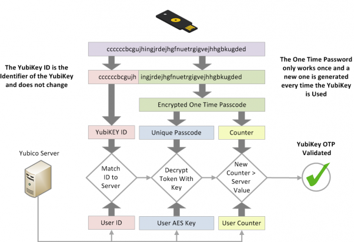

**Многофакторная аутентификация** (**МФА**) это механизм безопасности, который требует от вас дополнительных шагов, помимо ввода логина (или электронной почты) и пароля. Самый распространенный метод - временный коды, которые вы можете получить по СМС или из приложения.

Обычно, если хакеру (или злоумышленнику) удается узнать ваш пароль, то он получает доступ к учетной записи, которую этот пароль защищал. Учетная запись с МФА вынуждает хакера иметь как пароль (то, что вы *знаете*), так и устройство, которым вы владеете (то, что у вас *есть*), например, ваш телефон.

Методы MFA различаются по степени безопасности, но в их основе лежит принцип, что чем сложнее злоумышленнику получить доступ к вашему методу MFA, тем лучше. Примеры методов MFA (от самого слабого к самому сильному) включают СМС, коды по электронной почте, пуш-уведомления из приложений, TOTP, Yubico OTP и FIDO.

## Сравнение методов МФА

### МФА по СМС или электронной почте

Получение OTP-кодов по СМС или электронной почте - один из самых слабых способов защиты учетных записей с помощью MFA. Получение кода по электронной почте или СМС невилирует принцип "что-то, что у вас *есть*", поскольку существует множество способов, которыми хакер может [завладеть вашим телефонным номером](https://en.wikipedia.org/wiki/SIM_swap_scam) или получить доступ к вашей электронной почте, не имея физического доступа ни к одному из ваших устройств. Если злоумышленник получит доступ к вашей электронной почте, то он сможет использовать этот доступ как для сброса пароля, так и для получения кода аутентификации, что даст ему полный доступ к вашей учетной записи.

### Пуш-уведомления

MFA через пуш-уведомление представляет собой сообщение, отправленное в приложении на вашем телефоне с просьбой подтвердить новый вход в учетную запись. Этот метод намного лучше, чем СМС или электронная почта, поскольку злоумышленник, как правило, не сможет получить эти пуш-уведомления, не имея уже зарегистрированного устройства. Это означает, что ему придется сначала скомпрометировать одно из ваших других устройств.

Мы все совершаем ошибки, поэтому существует риск, что вы можете случайно одобрить вход в систему. Авторизация входа с помощью пуш-уведомлений обычно отправляется на *все* ваши устройства одновременно, что расширяет доступность кодов МФА, если у вас много устройств.

Безопасность МФА с пуш-уведомлениями зависит как от качества приложения, серверного компонента, так и от доверия к разработчику, который его создает. Установка приложений также может потребовать от вас выдачу инвазивных разрешений, предоставляющих доступ к другим данным на вашем устройстве. Некоторые приложения также требуют наличие отдельного приложения для каждого сервиса, для открытия которого может не требоваться пароль, в отличие от хорошего приложения генератора TOTP.

### Одноразовый пароль основанный на времени (TOTP)

TOTP - одна из наиболее распространенных форм MFA. При установке TOTP обычно требуется отсканировать [QR-код](https://ru.wikipedia.org/wiki/QR-код), который содержит "[общий секрет](https://en.wikipedia.org/wiki/Shared_secret)" с сервисом, который вы собираетесь использовать. Общий секрет хранится внутри данных приложения аутентификатора и иногда защищен паролем.

Код, ограниченный по времени, вычисляется из общего секрета и текущего времени. Поскольку код действителен только в течение короткого времени, без доступа к общему секрету злоумышленник не может генерировать новые коды.

Если у вас есть аппаратный ключ безопасности с поддержкой TOTP (например, YubiKey с [Yubico Authenticator](https://www.yubico.com/products/yubico-authenticator/)), мы рекомендуем хранить ваши "общие секреты" на этом аппаратном ключе. Такое оборудование, как YubiKey, было разработано с целью сделать "общий секрет" трудноизвлекаемым и копируемым. YubiKey также не подключен к интернету, в отличие от телефона с приложением TOTP.

В отличие от [WebAuthn](#fido-fast-identity-online), TOTP не обеспечивает защиту от [фишинга](https://ru.wikipedia.org/wiki/фишинг) или повторных атак. Если злоумышленник получает от вас действующий код, он может использовать его сколько угодно раз, пока не истечет срок его действия (обычно 60 секунд).

Злоумышленник может создать сайт, имитирующий официальный сервис, чтобы обманом заставить вас сообщить свое имя пользователя, пароль и текущий код TOTP. Если злоумышленник затем использует эти записанные учетные данные, он сможет войти в реальный сервис и завладеть учетной записью.

Хотя TOTP не совершенен, он достаточно безопасен для большинства людей, и если аппаратные ключи безопасности [](../multi-factor-authentication.md#hardware-security-keys) не поддерживаются, то [ приложения-аутентификаторы](../multi-factor-authentication.md#authenticator-apps) все ещё являются хорошим вариантом.

### Аппаратные ключи безопасности

YubiKey хранит данные на устойчивом к взлому твердотельном чипе, к которому, [невозможно получить доступ](https://security.stackexchange.com/a/245772), без криминалистической лаборатории и дорогостоящего процесса.

Как правило, такие ключи являются многофункциональными и предоставляют несколько способов аутентификации. Ниже приведены наиболее распространенные из них.

#### Yubico OTP

Yubico OTP - это протокол аутентификации, обычно реализуемый в аппаратных ключах безопасности. Когда вы решите использовать Yubico OTP, ключ будет генерировать публичный ID, личный ID и секретный ключ, который затем загружается на сервер Yubico OTP.

При входе на сайт достаточно просто физически прикоснуться к ключу безопасности. Ключ безопасности будет эмулировать клавиатуру и печатать одноразовый пароль в поле пароля.

Затем служба передаст одноразовый пароль на сервер Yubico OTP для проверки. Счетчик увеличивается как на ключе, так и на сервере проверки Yubico. OTP можно использовать только один раз, когда происходит успешная аутентификация, счетчик увеличивается, что предотвращает повторное использование OTP. Yubico предоставляет подробную документацию [](https://developers.yubico.com/OTP/OTPs_Explained.html) о процессе.

<figure markdown>
  
</figure>

Существуют некоторые преимущества и недостатки использования Yubico OTP по сравнению с TOTP.

Сервер проверки Yubico - это облачная служба, и вы доверяете компании Yubico в том, что она надежно хранит данные и не занимается их профилированием. Публичный идентификатор, связанный с Yubico OTP, используется повторно на каждом сайте и может стать еще одной возможностью для третьих лиц составить ваш профиль. Как и TOTP, Yubico OTP не обеспечивает защиту от фишинга.

Если ваша модель угроз требует наличия разных идентификаторов на разных сайтах, **не** используйте Yubico OTP с одним и тем же аппаратным ключом безопасности на этих сайтах, поскольку публичный идентификатор уникален для каждого ключа безопасности.

#### FIDO (Fast IDentity Online)

[FIDO](https://en.wikipedia.org/wiki/FIDO_Alliance) включает в себя ряд стандартов, сначала был U2F, а затем [FIDO2](https://en.wikipedia.org/wiki/FIDO2_Project), который включает в себя веб-стандарт [WebAuthn](https://en.wikipedia.org/wiki/WebAuthn).

U2F и FIDO2 относятся к [Client to Authenticator Protocol](https://en.wikipedia.org/wiki/Client_to_Authenticator_Protocol), который представляет собой протокол между ключом безопасности и компьютером, например ноутбуком или телефоном. Он дополняет WebAuthn, который является компонентом, используемым для аутентификации на сайте ("Relying Party"), на котором вы пытаетесь залогиниться.

WebAuthn - это наиболее безопасная и приватная форма двух-факторной аутентификации. Хотя процесс аутентификации похож на Yubico OTP, ключ не показывает одноразовый пароль и не проверяет его на стороннем сервере. Вместо этого он использует [криптографию с открытым ключом](https://en.wikipedia.org/wiki/Public-key_cryptography) для аутентификации.

<figure markdown>
  
</figure>

Когда вы создаете учетную запись, открытый ключ отправляется в службу, затем, когда вы входите в систему, служба потребует от вас "подписать" некоторые данные вашим закрытым ключом. Преимуществом этого является то, что служба никогда не хранит данные пароля, поэтому злоумышленнику нечего украсть.

В презентации рассматривается история парольной аутентификации, подводные камни (такие, как повторное использование пароля), а также обсуждаются стандарты FIDO2 и [WebAuthn](https://webauthn.guide).

<div class="yt-embed">
  <iframe width="560" height="315" src="https://invidious.privacyguides.net/embed/aMo4ZlWznao?local=true" title="Как FIDO2 и WebAuthn предотвращают захват аккаунтов" frameborder="0" allow="accelerometer; autoplay; clipboard-write; encrypted-media; gyroscope; picture-in-picture" allowfullscreen></iframe>
</div>

FIDO2 и WebAuthn обладают превосходными свойствами безопасности и конфиденциальности по сравнению с любыми методами МФА.

Обычно для веб-сервисов он используется вместе с WebAuthn, который является частью [рекомендаций W3C](https://en.wikipedia.org/wiki/World_Wide_Web_Consortium#W3C_recommendation_(REC)). Он использует аутентификацию с открытым ключом и является более безопасным, чем общие секреты, используемые в методах Yubico OTP и TOTP, поскольку включает имя происхождения (обычно доменное имя) при аутентификации. Аттестация предоставляется для защиты от фишинговых атак, так как помогает определить, что вы используете оригинальный сервис, а не поддельную копию.

В отличие от Yubico OTP, WebAuthn не использует публичный идентификатор, поэтому ключ **не** идентифицировать на разных сайтах. Он также не использует сторонние облачные серверы для аутентификации. Все коммуникации осуществляются между ключом и веб-сайтом, на который вы заходите. FIDO также использует счетчик, который увеличивается при использовании, чтобы предотвратить повторное использование сеанса и клонирование ключей.

Если сайт или сервис поддерживает WebAuthn для аутентификации, настоятельно рекомендуется использовать его вместо любой другой формы МФА.

## Общие рекомендации

У нас есть следующие общие рекомендации:

### Какой метод мне выбрать?

При настройке метода МФА следует помнить, что она настолько безопасна, насколько безопасен её самый слабый метод, который вы используете. Это означает, что важно использовать только лучший из доступных методов МФА. Например, если вы уже используете TOTP, вам следует отключить МФА по электронной почте и СМС. Если вы уже используете FIDO2/WebAuthn, вы не должны использовать Yubico OTP или TOTP на своем аккаунте.

### Резервное копирование

You should always have backups for your MFA method. Hardware security keys can get lost, stolen or simply stop working over time. It is recommended that you have a pair of hardware security keys with the same access to your accounts instead of just one.

When using TOTP with an authenticator app, be sure to back up your recovery keys or the app itself, or copy the "shared secrets" to another instance of the app on a different phone or to an encrypted container (e.g. [VeraCrypt](../encryption.md#veracrypt)).

### Первоначальная настройка

When buying a security key, it is important that you change the default credentials, set up password protection for the key, and enable touch confirmation if your key supports it. Products such as the YubiKey have multiple interfaces with separate credentials for each one of them, so you should go over each interface and set up protection as well.

### Электронная почта и СМС

If you have to use email for MFA, make sure that the email account itself is secured with a proper MFA method.

If you use SMS MFA, use a carrier who will not switch your phone number to a new SIM card without account access, or use a dedicated VoIP number from a provider with similar security to avoid a [SIM swap attack](https://en.wikipedia.org/wiki/SIM_swap_scam).

[MFA tools we recommend](../multi-factor-authentication.md ""){.md-button}

## More Places to Set Up MFA

Beyond just securing your website logins, multi-factor authentication can be used to secure your local logins, SSH keys or even password databases as well.

### Windows

Yubico has a dedicated [Credential Provider](https://docs.microsoft.com/en-us/windows/win32/secauthn/credential-providers-in-windows) that adds Challenge-Response authentication for the username + password login flow for local Windows accounts. If you have a YubiKey with Challenge-Response authentication support, take a look at the [Yubico Login for Windows Configuration Guide](https://support.yubico.com/hc/en-us/articles/360013708460-Yubico-Login-for-Windows-Configuration-Guide), which will allow you to set up MFA on your Windows computer.

### macOS

macOS has [native support](https://support.apple.com/guide/deployment/intro-to-smart-card-integration-depd0b888248/web) for authentication with smart cards (PIV). If you have a smartcard or a hardware security key that supports the PIV interface such as the YubiKey, we recommend that you follow your smartcard/hardware security vendor's documentation and set up second factor authentication for your macOS computer.

Yubico have a guide [Using Your YubiKey as a Smart Card in macOS](https://support.yubico.com/hc/en-us/articles/360016649059) which can help you set up your YubiKey on macOS.

After your smartcard/security key is set up, we recommend running this command in the Terminal:

```text
sudo defaults write /Library/Preferences/com.apple.loginwindow DisableFDEAutoLogin -bool YES
```

The command will prevent an adversary from bypassing MFA when the computer boots.

### Linux

!!! warning "Осторожно"

    Если имя хоста вашей системы изменится (например, из-за DHCP), вы не сможете залогиниться. It is vital that you set up a proper hostname for your computer before following this guide.

The `pam_u2f` module on Linux can provide two-factor authentication for logging in on most popular Linux distributions. If you have a hardware security key that supports U2F, you can set up MFA authentication for your login. Yubico has a guide [Ubuntu Linux Login Guide - U2F](https://support.yubico.com/hc/en-us/articles/360016649099-Ubuntu-Linux-Login-Guide-U2F) which should work on any distribution. The package manager commands—such as `apt-get`—and package names may however differ. This guide does **not** apply to Qubes OS.

### Qubes OS

Qubes OS has support for Challenge-Response authentication with YubiKeys. If you have a YubiKey with Challenge-Response authentication support, take a look at the Qubes OS [YubiKey documentation](https://www.qubes-os.org/doc/yubikey/) if you want to set up MFA on Qubes OS.

### SSH

#### Аппаратные ключи безопасности

SSH MFA could be set up using multiple different authentication methods that are popular with hardware security keys. We recommend that you check out Yubico's [documentation](https://developers.yubico.com/SSH/) on how to set this up.

#### Одноразовый пароль основанный на времени (TOTP)

SSH MFA can also be set up using TOTP. DigitalOcean has provided a tutorial [How To Set Up Multi-Factor Authentication for SSH on Ubuntu 20.04](https://www.digitalocean.com/community/tutorials/how-to-set-up-multi-factor-authentication-for-ssh-on-ubuntu-20-04). Most things should be the same regardless of distribution, however the package manager commands—such as `apt-get`—and package names may differ.

### KeePass (и KeePassXC)

KeePass and KeePassXC databases can be secured using Challenge-Response or HOTP as a second-factor authentication. Yubico has provided a document for KeePass [Using Your YubiKey with KeePass](https://support.yubico.com/hc/en-us/articles/360013779759-Using-Your-YubiKey-with-KeePass) and there is also one on the [KeePassXC](https://keepassxc.org/docs/#faq-yubikey-2fa) website.
