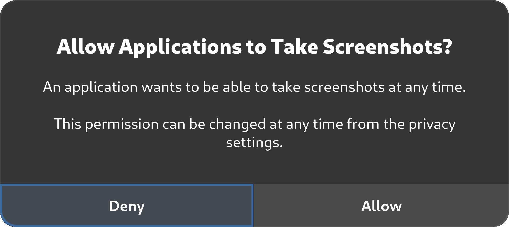

**Linux** açık kaynaklı, gizlilik odaklı bir masaüstü işletim sistemi alternatifidir. Yaygın telemetri ve ana akım işletim sistemlerindeki diğer gizliliği ihlal eden teknolojiler karşısında, masaüstü Linux, bilgisayarları üzerinde sıfırdan tam kontrol isteyen insanlar için açık bir seçim olmaya devam etti.

Web sitemizde genellikle **masaüstü** Linux dağıtımlarını tanımlamak için "Linux" terimi kullanılmaktadır. ChromeOS, Android ve Qubes OS gibi Linux çekirdeğini kullanan diğer işletim sistemleri bu sayfada ele alınmamıştır.

[Linux Önerilerimiz :material-arrow-right-drop-circle:](../desktop.md ""){.md-button}

## Güvenlik Anahtarları

Linux ile ilgili bilmeniz gereken bazı önemli güvenlik sorunları vardır. Bu dezavantajlara rağmen, masaüstü Linux dağıtımları isteyen çoğu insan için hala harikadır:

- Genellikle tescilli işletim sistemleriyle birlikte gelen telemetriden kaçının
- [Yazılım özgürlüğünü](https://gnu.org/philosophy/free-sw.en.html#four-freedoms) koruyun
- [Whonix](../desktop.md#whonix) veya [Tails](../desktop.md#tails) gibi gizlilik odaklı sistemler kullanın

### Açık Kaynak Güvenliği

Linux ve diğer açık kaynaklı yazılımların sadece kaynak kodu mevcut olduğu için doğal olarak güvenli olduğu [yaygın](../basics/common-misconceptions.md#open-source-software-is-always-secure-or-proprietary-software-is-more-secure) bir [yanılgıdır](../basics/common-misconceptions.md#open-source-software-is-always-secure-or-proprietary-software-is-more-secure). Topluluk doğrulamasının düzenli olarak yapılması yönünde bir beklenti vardır, ancak bu her zaman [böyle](https://seirdy.one/posts/2022/02/02/floss-security) değildir.

Gerçekte, dağıtım güvenliği proje etkinliği, geliştirici deneyimi, kod incelemelerine uygulanan titizlik düzeyi ve kod tabanının yıllarca dokunulmamış belirli bölümlerine ne sıklıkla dikkat edildiği gibi bir dizi faktöre bağlıdır.

### Eksik Güvenlik Özellikleri

At the moment, desktop Linux [falls behind alternatives](https://discussion.fedoraproject.org/t/fedora-strategy-2028-proposal-fedora-linux-is-as-secure-as-macos/46899/9) like macOS or Android when it comes to certain security features. We hope to see improvements in these areas in the future.

- **Verified boot** on Linux is not as robust as alternatives such as Apple’s [Secure Boot](https://support.apple.com/guide/security/secac71d5623/web) or Android’s [Verified Boot](https://source.android.com/security/verifiedboot). Verified boot prevents persistent tampering by malware and [evil maid attacks](https://en.wikipedia.org/wiki/Evil_Maid_attack), but is still largely [unavailable on even the most advanced distributions](https://discussion.fedoraproject.org/t/has-silverblue-achieved-verified-boot/27251/3).

- **Strong sandboxing** for apps on Linux is severely lacking, even with containerized apps like Flatpaks or sandboxing solutions like Firejail. Flatpak is the most promising sandboxing utility for Linux thus far, but is still deficient in many areas and allows for [unsafe defaults](https://flatkill.org/2020) which permit most apps to trivially bypass their sandbox.

Additionally, Linux falls behind in implementing [exploit mitigations](https://madaidans-insecurities.github.io/linux.html#exploit-mitigations) which are now standard on other operating systems, such as Arbitrary Code Guard on Windows or Hardened Runtime on macOS. Also, most Linux programs and Linux itself are coded in memory-unsafe languages. Memory corruption bugs are responsible for the [majority of vulnerabilities](https://msrc.microsoft.com/blog/2019/07/a-proactive-approach-to-more-secure-code) fixed and assigned a CVE. While this is also true for Windows and macOS, they are quickly making progress on adopting memory-safe languages such as Rust and Swift, respectively.

## Choosing your distribution

Not all Linux distributions are created equal. Our [Linux recommendation page](../desktop.md) is not meant to be an authoritative source on which distribution you should use, but our recommendations *are* aligned with the following guidelines. These are a few things you should keep in mind when choosing a distribution:

### Release cycle

We highly recommend that you choose distributions which stay close to the stable upstream software releases, often referred to as rolling release distributions. This is because frozen release cycle distributions often don’t update package versions and fall behind on security updates.

For frozen distributions such as [Debian](https://debian.org/security/faq#handling), package maintainers are expected to backport patches to fix vulnerabilities rather than bump the software to the “next version” released by the upstream developer. Some security fixes (particularly for less popular software) [do not](https://arxiv.org/abs/2105.14565) receive a [CVE ID](https://en.wikipedia.org/wiki/Common_Vulnerabilities_and_Exposures) at all and therefore do not make it into the distribution with this patching model. As a result, minor security fixes are sometimes held back until the next major release.

We don’t believe holding packages back and applying interim patches is a good idea, as it diverges from the way the developer might have intended the software to work. [Richard Brown](https://rootco.de/aboutme) has a presentation about this:

- [Regular Releases are Wrong, Roll for your life](https://youtu.be/i8c0mg_mS7U) <small>(YouTube)</small>

### Traditional vs Atomic Updates

Traditionally, Linux distributions update by sequentially updating the desired packages. Traditional updates such as those used in Fedora, Arch Linux, and Debian-based distributions can be less reliable if an error occurs while updating.

Distros which use atomic updates, on the other hand, apply updates in full or not at all. On an atomic distribution, if an error occurs while updating (perhaps due to a power failure), nothing is changed on the system.

The atomic update method can achieve reliability with this model and is used for [distributions](../desktop.md#atomic-distributions) like Silverblue and NixOS. [Adam Šamalík](https://twitter.com/adsamalik) provides a presentation on how `rpm-ostree` works with Silverblue:

- [Let's try Fedora Silverblue — an immutable desktop OS! - Adam Šamalík](https://youtu.be/aMo4ZlWznao) <small>(YouTube)</small>

### “Security-focused” distributions

There is often some confusion between “security-focused” distributions and “pentesting” distributions. A quick search for “the most secure Linux distribution” will often give results like Kali Linux, Black Arch, or Parrot OS. These distributions are offensive penetration testing distributions that bundle tools for testing other systems. They don’t include any “extra security” or defensive mitigations intended for regular use.

### Arch-based distributions

Arch and Arch-based distributions are not recommended for those new to Linux (regardless of distribution) as they require regular [system maintenance](https://wiki.archlinux.org/title/System_maintenance). Arch does not have a distribution update mechanism for the underlying software choices. As a result you have to stay aware with current trends and adopt technologies on your own as they supersede older practices.

For a secure system, you are also expected to have sufficient Linux knowledge to properly set up security for their system such as adopting a [mandatory access control](#mandatory-access-control) system, setting up [kernel module](https://en.wikipedia.org/wiki/Loadable_kernel_module#Security) blacklists, hardening boot parameters, manipulating [sysctl](https://en.wikipedia.org/wiki/Sysctl) parameters, and knowing what components they need such as [Polkit](https://en.wikipedia.org/wiki/Polkit).

Anyone using the [Arch User Repository (AUR)](https://wiki.archlinux.org/title/Arch_User_Repository) **must** be comfortable auditing PKGBUILDs that they download from that service. AUR packages are community-produced content and are not vetted in any way, and therefore are vulnerable to software [:material-package-variant-closed-remove: Supply Chain Attacks](../basics/common-threats.md#attacks-against-certain-organizations ""){.pg-viridian}, which has in fact happened [in the past](https://bleepingcomputer.com/news/security/malware-found-in-arch-linux-aur-package-repository).

The AUR should always be used sparingly, and often there is a lot of bad advice on various pages which direct people to blindly use [AUR helpers](https://wiki.archlinux.org/title/AUR_helpers) without sufficient warning. Similar warnings apply to the use of third-party Personal Package Archives (PPAs) on Debian-based distributions or Community Projects (COPR) on Fedora.

If you are experienced with Linux and wish to use an Arch-based distribution, we generally recommend mainline Arch Linux over any of its derivatives.

Additionally, we recommend **against** these two Arch derivatives specifically:

- **Manjaro**: This distribution holds packages back for 2 weeks to make sure that their own changes don’t break, not to make sure that upstream is stable. When AUR packages are used, they are often built against the latest [libraries](https://en.wikipedia.org/wiki/Library_(computing)) from Arch’s repositories.
- **Garuda**: AUR'den paketleri otomatik ve kör bir şekilde derleyen [Chaotic-AUR](https://aur.chaotic.cx) kullanıyorlar. AUR paketlerinin tedarik zinciri saldırılarına maruz kalmadığından emin olmak için herhangi bir doğrulama süreci bulunmamaktadır.

### Linux-libre çekirdeği ve "Libre" dağıtımları

Linux-libre çekirdeğini **kullanmamanızı** öneririz, çünkü [güvenlik önlemlerini kaldırır](https://phoronix.com/news/GNU-Linux-Libre-5.7-Released) ve savunmasız mikro kodla ilgili [çekirdek uyarılarını bastırır](https://news.ycombinator.com/item?id=29674846).

### Zorunlu erişim kontrolü

Zorunlu erişim denetimi, uygulamalar ve sistem hizmetleri gibi sistem parçalarının sınırlandırılmasına yardımcı olan bir dizi ek güvenlik denetimidir. Linux dağıtımlarında bulunan iki yaygın zorunlu erişim denetimi biçimi [SELinux](https://github.com/SELinuxProject) ve [AppArmor](https://apparmor.net)'dur. Fedora ve Tumbleweed varsayılan olarak SELinux kullanır, Tumbleweed bunun yerine AppArmor'u seçmek için yükleyicisinde bir seçenek sunar.

[Fedora](https://docs.fedoraproject.org/en-US/quick-docs/selinux-getting-started) 'daki SELinux varsayılan olarak Linux konteynerlerini, sanal makineleri ve hizmet daemonlarını sınırlar. AppArmor, snap daemon tarafından [Firefox](https://snapcraft.io/firefox) gibi [katı](https://snapcraft.io/docs/snap-confinement) sınırlamalara sahip snaps'leri [sandbox](https://snapcraft.io/docs/security-sandboxing) 'lamak için kullanılır. [ConfinedUsers](https://fedoraproject.org/wiki/SIGs/ConfinedUsers) özel ilgi grubu ile Fedora'da sistemin daha fazla bölümünü sınırlandırmak için bir topluluk çabası var.

## Genel Öneriler

### Sürücü Şifreleme

Çoğu Linux dağıtımının yükleyicisinde [LUKS](../encryption.md#linux-unified-key-setup) FDE'yi etkinleştirmek için bir seçenek vardır. Bu seçenek kurulum sırasında ayarlanmazsa, şifreleme [disk bölümlemesinden](https://en.wikipedia.org/wiki/Disk_partitioning) sonra, ancak [dosya sistemleri](https://en.wikipedia.org/wiki/File_system) biçimlendirilmeden önce uygulandığından verilerinizi yedeklemeniz ve yeniden kurulum yapmanız gerekecektir. Ayrıca depolama cihazınızı güvenli bir şekilde silmenizi öneririz:

- [DNS hakkında daha fazla bilgi edinin :material-arrow-right-drop-circle:](https://blog.privacyguides.org/2022/05/25/secure-data-erasure)

### Değiştir

Hassas olabilecek bellek verilerini kalıcı depolama alanına yazmaktan kaçınmak (ve performansı artırmak) için geleneksel bir takas dosyası veya bölümü yerine [ZRAM](https://wiki.archlinux.org/title/Zram#Using_zram-generator) kullanmayı düşünün. Fedora tabanlı dağıtımlar [varsayılan olarak ZRAM kullanır](https://fedoraproject.org/wiki/Changes/SwapOnZRAM).

Diske askıya alma (hazırda bekletme) işlevine ihtiyacınız varsa, yine de geleneksel bir takas dosyası veya bölümü kullanmanız gerekecektir. Bu tehditlerin bazılarını azaltmak için kalıcı bir depolama aygıtında sahip olduğunuz takas alanının [en](https://wiki.archlinux.org/title/Dm-crypt/Swap_encryption) azından [şifrelenmiş](https://wiki.archlinux.org/title/Dm-crypt/Swap_encryption) olduğundan emin olun.

### Tescilli Ürün Yazılımı (Mikrokod Güncellemeleri)

Bazı Linux dağıtımları ( [Linux-libre tabanlı](https://en.wikipedia.org/wiki/Linux-libre) veya DIY dağıtımları gibi) kritik güvenlik açıklarını yamalayan tescilli [mikrokod](https://en.wikipedia.org/wiki/Microcode) güncellemeleriyle birlikte gelmez. Bu güvenlik açıklarının bazı önemli örnekleri arasında [Spectre](https://en.wikipedia.org/wiki/Spectre_(security_vulnerability)), [Meltdown](https://en.wikipedia.org/wiki/Meltdown_(security_vulnerability)), [SSB](https://en.wikipedia.org/wiki/Speculative_Store_Bypass), [Foreshadow](https://en.wikipedia.org/wiki/Foreshadow), [MDS](https://en.wikipedia.org/wiki/Microarchitectural_Data_Sampling), [SWAPGS](https://en.wikipedia.org/wiki/SWAPGS_(security_vulnerability)) ve diğer [donanım güvenlik açıkları](https://kernel.org/doc/html/latest/admin-guide/hw-vuln/index.html) yer almaktadır.

Mikrokod güncellemelerini yüklemenizi şiddetle **tavsiye** ederiz, çünkü bunlar CPU için sadece yazılımla tam olarak azaltılamayan önemli güvenlik yamaları içerir. Fedora ve openSUSE'nin her ikisi de varsayılan olarak mikrokod güncellemelerini uygular.

### Güncellemeler

Çoğu Linux dağıtımı güncellemeleri otomatik olarak yükler veya size bunu hatırlatır. Bir güvenlik açığı bulunduğunda yazılımınızın yamalanması için işletim sisteminizi güncel tutmanız önemlidir.

Bazı dağıtımlar (özellikle ileri düzey kullanıcılara yönelik olanlar) daha yalındır ve işleri kendiniz yapmanızı bekler (örneğin Arch veya Debian). Bunlar, önemli güvenlik güncellemelerini almak için "paket yöneticisini"`(apt`, `pacman`, `dnf`, vb.) manuel olarak çalıştırmayı gerektirecektir.

Ayrıca, bazı dağıtımlar ürün yazılımı güncellemelerini otomatik olarak indirmeyecektir. Bunun için şunları yüklemeniz gerekir [`fwupd`](https://wiki.archlinux.org/title/Fwupd).

### İzin Kontrolleri

[Wayland](https://wayland.freedesktop.org) görüntüleme protokolünü destekleyen masaüstü ortamları (DE'ler), yalnızca X11'i destekleyenlere göre [daha güvenlidir](https://lwn.net/Articles/589147). Ancak, tüm DE'ler Wayland'in mimari güvenlik iyileştirmelerinden tam olarak yararlanamamaktadır.

Örneğin, GNOME, [ekranınızı yakalamaya](https://gitlab.gnome.org/GNOME/gnome-shell/-/issues/3943) çalışan üçüncü taraf yazılımlar için izin denetimleri uygulayarak diğer DE'lere kıyasla güvenlik konusunda kayda değer bir avantaja sahiptir. Yani, üçüncü taraf bir uygulama ekranınızı yakalamaya çalıştığında, ekranınızı uygulama ile paylaşmak için izniniz istenir.

<figure markdown>
  { width="450" }
  <figcaption>GNOME'un ekran görüntüsü izin iletişim kutusu</figcaption>
</figure>

Birçok alternatif henüz aynı izin kontrollerini sağlamıyor,[^1] Bazıları ise Wayland'in bu kontrolleri yukarı yönde uygulamasını bekliyor.[^2]

## Gizlilik Ayarları

### MAC Adresi Rastgeleleştirme

Birçok masaüstü Linux dağıtımı (Fedora, openSUSE, vb.) Ethernet ve Wi-Fi ayarlarını yapılandırmak için [NetworkManager](https://en.wikipedia.org/wiki/NetworkManager) ile birlikte gelir.

NetworkManager kullanırken [MAC adresini](https://en.wikipedia.org/wiki/MAC_address) [rastgele ayarlamak](https://fedoramagazine.org/randomize-mac-address-nm) mümkündür. Bu, bağlı olduğunuz ağdaki belirli cihazların izlenmesini zorlaştırdığı için Wi-Fi ağlarında biraz daha fazla gizlilik sağlar. Öyle. [**değil**](https://papers.mathyvanhoef.com/wisec2016.pdf) seni anonim yapar.

[Makalede](https://fedoramagazine.org/randomize-mac-address-nm) önerildiği gibi ayarı **sabit** yerine **rastgele** olarak değiştirmenizi öneririz.

Eğer [systemd-networkd](https://en.wikipedia.org/wiki/Systemd#Ancillary_components) kullanıyorsanız, şunları ayarlamanız gerekecektir [`MACAddressPolicy=random`](https://freedesktop.org/software/systemd/man/systemd.link.html#MACAddressPolicy=)[RFC 7844'ü (DHCP İstemcileri için Anonimlik Profilleri)](https://freedesktop.org/software/systemd/man/systemd.network.html#Anonymize=) etkinleştirecektir.

MAC adresi rastgeleleştirme öncelikle Wi-Fi bağlantıları için faydalıdır. Ethernet bağlantıları için MAC adresinizi rastgele hale getirmek çok az fayda sağlar (eğer varsa), çünkü bir ağ yöneticisi cihazınızı başka yollarla (ağ anahtarında bağlı olduğunuz bağlantı noktasını incelemek gibi) önemsiz bir şekilde tanımlayabilir. Randomizing Wi-Fi MAC addresses depends on support from the Wi-Fi’s firmware.

### Other Identifiers

There are other system identifiers which you may wish to be careful about. You should give this some thought to see if it applies to your [threat model](../basics/threat-modeling.md):

- **Hostnames:** Your system's hostname is shared with the networks you connect to. You should avoid including identifying terms like your name or operating system in your hostname, instead sticking to generic terms or random strings.
- **Usernames:** Similarly, your username is used in a variety of ways across your system. Consider using generic terms like "user" rather than your actual name.
- **Machine ID:** During installation, a unique machine ID is generated and stored on your device. Consider [setting it to a generic ID](https://madaidans-insecurities.github.io/guides/linux-hardening.html#machine-id).

### System Counting

The Fedora Project [counts](https://fedoraproject.org/wiki/Changes/DNF_Better_Counting) how many unique systems access its mirrors by using a [`countme`](https://fedoraproject.org/wiki/Changes/DNF_Better_Counting#Detailed_Description) variable instead of a unique ID. Fedora does this to determine load and provision better servers for updates where necessary.

This [option](https://dnf.readthedocs.io/en/latest/conf_ref.html#options-for-both-main-and-repo) is currently off by default. We recommend adding `countme=false` to `/etc/dnf/dnf.conf` just in case it is enabled in the future. On systems that use `rpm-ostree` such as Silverblue, the `countme` option is disabled by masking the [rpm-ostree-countme](https://fedoramagazine.org/getting-better-at-counting-rpm-ostree-based-systems) timer.

openSUSE also uses a [unique ID](https://en.opensuse.org/openSUSE:Statistics) to count systems, which can be disabled by emptying the `/var/lib/zypp/AnonymousUniqueId` file.

[^1]: KDE currently has an open proposal to add controls for screen captures: <https://invent.kde.org/plasma/xdg-desktop-portal-kde/-/issues/7>
[^2]: Sway is waiting to add specific security controls until they "know how security as a whole is going to play out" in Wayland: <https://github.com/swaywm/sway/issues/5118#issuecomment-600054496>
