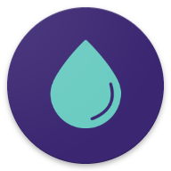

Bir konuda belirli bir çözüm arıyorsanız, çeşitli kategorilerde önerdiğimiz donanım ve yazılım araçları bunlardır. Tavsiye edilen gizlilik araçlarımız öncelikle güvenlik özelliklerine göre seçilmiş olup, merkezi olmayan ve açık kaynaklı araçlara ek vurgu yapılmaktadır. Bunlar, küresel kitlesel gözetleme programlarına karşı korunmadan büyük teknoloji şirketlerinden kaçınmaya ve saldırıları hafifletmeye kadar çeşitli tehdit modellerine uygulanabilir, ancak ihtiyaçlarınız için neyin en iyi sonucu vereceğini yalnızca siz belirleyebilirsiniz.

[VPN Providers](vpn.md){ .md-button }
[Password Managers](passwords.md){ .md-button }
[Email Providers](email.md){ .md-button }
[Browser Extensions](browser-extensions.md){ .md-button }
[DNS Servers](dns.md){ .md-button }
[Email Aliasing Services](email-aliasing.md){ .md-button }
[Photo Organization Tools](photo-management.md){ .md-button }

[Self-hosting recommendations](self-hosting/index.md) have been moved to their own category.

İhtiyaçlarınız için en iyi gizlilik araçlarını ve alternatif programları bulma konusunda yardım istiyorsanız, [forumumuzda](https://discuss.privacyguides.net) veya [Matrix](https://matrix.to/#/#privacyguides:matrix.org) topluluğumuzda bir tartışma başlatın!

Her proje hakkında daha fazla ayrıntı, neden seçildikleri ve önerdiğimiz ek ipuçları veya püf noktaları için, her bölümdeki "Daha fazla bilgi edinin" bağlantısını tıklayın veya sayfanın ilgili bölümüne yönlendirilmek için önerinin kendisine tıklayın.

- [x] **Reklamsız Öneriler**
- [x] **Sık Güncellemeler**
- [x] **Okuyucular Tarafından Güvenilen**

- [x] **Tam Editoryal Bağımsızlık**
- [x] **Açık Kaynak Katkıları**
- [x] **Gazeteciler Tarafından Güvenilen**

## Özel Web Tarayıcıları

{ align=left }

Anonimliğe ihtiyacınız varsa **Tor Browser** (Masaüstü ve Android) en iyi seçimdir, çünkü size ücretsiz olarak bağlanmanıza ve İnternet'te gizliliğinizi ve güvenliğinizi artırmanıza olanak tanıyan gönüllü olarak işletilen bir grup sunucu olan **Tor** ağına erişim sağlar. Bireyler ve kuruluşlar da gizliliklerinden ödün vermeden ".onion gizli servisleri" ile Tor ağı üzerinden bilgi paylaşımında bulunabilirler. Tor trafiğinin engellenmesi ve izlenmesi zor olduğundan, Tor etkili bir sansür atlatma aracıdır.

[İncelememizin Tamamını Okuyun :material-arrow-right-drop-circle:](tor.md){ .md-button .md-button--primary }

{ align=right }

**Mullvad Browser**, [Tor Browser]'ın (tor.md#tor-browser) Tor ağ entegrasyonları kaldırılmış bir sürümüdür ve Tor Browser'ın parmak izi önleme tarayıcı teknolojilerini VPN kullanıcılarına sunmayı amaçlamaktadır.

    - [Read Full Review :material-arrow-right-drop-circle:](desktop-browsers.md#mullvad-browser)

- { .lg .middle .twemoji } **Firefox**

    ---

    **Firefox**, çeşitli [izleme türlerini](https://support.mozilla.org/kb/enhanced-tracking-protection-firefox-desktop#w_what-enhanced-tracking-protection-blocks) engellemeye yardımcı olabilecek [Geliştirilmiş İzleme Koruması](https://support.mozilla.org/kb/enhanced-tracking-protection-firefox-desktop) gibi güçlü gizlilik ayarları sağlayan harika bir Chromium alternatifidir.

    - [Read Full Review :material-arrow-right-drop-circle:](desktop-browsers.md#firefox)

- { .lg .middle .twemoji } **Brave Browser**

    ---

    **Brave**, Chromium tabanlı varsayılan bir özel tarayıcıdır, bu nedenle tanıdık gelmeli ve minimum web sitesi uyumluluk sorunları olmalıdır.

    - [Brave Desktop Review :material-arrow-right-drop-circle:](desktop-browsers.md#brave)
    - [Brave Mobile Review :material-arrow-right-drop-circle:](mobile-browsers.md#brave)

- { .lg .middle .twemoji } **Cromite (Android)**

    ---

    **Cromite** yerleşik reklam engelleme ve [gizlilik geliştirmeleri](https://github.com/uazo/cromite/blob/master/docs/FEATURES.md) içeren Chromium tabanlı bir Android tarayıcıdır. Artık kullanımdan kaldırılmış olan popüler Bromite tarayıcısının bir çatalıdır.

    - [Read Full Review :material-arrow-right-drop-circle:](mobile-browsers.md#cromite-android)

- { .lg .middle .twemoji } **Safari (iOS)**

    ---

    [Parmak izi önleme](https://webkit.org/blog/15697/private-browsing-2-0) özellikleri ve varsayılan izleyici engellemesi nedeniyle **Safari**'yi öneriyoruz. Ayrıca sekmeler arasında izlemeyi önlemek için çerezlerinizi özel tarama modunda ayırır.

    - [Read Full Review :material-arrow-right-drop-circle:](mobile-browsers.md#safari-ios)

### Tarayıcı Uzantıları

- { .twemoji loading=lazy } [uBlock Origin](browser-extensions.md#ublock-origin)
- { .twemoji loading=lazy } [uBlock Origin Lite](browser-extensions.md#ublock-origin-lite)
- { .twemoji loading=lazy } [iOS için AdGuard](browser-extensions.md#adguard)

### Daha Fazla Tor Ağı Aracı

- { .twemoji loading=lazy } [Onion Browser (Tor for iOS)](tor.md#onion-browser-ios)

## En İyi 3 Özel VPN Sağlayıcısı

"VPN'ler anonimlik sağlamaz"

VPN kullanmak tarama alışkanlıklarınızı anonim **tutmayacağı** gibi güvenli olmayan (HTTP) trafiğe de ek güvenlik sağlamaz.

Eğer **anonimlik** arıyorsanız, Tor Browser'ı kullanmalısınız.

Daha fazla **güvenlik** arıyorsanız, her zaman HTTPS kullanan web sitelerine bağlandığınızdan emin olmalısınız. Bir VPN, iyi güvenlik uygulamalarının yerine geçmez.

[Dns hakkında daha fazla bilgi edinin :material-arrow-right-drop-circle:](vpn.md)

- { .lg .middle .twemoji } **Proton VPN**

    ---

    - [x] **112+ Ülke**
    - [x] WireGuard Desteği
    - [x] Nakit Ödemeler
    - [x] Kısmi Port Yönlendirme Desteği
    - [ ] IPv6 Yok

    [Tam İncelemeyi Oku :material-arrow-right-drop-circle:](vpn.md#proton-vpn)

- { .lg .middle .twemoji } **IVPN**

    ---

    - [x] **37+ Ülke**
    - [x] WireGuard Desteği
    - [x] Monero & Nakit Ödemeler
    - [ ] Port Yönlendirme Yok
    - [ ] IPv6 Yok

    [Read Full Review :material-arrow-right-drop-circle:](vpn.md#ivpn)

- { .lg .middle .twemoji } **Mullvad**

    ---

    - [x] **49+ Ülke**
    - [x] WireGuard Desteği
    - [x] Monero ve Nakit Ödemeler
    - [ ] Port Yönlendirme Yok
    - [x] IPv6 Desteği

    [Tam İncelemeyi Oku :material-arrow-right-drop-circle:](vpn.md#mullvad)

## En İyi 3 Özel Vpn Sağlayıcısı

- { align=right }

**Proton Mail** gizlilik, şifreleme, güvenlik ve kullanım kolaylığına odaklanan bir e-posta hizmetidir. **2013** yılından beri faaliyet göstermektedirler. Proton AG'nin merkezi İsviçre'nin Cenevre kentindedir. Proton Mail Free planı, ücretsiz olarak 1 GB'a kadar artırabileceğiniz 500 MB Posta depolama alanı ile birlikte gelir.

    [Read Full Review :material-arrow-right-drop-circle:](email.md#proton-mail)

- { .lg .middle .twemoji } **Mailbox.org**

    ---

    Mailbox.org güvenli, reklamsız ve özel olarak %100 çevre dostu enerji ile çalışan bir e-posta hizmetidir. **2014** yılından beri faaliyet göstermektedirler. Mailbox.org'un merkezi Berlin, Almanya'da bulunmaktadır. Hesaplar, gerektiğinde yükseltilebilen 2 GB'a kadar depolama alanıyla başlar.

    [Read Full Review :material-arrow-right-drop-circle:](email.md#mailboxorg)

- { .lg .middle .twemoji }{ .lg .middle .twemoji } **Tuta**

    ---

    Tuta (eski adıyla *Tutanota*), şifreleme kullanarak güvenlik ve gizliliğe odaklanan bir e-posta hizmetidir. Tuta 2011 yılından beri faaliyet göstermektedir ve merkezi Almanya'nın Hannover kentindedir. Ücretsiz hesaplar 1 GB depolama alanı ile başlar.

    [Read Full Review :material-arrow-right-drop-circle:](email.md#tuta)

### E-posta Takma Adlandırma Hizmetleri

- { .twemoji loading=lazy } [Addy.io](email-aliasing.md#addyio)
- { .twemoji loading=lazy } [SimpleLogin](email-aliasing.md#simplelogin)

### Güvenli E-posta İstemcileri

- { .twemoji loading=lazy } [Thunderbird](email-clients.md#thunderbird)
- { .twemoji loading=lazy } [Apple Mail (macOS)](email-clients.md#apple-mail-macos)
- { .twemoji loading=lazy } [FairEmail (Android)](email-clients.md#fairemail-android)
- { .twemoji loading=lazy } [GNOME Evolution (Linux)](email-clients.md#gnome-evolution-gnome)
- { .twemoji loading=lazy } [Kontact (Linux)](email-clients.md#kontact-kde)
- { .twemoji loading=lazy } [Mailvelope (PGP in standard webmail)](email-clients.md#mailvelope-browser)
- { .twemoji loading=lazy } [NeoMutt (CLI)](email-clients.md#neomutt-cli)

[Dns hakkında daha fazla bilgi edinin :material-arrow-right-drop-circle:](email-clients.md)

## Daha Fazla Özel Hizmet Sağlayıcı

### Bulut depolama

- { .twemoji loading=lazy } [Proton Drive](cloud.md#proton-drive)
- { .twemoji loading=lazy } [Tresorit](cloud.md#tresorit)
- { .twemoji loading=lazy } [Peergos](cloud.md#peergos)

[Dns hakkında daha fazla bilgi edinin :material-arrow-right-drop-circle:](cloud.md)

### Veri Kaldırma Hizmetleri

- { .twemoji loading=lazy } [EasyOptOuts](data-broker-removals.md#easyoptouts-paid)
- { .twemoji loading=lazy } [Google *Sizinle ilgili sonuçlar*](data-broker-removals.md#google-results-about-you-free)

[DNS hakkında daha fazla bilgi edinin :material-arrow-right-drop-circle:](data-broker-removals.md)

### DNS

#### DNS Sağlayıcıları

Diğerlerinin yanı sıra [Mullvad](https://mullvad.net/en/help/dns-over-https-and-dns-over-tls) ve [Quad9](https://quad9.net) gibi çeşitli kriterlere dayalı bir dizi şifreli DNS sunucusu [öneriyoruz](dns.md#recommended-providers). Bir sağlayıcı seçmeden önce DNS ile ilgili sayfalarımızı okumanızı tavsiye ederiz. Çoğu durumda, alternatif bir DNS sağlayıcısı kullanılması önerilmez.

[Dns hakkında daha fazla bilgi edinin :material-arrow-right-drop-circle:](dns.md)

#### Şifrelenmiş DNS Proxy'leri

- { .twemoji loading=lazy }{ .twemoji loading=lazy } [RethinkDNS](dns.md#rethinkdns)
- { .twemoji loading=lazy } [DNSCrypt-Proxy](dns.md#dnscrypt-proxy)

[DNS hakkında daha fazla bilgi edinin :material-arrow-right-drop-circle:](dns.md#encrypted-dns-proxies)

#### Self-hosted Çözümler

- { .twemoji loading=lazy } [AdGuard Home](dns.md#adguard-home)
- { .twemoji loading=lazy } [Pi-hole](dns.md#pi-hole)

[DNS hakkında daha fazla bilgi edinin :material-arrow-right-drop-circle:](dns.md#self-hosted-dns-filtering)

### Finansal Hizmetler

#### Ödeme Maskeleme Hizmetleri

- { .twemoji loading=lazy }{ .twemoji loading=lazy } [Privacy.com](financial-services.md#privacycom-us)
- { .twemoji loading=lazy }{ .twemoji loading=lazy } [MySudo](financial-services.md#mysudo-us-paid)

[Dns hakkında daha fazla bilgi edinin :material-arrow-right-drop-circle:](financial-services.md#payment-masking-services)

#### Çevrimiçi Hediye Kartı Pazarları

- { .twemoji loading=lazy } [Coincards](financial-services.md#coincards)

[Dns hakkında daha fazla bilgi edinin :material-arrow-right-drop-circle:](financial-services.md#gift-card-marketplaces)

### Fotoğraf Yönetimi

- { .twemoji loading=lazy } [Ente Photos](photo-management.md#ente-photos)
- { .twemoji loading=lazy } [PhotoPrism](photo-management.md#photoprism)

[Dns hakkında daha fazla bilgi edinin :material-arrow-right-drop-circle:](photo-management.md)

### Arama motorları

- { .twemoji loading=lazy } [Brave Search](search-engines.md#brave-search)
- { .twemoji loading=lazy } [DuckDuckGo](search-engines.md#duckduckgo)
- { .twemoji loading=lazy } [Mullvad Leta](search-engines.md#mullvad-leta)
- { .twemoji loading=lazy } [SearXNG](search-engines.md#searxng)
- { .twemoji loading=lazy }{ .twemoji loading=lazy } [Startpage](search-engines.md#startpage)

[Dns hakkında daha fazla bilgi edinin :material-arrow-right-drop-circle:](search-engines.md)

## Yazılım

### AI Sohbet

- { .twemoji loading=lazy } [Kobold.cpp](ai-chat.md#koboldcpp)
- { .twemoji loading=lazy } [Llamafile](ai-chat.md#llamafile)
- { .twemoji loading=lazy } [Ollama (CLI)](ai-chat.md#ollama-cli)

[Dns hakkında daha fazla bilgi edinin :material-arrow-right-drop-circle:](ai-chat.md)

### Calendar Sync

- { .twemoji loading=lazy }{ .twemoji loading=lazy } [Tuta](calendar.md#tuta)
- { .twemoji loading=lazy } [Proton Calendar](calendar.md#proton-calendar)

[Dns hakkında daha fazla bilgi edinin :material-arrow-right-drop-circle:](calendar.md)

### Cryptocurrency

- { .twemoji loading=lazy } [Monero](cryptocurrency.md#monero)

[Dns hakkında daha fazla bilgi edinin :material-arrow-right-drop-circle:](cryptocurrency.md)

### Veri ve Meta Veri Redaksiyonu

- { .twemoji loading=lazy } [MAT2](data-redaction.md#mat2)
- { .twemoji loading=lazy } [ExifEraser (Android)](data-redaction.md#exiferaser-android)
- { .twemoji loading=lazy } [ExifTool (CLI)](data-redaction.md#exiftool-cli)

[Dns hakkında daha fazla bilgi edinin :material-arrow-right-drop-circle:](data-redaction.md)

### Document Collaboration

- { .twemoji loading=lazy } [Nextcloud (Self-Hostable)](document-collaboration.md#nextcloud)
- { .twemoji loading=lazy } [CryptPad](document-collaboration.md#cryptpad)

[Dns hakkında daha fazla bilgi edinin :material-arrow-right-drop-circle:](document-collaboration.md)

### Encryption Software

İşletim Sistemi Şifreleme

For encrypting your OS drive, we typically recommend using the encryption tool your operating system provides, whether that is **BitLocker** on Windows, **FileVault** on macOS, or **LUKS** on Linux. These tools are included with the operating system and take advantage of hardware encryption elements such as a [secure cryptoprocessor](basics/hardware.md/#tpmsecure-cryptoprocessor).

[Dns hakkında daha fazla bilgi edinin :material-arrow-right-drop-circle:](encryption.md#operating-system-encryption)

#### Cross-Platform Tools

- { .twemoji loading=lazy } [Cryptomator](encryption.md#cryptomator-cloud)
- { .twemoji loading=lazy } [Picocrypt](encryption.md#picocrypt-file)
- { .twemoji loading=lazy }{ .twemoji loading=lazy } [VeraCrypt (FDE)](encryption.md#veracrypt-disk)
- { .twemoji loading=lazy } [Kryptor](encryption.md#kryptor)
- { .twemoji loading=lazy } [Tomb](encryption.md#tomb)

[Dns hakkında daha fazla bilgi edinin :material-arrow-right-drop-circle:](encryption.md)

#### OpenPGP Clients

- { .twemoji loading=lazy } [GnuPG](encryption.md#gnu-privacy-guard)
- { .twemoji loading=lazy } [GPG4Win (Windows)](encryption.md#gpg4win)
- { .twemoji loading=lazy } [GPG Suite (macOS)](encryption.md#gpg-suite)
- { .twemoji loading=lazy } [OpenKeychain](encryption.md#openkeychain)

[Dns hakkında daha fazla bilgi edinin :material-arrow-right-drop-circle:](encryption.md#openpgp)

### File Sharing and Sync

- { .twemoji loading=lazy } [Send](file-sharing.md#send)
- { .twemoji loading=lazy } [OnionShare](file-sharing.md#onionshare)
- { .twemoji loading=lazy } [FreedomBox](file-sharing.md#freedombox)
- { .twemoji loading=lazy } [Nextcloud (Self-Hostable)](file-sharing.md#nextcloud-client-server)
- { .twemoji loading=lazy } [Syncthing](file-sharing.md#syncthing-p2p)

[Dns hakkında daha fazla bilgi edinin :material-arrow-right-drop-circle:](file-sharing.md)

### Frontends

- { .twemoji loading=lazy } [Redlib (Reddit, Web)](frontends.md#redlib)
- { .twemoji loading=lazy } [ProxiTok (TikTok, Web)](frontends.md#proxitok)
- { .twemoji loading=lazy } [FreeTube (YouTube, Desktop)](frontends.md#freetube)
- { .twemoji loading=lazy } [Yattee (YouTube; iOS, tvOS, macOS)](frontends.md#yattee)
- { .twemoji loading=lazy }{ .twemoji loading=lazy } [LibreTube (YouTube, Android)](frontends.md#libretube-android)
- { .twemoji loading=lazy } [NewPipe (YouTube, Android)](frontends.md#newpipe-android)
- { .twemoji loading=lazy }{ .twemoji loading=lazy } [Invidious (YouTube, Web)](frontends.md#invidious)
- { .twemoji loading=lazy } [Piped (YouTube, Web)](frontends.md#piped)

[Dns hakkında daha fazla bilgi edinin :material-arrow-right-drop-circle:](frontends.md)

### Health and Wellness Apps

- { .twemoji loading=lazy } [Drip](health-and-wellness.md#drip)
- { .twemoji loading=lazy } [Euki](health-and-wellness.md#euki)
- { .twemoji loading=lazy } { .twemoji loading=lazy } [Apple Health](health-and-wellness.md#apple-health)
- { .twemoji loading=lazy }{ .twemoji loading=lazy } [Gadgetbridge](health-and-wellness.md#gadgetbridge)
- { .twemoji loading=lazy } { .twemoji loading=lazy } [Apple Health Records](health-and-wellness.md#apple-health-records)
- { .twemoji loading=lazy } [CommonHealth](health-and-wellness.md#commonhealth)

[Dns hakkında daha fazla bilgi edinin :material-arrow-right-drop-circle:](health-and-wellness.md)

### Language Tools

- { .twemoji loading=lazy }{ .twemoji loading=lazy } [LanguageTool](language-tools.md#languagetool)

[Dns hakkında daha fazla bilgi edinin :material-arrow-right-drop-circle:](language-tools.md)

### Maps and Navigation Apps

- { .twemoji loading=lazy } [Organic Maps](maps.md#organic-maps)
- { .twemoji loading=lazy } [OsmAnd](maps.md#osmand)

[Dns hakkında daha fazla bilgi edinin :material-arrow-right-drop-circle:](maps.md)

### Multi-Factor Authentication Tools

**Note:** [Hardware security keys](#security-keys) have been moved to their own category.

- { .twemoji loading=lazy } [Ente Auth](multi-factor-authentication.md#ente-auth)
- { .twemoji loading=lazy } [Aegis Authenticator (Android)](multi-factor-authentication.md#aegis-authenticator-android)

[Dns hakkında daha fazla bilgi edinin :material-arrow-right-drop-circle:](multi-factor-authentication.md)

### News Aggregators

- { .twemoji loading=lazy } [Akregator](news-aggregators.md#akregator)
- { .twemoji loading=lazy } [NewsFlash](news-aggregators.md#newsflash)
- { .twemoji} [Feeder (Android)](news-aggregators.md#feeder)
- { .twemoji loading=lazy }{ .twemoji loading=lazy } [Miniflux](news-aggregators.md#miniflux)
- { .twemoji loading=lazy } [NetNewsWire](news-aggregators.md#netnewswire)
- { .twemoji loading=lazy } [Newsboat](news-aggregators.md#newsboat)

[Dns hakkında daha fazla bilgi edinin :material-arrow-right-drop-circle:](news-aggregators.md)

### Notebooks

- { .twemoji loading=lazy } [Standard Notes](notebooks.md#standard-notes)
- { .twemoji loading=lazy } [Notesnook](notebooks.md#notesnook)
- { .twemoji loading=lazy } [Joplin](notebooks.md#joplin)
- { .twemoji loading=lazy }{ .twemoji loading=lazy } [Cryptee](notebooks.md#cryptee)
- { .twemoji loading=lazy } [Org-mode](notebooks.md#org-mode)

[Dns hakkında daha fazla bilgi edinin :material-arrow-right-drop-circle:](notebooks.md)

### Office Suites

- { .twemoji loading=lazy } [LibreOffice](office-suites.md#libreoffice)
- { .twemoji loading=lazy } [OnlyOffice](office-suites.md#onlyoffice)

[Dns hakkında daha fazla bilgi edinin :material-arrow-right-drop-circle:](office-suites.md)

### Password Managers

- { .twemoji loading=lazy } [Bitwarden](passwords.md#bitwarden)
- { .twemoji loading=lazy } [Proton Pass](passwords.md#proton-pass)
- { .twemoji loading=lazy } [1Password](passwords.md#1password)
- { .twemoji loading=lazy } [Psono](passwords.md#psono)
- { .twemoji loading=lazy } [KeePassXC](passwords.md#keepassxc)
- { .twemoji loading=lazy } [KeePassDX (Android)](passwords.md#keepassdx-android)
- { .twemoji loading=lazy } [Gopass (CLI)](passwords.md#gopass-cli)

[Dns hakkında daha fazla bilgi edinin :material-arrow-right-drop-circle:](passwords.md)

### Pastebins

- { .twemoji loading=lazy } [PrivateBin](pastebins.md#privatebin)
- { .twemoji loading=lazy } [Paaster](pastebins.md#paaster)

[Dns hakkında daha fazla bilgi edinin :material-arrow-right-drop-circle:](pastebins.md)

### Gerçek Zamanlı İletişim

- { .twemoji loading=lazy } [Signal](real-time-communication.md#signal)
- { .twemoji loading=lazy } [Briar](real-time-communication.md#briar)
- { .twemoji loading=lazy } [SimpleX Chat](real-time-communication.md#simplex-chat)

[Dns hakkında daha fazla bilgi edinin :material-arrow-right-drop-circle:](real-time-communication.md)

### Social Networks

- { .twemoji loading=lazy } [Mastodon](social-networks.md#mastodon)
- { .twemoji loading=lazy } [Element](social-networks.md#element)

[Dns hakkında daha fazla bilgi edinin :material-arrow-right-drop-circle:](social-networks.md)

## Donanım

### Güvenlik Anahtarları

- { .twemoji loading=lazy } [Yubico Güvenlik Anahtarı](security-keys.md#yubico-security-key)
- { .twemoji loading=lazy } [YubiKey](security-keys.md#yubikey)
- { .twemoji loading=lazy } [Nitrokey](security-keys.md#nitrokey)

[Dns hakkında daha fazla bilgi edinin :material-arrow-right-drop-circle:](security-keys.md)

### Cep telefonları

- { .twemoji loading=lazy } [Google Pixel](mobile-phones.md#google-pixel)

[Dns hakkında daha fazla bilgi edinin :material-arrow-right-drop-circle:](mobile-phones.md)

## İşletim Sistemleri

### Mobil

#### Özel Android İşletim Sistemleri

- { .twemoji loading=lazy }{ .twemoji loading=lazy } [GrapheneOS](android/distributions.md#grapheneos)

[Dns hakkında daha fazla bilgi edinin :material-arrow-right-drop-circle:](android/distributions.md)

#### Android Uygulamaları

- { .twemoji loading=lazy } [Shelter (İş Profilleri)](android/general-apps.md#shelter)
- { .twemoji loading=lazy }{ .twemoji loading=lazy } [Güvenli Kamera](android/general-apps.md#secure-camera)
- { .twemoji loading=lazy }{ .twemoji loading=lazy } [Secure PDF Viewer](android/general-apps.md#secure-pdf-viewer)

[Dns hakkında daha fazla bilgi edinin :material-arrow-right-drop-circle:](android/general-apps.md)

#### Android Uygulamalarını Edinme Yolları

- { .twemoji loading=lazy } [Obtainium (Uygulama Yöneticisi)](android/obtaining-apps.md#obtainium)
- { .twemoji loading=lazy } [Aurora Store (Google Play İstemcisi)](android/obtaining-apps.md#aurora-store)

[Dns hakkında daha fazla bilgi edinin :material-arrow-right-drop-circle:](android/obtaining-apps.md)

### Masaüstü/PC

- { .twemoji loading=lazy } [Qubes OS (Xen VM Distribution)](desktop.md#qubes-os)
- { .twemoji loading=lazy } [Fedora Linux](desktop.md#fedora-linux)
- { .twemoji loading=lazy } [openSUSE Tumbleweed](desktop.md#opensuse-tumbleweed)
- { .twemoji loading=lazy } [Arch Linux](desktop.md#arch-linux)
- { .twemoji loading=lazy } [Fedora Atomic Desktops](desktop.md#fedora-atomic-desktops)
- { .twemoji loading=lazy } [NixOS](desktop.md#nixos)
- { .twemoji loading=lazy } [Whonix (Tor)](desktop.md#whonix)
- { .twemoji loading=lazy } [Tails (Live Boot)](desktop.md#tails)
- { .twemoji loading=lazy } [Secureblue](desktop.md#secureblue)
- { .twemoji loading=lazy } [Kicksecure](desktop.md#kicksecure)

[Dns hakkında daha fazla bilgi edinin :material-arrow-right-drop-circle:](desktop.md)

### Yönlendirici Yazılımı

- { .twemoji loading=lazy }{ .twemoji loading=lazy } [OpenWrt](router.md#openwrt)
- { .twemoji loading=lazy } [OPNsense](router.md#opnsense)

[Dns hakkında daha fazla bilgi edinin :material-arrow-right-drop-circle:](router.md)

## Gelişmiş Araçlar

Bu araçlar belirli bireyler için fayda sağlayabilir. Çoğu insanın endişelenmesine gerek olmayan işlevsellik sağlarlar ve genellikle etkili bir şekilde kullanmak için daha derinlemesine teknik bilgi gerektirirler.

### Alternatif Ağlar

- { .twemoji loading=lazy } { .twemoji loading=lazy } [I2P](alternative-networks.md#i2p-the-invisible-internet-project)
- { .twemoji loading=lazy } [Tor](alternative-networks.md#tor)
- { .twemoji loading=lazy } [Orbot (Mobile Tor Proxy)](alternative-networks.md#orbot)
- { .twemoji loading=lazy }{ .twemoji loading=lazy } [Snowflake](alternative-networks.md#snowflake)

[Dns hakkında daha fazla bilgi edinin :material-arrow-right-drop-circle:](alternative-networks.md)

### Cihaz Bütünlüğü Doğrulaması

- { .twemoji loading=lazy }{ .twemoji loading=lazy } [Mobile Verification Toolkit](device-integrity.md#mobile-verification-toolkit)
- { .twemoji loading=lazy } [iMazing (iOS)](device-integrity.md#imazing-ios)
- { .twemoji loading=lazy }{ .twemoji loading=lazy } [Auditor (Android)](device-integrity.md#auditor-android)

[Dns hakkında daha fazla bilgi edinin :material-arrow-right-drop-circle:](device-integrity.md)
