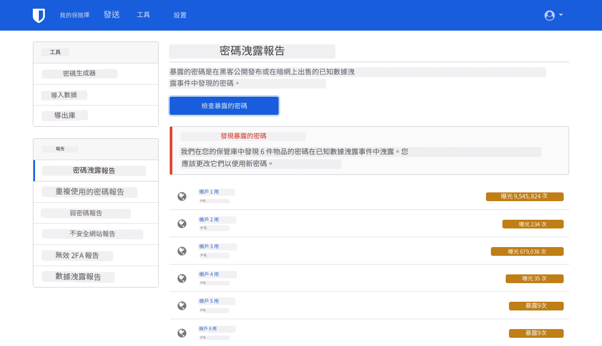

隨著時間的推移，一般人很容易地積累一些網路帳戶，但可能其中有不少早已不再使用。 刪除這些未使用的帳戶是收回隱私的重要一步，因為休眠帳戶容易受到數據洩露的影響。 資料外洩是指當服務的安全性遭到破壞時，受保護的資訊被未經授權者檢視、傳輸或竊取的事件。 不幸的是近來資料外洩事件 [已見怪不怪](https://haveibeenpwned.com/PwnedWebsites)  ，保持良好的數位清潔才能減輕資料外洩對個人生活的衝擊。 本指南的目標是幫助您通過令人討厭的帳戶刪除過程----往往透由 [欺騙性設計](https://deceptive.design)讓刪除困難，來改善網路現身。

## 查找舊帳戶

### 密碼管理器。

如果您使用一個貫穿整個數位生活的密碼管理器，這部分將非常容易。 通常，它們包括內建功能，用於偵測憑證是否在資料洩露中暴露----例如Bitwarden的 [資料洩露報告](https://bitwarden.com/blog/have-you-been-pwned)。

<figure markdown>
  
</figure>

即便您之前沒有印象有使用過密碼管理程式，也有可能在不知不覺間使用過瀏覽器（[Firefox](https://support.mozilla.org/kb/password-manager-remember-delete-edit-logins)、[Chrome](https://passwords.google.com/intro)、[Edge](https://support.microsoft.com/microsoft-edge/save-or-forget-passwords-in-microsoft-edge-b4beecb0-f2a8-1ca0-f26f-9ec247a3f336)）或是手機（原生 Android 上的 [Google](https://passwords.google.com/intro)、iOS 上的[密碼](https://support.apple.com/HT211146)）內建的功能。

桌面平臺通常還有一個密碼管理器，可以幫助您恢復忘記的密碼：

- Windows：[認證管理員](https://support.microsoft.com/windows/accessing-credential-manager-1b5c916a-6a16-889f-8581-fc16e8165ac0)
- macOS：[密碼](https://support.apple.com/HT211145)
- Linux：GNOME 鑰匙圈（透過 [Seahorse](https://gitlab.gnome.org/GNOME/seahorse#seahorse) 存取）或 [KDE 錢包管理員](https://userbase.kde.org/KDE_Wallet_Manager)

### 電子郵件

若您過去沒有使用密碼管理器，或您認為您有從未加入密碼管理器的帳號，另一個選項則是搜尋印象中用於註冊的電子郵件帳號。 在電子郵件用戶端上，搜尋「驗證」或「歡迎」等關鍵字。 幾乎每次你建立線上帳戶時，該服務都會向你的電子郵件發送驗證連結或介紹訊息。 這可能是找到舊的，被遺忘的帳戶的好方法。

## 刪除舊帳戶

### 登入

若要刪除舊帳戶，您必須先確認能夠登入帳戶。 同樣，如果帳戶在您的密碼管理員中，則此步驟很簡單。 如果沒有，你可以試著猜測你的密碼。 否則，通常有選項可以重新訪問您的帳戶，通常可以通過登錄頁面的「忘記密碼」鏈接來獲得。 您放棄的帳戶也可能已被刪除：有時服務會自動刪除所有舊帳戶。

嘗試重新取得存取權時，如果網站傳回錯誤訊息，表示電子郵件未與帳戶關聯，或在多次嘗試後您從未收到重設連結，則您沒有該電子郵件位址下的帳戶，應嘗試其他帳戶。 如果您無法確定使用了哪個電子郵件位址，或者您無法再存取該電子郵件，您可以嘗試聯絡該服務的客服。 不幸的是，我們無法保證您能夠恢復訪問您的帳戶。

### GDPR （僅限歐洲經濟區居民）

歐洲經濟區的居民享有資料刪除的額外權利，其詳見於 GDPR [第 17 條](https://gdpr-info.eu/art-17-gdpr)規定。 如果適用於您，請閱讀任何特定服務的隱私權政策，以查找有關如何行使刪除權利的資訊。 閱讀隱私政策可能很重要，因為某些服務的「刪除帳戶」選項，實際上只是停用您的帳戶，若要真正刪除，您必須採取額外行動。 有時，刪除過程中可能需填寫調查、向服務商的資料保護人員發送電子郵件，甚至提出您為歐盟居民的證明。 如果您打算這樣做，請 **不要** 覆寫帳戶資訊-可能需要歐盟居民身份。 請注意，服務的位置並不重要； GDPR 適用於為歐盟用戶服務的任何人。 如果該服務不尊重您的刪除權利，您可以聯絡您的國家[資料保護機構](https://ec.europa.eu/info/law/law-topic/data-protection/reform/rights-citizens/redress/what-should-i-do-if-i-think-my-personal-data-protection-rights-havent-been-respected_en)，可能有權獲得金錢賠償。

### 覆寫帳戶資訊

在某些情況下，可以採用虛假資料來覆蓋帳戶的信息。 當您登入後，請將帳戶中的所有資訊變更為偽造資訊。 原因是許多網站甚至在帳戶刪除後仍會保留您之前擁有的資訊。 希望他們會用你輸入的最新數據覆蓋之前的信息。 但是，無法保證不會有先前信息的備份。

關於帳戶電子郵件，可以透過所選擇的供應商建立一個新的備用電子郵件帳戶，或使用[電子郵件別名服務建立別名](/email/#email-aliasing-services)。 完成後，您可以刪除替代電子郵件位址。 我們建議您不要使用臨時電子郵件提供商，因為通常可以重新啟用臨時電子郵件。

### 刪除帳戶

您可以檢查 [JustDeleteMe](https://justdeleteme. xyz) 以獲取有關刪除特定服務帳戶的指示。 有些網站會慷慨地提供「刪除帳戶」選項，而其他網站則會強迫您與支援人員交談。 刪除過程可能因網站而異，有些網站無法刪除帳戶。

對於不允許帳戶刪除的服務，最好的做法是偽造前面提到的所有信息，並加強帳戶安全性。 爲此，啓用 [MFA](multi-factor-authentication.md) 和提供的任何額外安全功能。 此外，請將密碼更改為隨機生成的最大允許大小的密碼（ [密碼管理器](../passwords.md) 對此很有用）。

如果您確信您關心的所有資訊都已被刪除，您可以放心地忘記此帳戶。 如果沒有，最好將憑證與其他密碼一起儲存，並偶爾重新登錄以重設密碼。

即使您能夠刪除帳戶，也無法保證您的所有信息都將被刪除。 事實上，法律要求一些公司保留某些信息，特別是與金融交易有關的信息。 當涉及到網站和雲端服務時，您的數據會發生什麼事情，這在很大程度上是您無法控制的。

## 避免註冊新帳戶

俗話說：「預防更勝治療。」 每當你覺得想要註冊一個新帳戶時，問問自己：「我真的需要註冊這個嗎？ 有不需要註冊的替代方案嗎？」 刪除一個帳戶通常比創建一個帳戶要困難得多。 即使在删除或改變帳户資訊，可能還有一個來自第三方的緩存版本，如 [Internet Archive](https://archive.org)。 如果可能的話，不要隨便註冊帳號－未來的你會感謝你現在的決定！
